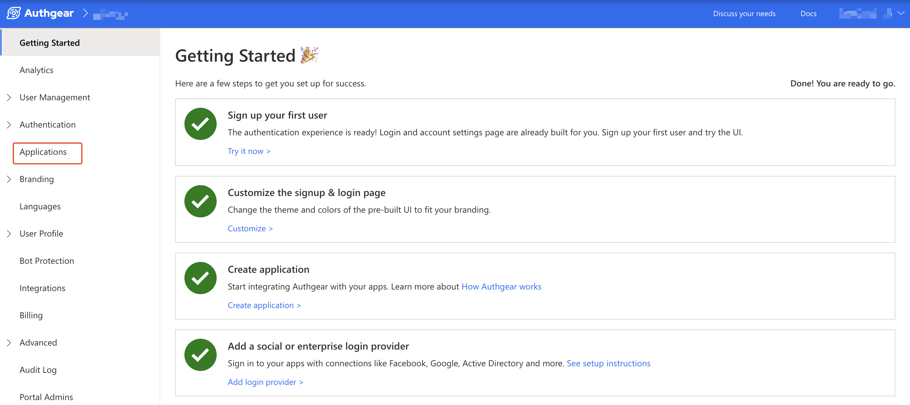
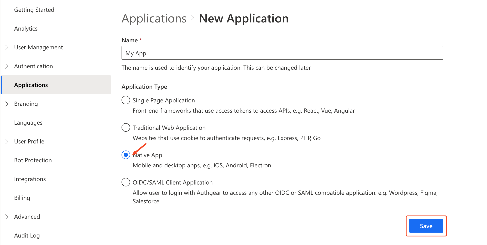
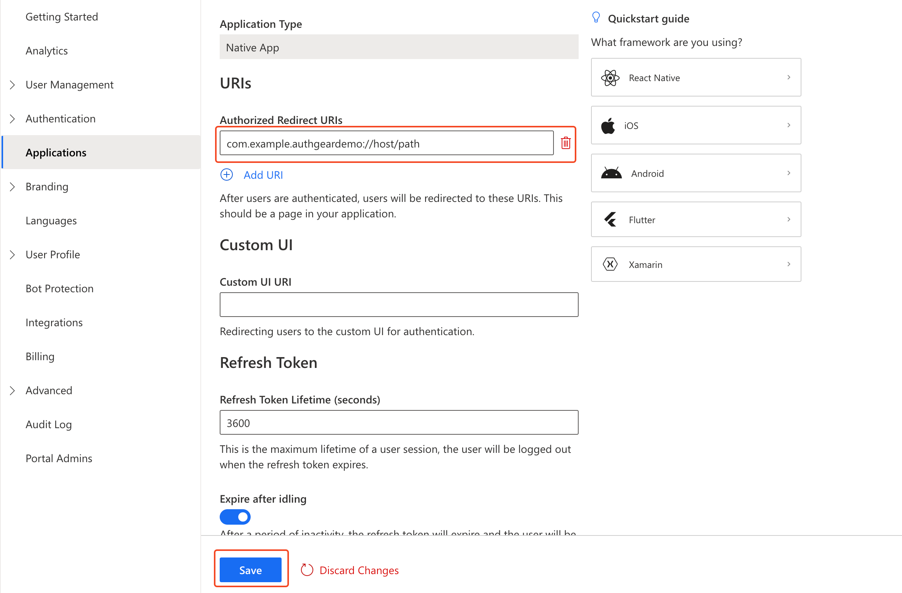
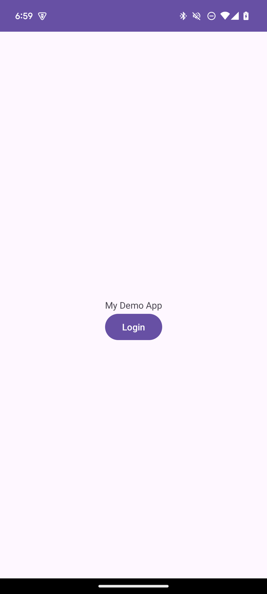

# Android SDK

This guide provides instructions on integrating Authgear with an Android app. Supported platforms include:

* Android 5.0 (API 21) or higher

Follow this guide to add Authgear to your Android app in 🕐 10 minutes.


You can find the full code for the demo app for this tutorial in [this Github repo](https://github.com/authgear/authgear-example-android)


## Setup Application in Authgear

Sign up for an Authgear Portal account at [https://portal.authgear.com](https://portal.authgear.com/). Or you can use your self-deployed Authgear.

From the Project listing, create a new Project or select an existing Project. After that, we will need to create an application in the project.

### **Step 1: Create an application in the Portal**

Go to **Applications** on the left menu bar.

<figure><figcaption></figcaption></figure>

Click **⊕Add Application** in the top toolbar.

Input the name of your application and select **Native App** as the application type. Click "Save".

You will see a list of guides that can help you for setting up, then click "Next".



### **Step 2: Configure the application**

Define a custom URI scheme that Authgear will use to redirect users back to your app after they have authenticated. The scheme should be based on the package name for your Android app. For the demo app, we'll be creating in this guide the scheme is: `com.example.authgeardemo://host/path`. To learn more about setting up a custom URI scheme in Android, see the official documentation [here](https://developer.android.com/training/app-links/deep-linking).

Head back to Authgear Portal, and add the URL scheme you have defined as a Redirect URI. For our demo app, add the following URI:

```
com.example.authgeardemo://host/path
```

Click "Save" in the top toolbar and note the **Client ID** as you'll use it later in your Android app. You can also obtain it again from the Applications list later.



## Add Authgear to an Android Application

In this step, we'll add user authentication to an Android application using the Authgear client application we set up in the previous steps.

The Authgear SDK works with both **Jetpack Compose** and the classic **View/XML** UI toolkit. [Step 4](#step-4-implement-authentication) below provides the implementation for each — pick the tab that matches your app.

### Pre-requisites

To follow along, you need to have the following:

* Android Studio installed on your computer
* Basic knowledge of Kotlin or Java

### Step 1: Create an Android App project

For the purpose of this guide, we'll be creating a new simple Android app project. Feel free to skip this step if you are adding Authgear to your existing app.

Open Android Studio and create a new project with the following details:

* On the Activity selection screen, choose **Empty Activity** (Jetpack Compose) or **Empty Views Activity** (XML) — this guide covers both. The current Android Studio default, **Empty Activity**, uses Jetpack Compose.
* **Name**: My Demo App
* **Build configuration language**: Groovy DSL


The reason for recommending you use Groovy DSL as **Build configuration language** for this guide is to make it easier to copy and paste the Gradle configurations we've provided without having to make many rewrites.


### Step 2: Add Authgear SDK to your project

The Authgear Android SDK makes it easier to interact with Authgear endpoints and services from your Android app.

The SDK is published on Maven Central. Make sure the `mavenCentral()` repository is available to your project. It is included by default in new Android Studio projects; if it is missing, add it to your project's `settings.gradle` file:

```groovy
dependencyResolutionManagement {
    repositoriesMode.set(RepositoriesMode.FAIL_ON_PROJECT_REPOS)
    repositories {
        mavenCentral()
    }
}
```

Next, add the Authgear SDK to the `dependencies` section of your app-level (`/app/build.gradle`) `build.gradle`:

```groovy
dependencies {
    // Other implementations
    implementation 'com.authgear:android-sdk:3.0.0'
}
```

`3.0.0` is the latest version at the time of writing. Check for newer releases on [Maven Central](https://central.sonatype.com/artifact/com.authgear/android-sdk) or the [release tags](https://github.com/authgear/authgear-sdk-android/tags).

#### Enable Java 8+ API desugaring support

To enable Java 8+ API desugaring support for your project, make the following changes to the app-level `build.gradle` file.

1. Add `coreLibraryDesugaringEnabled true` to the `android` > `compileOptions` section:

```gradle
compileOptions {
    coreLibraryDesugaringEnabled true
}
```

2. Then add the coreLibraryDesugaring to the dependencies section:

```gradle
dependencies {
    // Other implementations
    coreLibraryDesugaring 'com.android.tools:desugar_jdk_libs:2.0.3'
}
```

Learn more about Java 8+ API desugaring support [here](https://developer.android.com/studio/write/java8-support#library-desugaring).


Your app's **window theme** must descend from a `Theme.AppCompat` theme. The SDK's authentication screens (`OAuthActivity`, `OAuthRedirectActivity`) are `AppCompatActivity`, and Android throws `You need to use a Theme.AppCompat theme (or descendant) with this activity` on login if the app theme is a plain framework theme.

An **Empty Views Activity** project already uses a Material Components (AppCompat-descendant) theme. If you created a **Jetpack Compose** project, open `res/values/themes.xml` and make sure your app theme uses an AppCompat or Material 3 parent, for example:

```xml
<resources>
    <style name="Theme.MyDemoApp" parent="Theme.AppCompat.DayNight.NoActionBar" />
</resources>
```

Your Compose UI still themes itself; this is only the window theme.


Sync Gradle to continue.

### Step 3: Set up the Redirect URI

Add the following activity entry to the `AndroidManifest.xml` of your app. The intent system would dispatch the redirect URI to `OAuthRedirectActivity` and the SDK would handle the rest.

<pre class="language-xml"><code class="lang-xml">&#x3C;!-- Your application configuration. Omitted here for brevity -->
&#x3C;application>
<strong>    &#x3C;!-- Other activities or entries -->
</strong>
    &#x3C;!-- Add the following activity -->
    &#x3C;!-- android:exported="true" is required -->
    &#x3C;!-- See https://developer.android.com/about/versions/12/behavior-changes-12#exported -->
    &#x3C;activity android:name="com.oursky.authgear.OAuthRedirectActivity"
        android:exported="true"
        android:launchMode="singleTask">
        &#x3C;intent-filter>
            &#x3C;action android:name="android.intent.action.VIEW" />
            &#x3C;category android:name="android.intent.category.DEFAULT" />
            &#x3C;category android:name="android.intent.category.BROWSABLE" />
            &#x3C;!-- Configure data to be the exact redirect URI your app uses. -->
            &#x3C;!-- Here, we are using com.example.authgeardemo://host/path as configured in the portal -->
            &#x3C;!-- NOTE: The redirectURI supplied in AuthenticateOptions *has* to match as well -->
            &#x3C;data android:scheme="com.example.authgeardemo"
                android:host="host"
                android:pathPrefix="/path"/>
        &#x3C;/intent-filter>
    &#x3C;/activity>
&#x3C;/application>
</code></pre>

#### Targeting API level 30 or above (Android 11 or above)

If your Android app is targeting API level 30 or above (Android 11 or above), you need to add a `queries` section to `AndroidManifest.xml`.

```xml
<?xml version="1.0" encoding="utf-8"?>
<manifest xmlns:android="http://schemas.android.com/apk/res/android">
  <!-- Other elements such <application> -->
  <queries>
    <intent>
      <action android:name="android.support.customtabs.action.CustomTabsService" />
    </intent>
  </queries>
</manifest>
```

### Step 4: Implement authentication

Now initialize Authgear and build the screen with a **Login** button, plus **User Settings** and **Logout** for logged-in users. Choose the tab that matches your UI toolkit — both produce the same flow.

Replace `<CLIENT_ID>` and `<AUTHGEAR_ENDPOINT>` in the code below with the values from the configuration page of your Authgear client application.



The SDK exposes `suspend` functions, so you call them from Compose with `rememberCoroutineScope()` and `LaunchedEffect`.

Create the Authgear instance in your `MainActivity` and host your Compose UI:

```kotlin
class MainActivity : ComponentActivity() {

    private lateinit var authgear: Authgear

    override fun onCreate(savedInstanceState: Bundle?) {
        super.onCreate(savedInstanceState)
        authgear = Authgear(application, "<CLIENT_ID>", "<AUTHGEAR_ENDPOINT>")
        setContent {
            MaterialTheme {
                Surface(modifier = Modifier.fillMaxSize()) {
                    MainScreen(authgear)
                }
            }
        }
    }
}
```

The `MainScreen` composable configures Authgear when it first appears (restoring an existing session), then shows a **Login** button or the logged-in view based on `sessionState`:

```kotlin
private const val REDIRECT_URI = "com.example.authgeardemo://host/path"
private const val TAG = "AuthgearDemo"

@Composable
fun MainScreen(authgear: Authgear) {
    val scope = rememberCoroutineScope()
    var configuring by remember { mutableStateOf(true) }
    var email by remember { mutableStateOf<String?>(null) }
    var busy by remember { mutableStateOf(false) }

    // Configure once when the screen first appears; restore an existing session.
    LaunchedEffect(Unit) {
        try {
            authgear.configure()
            if (authgear.sessionState == SessionState.AUTHENTICATED) {
                email = authgear.fetchUserInfo().email
            }
        } catch (e: Throwable) {
            Log.e(TAG, "configure failed", e)
        }
        configuring = false
    }

    Column(
        modifier = Modifier
            .fillMaxSize()
            .padding(24.dp),
        horizontalAlignment = Alignment.CenterHorizontally,
        verticalArrangement = Arrangement.Center,
    ) {
        when {
            configuring -> CircularProgressIndicator()

            email != null -> {
                Text("Welcome, $email")
                OutlinedButton(
                    enabled = !busy,
                    onClick = { authgear.open(Page.SETTINGS) },
                    modifier = Modifier.padding(top = 16.dp),
                ) { Text("User Settings") }
                Button(
                    enabled = !busy,
                    onClick = {
                        scope.launch {
                            busy = true
                            try {
                                authgear.logout()
                                email = null
                            } catch (e: Throwable) {
                                Log.e(TAG, "logout failed", e)
                            }
                            busy = false
                        }
                    },
                ) { Text("Logout") }
            }

            else -> {
                Button(
                    enabled = !busy,
                    onClick = {
                        scope.launch {
                            busy = true
                            try {
                                email = authgear.authenticate(AuthenticateOptions(REDIRECT_URI)).email
                            } catch (e: Throwable) {
                                Log.e(TAG, "login failed", e)
                            }
                            busy = false
                        }
                    },
                ) { Text("Login") }
            }
        }
    }
}
```


`configure`, `authenticate`, `logout`, and `fetchUserInfo` are `suspend` extension functions on `Authgear` — import them (e.g. `import com.oursky.authgear.configure`) if they show as unresolved. Import any other unresolved class as well.




**Enable View Binding**

Add the following to your app-level (`/app/build.gradle`) `build.gradle` under the `android` block:

```groovy
buildFeatures {
    viewBinding = true
}
```

**Build the layout**

Open `res/layout/activity_main.xml`, delete the default "Hello World!" TextView, and add a title, a Login button, and the logged-in views (a progress bar, welcome text, User Settings and Logout buttons) grouped so they can be shown/hidden together:

```xml
<TextView
    android:id="@+id/app_title"
    android:layout_width="wrap_content"
    android:layout_height="wrap_content"
    android:text="My Demo App!"
    app:layout_constraintBottom_toBottomOf="parent"
    app:layout_constraintEnd_toEndOf="parent"
    app:layout_constraintStart_toStartOf="parent"
    app:layout_constraintTop_toTopOf="parent" />

<Button
    android:id="@+id/login_btn"
    android:layout_width="wrap_content"
    android:layout_height="wrap_content"
    android:text="Login"
    app:layout_constraintEnd_toEndOf="parent"
    app:layout_constraintStart_toStartOf="parent"
    app:layout_constraintTop_toBottomOf="@+id/app_title" />

<ProgressBar
    android:id="@+id/progressBar"
    style="?android:attr/progressBarStyleHorizontal"
    android:layout_width="0dp"
    android:layout_height="wrap_content"
    android:layout_marginTop="48dp"
    android:indeterminate="true"
    android:visibility="invisible"
    app:layout_constraintEnd_toEndOf="parent"
    app:layout_constraintStart_toStartOf="parent"
    app:layout_constraintTop_toTopOf="parent" />

<TextView
    android:id="@+id/welcome_text"
    android:layout_width="wrap_content"
    android:layout_height="wrap_content"
    android:text="welcome user"
    app:layout_constraintEnd_toEndOf="parent"
    app:layout_constraintStart_toStartOf="parent"
    app:layout_constraintTop_toTopOf="@+id/login_btn" />

<Button
    android:id="@+id/user_settings_btn"
    android:layout_width="wrap_content"
    android:layout_height="wrap_content"
    android:text="User Settings"
    app:layout_constraintEnd_toEndOf="parent"
    app:layout_constraintStart_toStartOf="parent"
    app:layout_constraintTop_toBottomOf="@+id/welcome_text" />

<Button
    android:id="@+id/logout_btn"
    android:layout_width="wrap_content"
    android:layout_height="wrap_content"
    android:text="Logout"
    app:layout_constraintEnd_toEndOf="parent"
    app:layout_constraintStart_toStartOf="parent"
    app:layout_constraintTop_toBottomOf="@+id/user_settings_btn" />

<androidx.constraintlayout.widget.Group
    android:id="@+id/logged_in_views"
    android:layout_width="wrap_content"
    android:layout_height="wrap_content"
    android:visibility="gone"
    app:constraint_referenced_ids="welcome_text,user_settings_btn,logout_btn" />
```

The complete `activity_main.xml` is available [here](https://github.com/authgear/authgear-example-android/blob/main/app/src/main/res/layout/activity_main.xml).

**Initialize Authgear and wire the buttons**

In `MainActivity.kt`, initialize Authgear with view binding, call `configure()`, and connect the buttons:

```kotlin
class MainActivity : AppCompatActivity() {

    private lateinit var authgear: Authgear
    private lateinit var binding: ActivityMainBinding

    override fun onCreate(savedInstanceState: Bundle?) {
        super.onCreate(savedInstanceState)
        binding = ActivityMainBinding.inflate(layoutInflater)
        setContentView(binding.root)

        authgear = Authgear(application, "<CLIENT_ID>", "<AUTHGEAR_ENDPOINT>")
        authgear.configure(object : OnConfigureListener {
            override fun onConfigured() {
                updateUi(authgear)
            }

            override fun onConfigurationFailed(throwable: Throwable) {
                Log.d("TAG", throwable.toString())
                // Something went wrong, check the client ID or endpoint.
            }
        })

        binding.loginBtn.setOnClickListener { startLogin() }
        binding.logoutBtn.setOnClickListener { logout() }
        binding.userSettingsBtn.setOnClickListener { openUserSettings() }
    }
}
```

**Implement the actions**

Add these methods to `MainActivity`. `startLogin()` starts the authentication flow, `updateUi()` reflects the session state (and fetches the user's email), `logout()` ends the session, and `openUserSettings()` opens the pre-built settings page:

```kotlin
fun startLogin() {
    binding.progressBar.visibility = View.VISIBLE
    val options = AuthenticateOptions("com.example.authgeardemo://host/path")
    authgear.authenticate(options, object : OnAuthenticateListener {
        override fun onAuthenticated(userInfo: UserInfo) {
            updateUi(authgear)
        }

        override fun onAuthenticationFailed(throwable: Throwable) {
            binding.progressBar.visibility = View.INVISIBLE
            Log.d("TAG", throwable.toString())
        }
    })
}

fun updateUi(authgear: Authgear) {
    val state = authgear.sessionState
    if (state == SessionState.AUTHENTICATED) {
        binding.loginBtn.visibility = View.GONE
        binding.loggedInViews.visibility = View.VISIBLE
        // Get userInfo and display in welcome text
        authgear.fetchUserInfo(object : OnFetchUserInfoListener {
            override fun onFetchedUserInfo(userInfo: UserInfo) {
                binding.welcomeText.text = userInfo.email
            }

            override fun onFetchingUserInfoFailed(throwable: Throwable) {
                Log.d("TAG", "Failed to fetch UserInfo")
            }
        })
    } else {
        binding.loggedInViews.visibility = View.GONE
        binding.loginBtn.visibility = View.VISIBLE
    }
    binding.progressBar.visibility = View.INVISIBLE
}

fun logout() {
    binding.progressBar.visibility = View.VISIBLE
    authgear.logout(true, object : OnLogoutListener {
        override fun onLogout() {
            updateUi(authgear)
        }

        override fun onLogoutFailed(throwable: Throwable) {
            Log.d("TAG", throwable.toString())
        }
    })
}

fun openUserSettings() {
    authgear.open(Page.SETTINGS)
}
```


Import any class that shows as unresolved.




#### Checkpoint

Run your app on a device or emulator and tap **Login**. Because you set up the Redirect URI in [Step 3](#step-3-set-up-the-redirect-uri), the Authgear login page opens, and on success you're returned to the app showing the user's email with the **User Settings** and **Logout** buttons.

<figure><figcaption><p>Demo app screenshot</p></figcaption></figure>

### Additional Actions

#### Get the Logged In State

You can use the user's logged-in state to determine whether a user is logged in and display content like their user info and a logout button, as we did in [Step 4](#step-4-implement-authentication). The `SessionState` reflects the user logged-in state in the SDK local state. That means even if the `SessionState` is `AUTHENTICATED`, the session may be invalid if it is revoked remotely. After initializing the Authgear SDK, call `fetchUserInfo` to update the `SessionState` as soon as it is proper to do so.

```kotlin
// After authgear.configure, it only reflect SDK local state.
// value can be NO_SESSION or AUTHENTICATED
val state = authgear.sessionState
```

The value of `SessionState` can be `UNKNOWN`, `NO_SESSION` or `AUTHENTICATED`. Initially, the `sessionState` is `UNKNOWN`. After a call to `authgear.configure`, the session state would become `AUTHENTICATED` if a previous session was found, or `NO_SESSION` if such session was not found.

#### Fetching User Info

In some cases, you may need to obtain current user info through the SDK. (e.g. Display email address in the UI as we did in [Step 4](#step-4-implement-authentication)). Use the `fetchUserInfo` function to obtain the user info, see [example](../../../reference/apis/oauth-2.0-and-openid-connect-oidc/userinfo.md).

#### Using the Access Token in HTTP Requests

Call `refreshAccessTokenIfNeeded` every time before using the access token, the function will check and make the network call only if the access token has expired. Include the access token in the Authorization header of your application request. If you are using OKHttp in your project, you can also use the interceptor extension provided by the SDK, see [detail](okhttp-interceptor-extension.md).


The access token is a [JSON Web Token (JWT)](https://en.wikipedia.org/wiki/JSON_Web_Token).


```kotlin
try {
    authgear.refreshAccessTokenIfNeededSync()
} catch (e: OAuthException) {
    // Something went wrong
}

val accessToken = authgear.accessToken 
if (accessToken == null) {
    // The user is not logged in, or the token is expired.
    // It is up to the caller to decide how to handle this situation.
    // Typically, the request could be aborted
    // immediately as the response would be 401 anyways.
    return
}

val headers = mutableMapOf<String, String>()
headers["authorization"] = "Bearer $accessToken"

// Submit the request with the headers..
```

## **Next steps** <a href="#secure-your-application-server-with-authgear" id="secure-your-application-server-with-authgear"></a>

To protect your application server from unauthorized access. You will need to [integrate Authgear to your backend](../../backend-api/).


[backend-api](../../backend-api/)


## Android SDK Reference

For detailed documentation on the Android SDK, visit [Android SDK Reference](https://authgear.github.io/authgear-sdk-android/)
