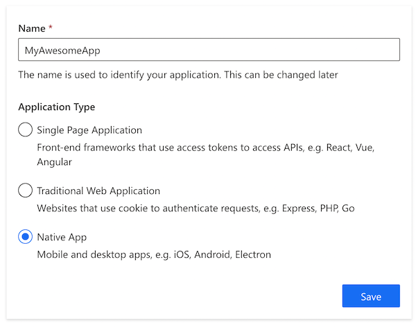
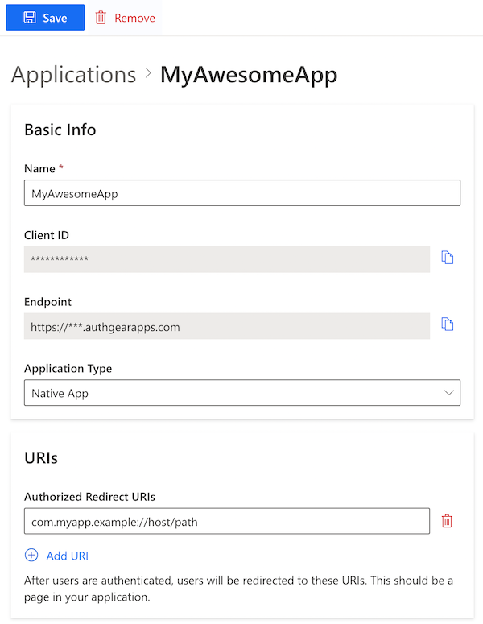

# Android SDK

This guide provides instructions on integrating Authgear with an Android app. Supported platforms include:

* Android 5.0 (API 21) or higher

## Setup Application in Authgear

Signup for an Authgear Portal account in [https://portal.authgear.com](https://portal.authgear.com/). Or you can use your self-deployed Authgear.

From the Project listing, create a new Project or select an existing Project. After that, we will need to create an application in the project.



**Step 1: Create an application in the Portal**

1. Go to **Applications** on the left menu bar.
2. Click **⊕Add Application** in the top tool bar.
3. Input the name of your application and select **Native App** as the application type. Click "Save".
4. You will see a list of guides that can help you for setting up, then click "Next".



**Step 2: Configure the application**

1. In your IDE (e.g. Android Studio), define a custom URI scheme that the users will be redirected back to your app after they have authenticated with Authgear, e.g. `com.myapp.example://host/path`.\[^1]
2. Head back to Authgear Portal, fill in the Redirect URI that you have defined in the previous steps.
3. Click "Save" in the top tool bar and keep the **Client ID**. You can also obtain it again from the Applications list later.




If you wish to [validate JSON Web Token (JWT) in your own application server](https://github.com/authgear/docs/blob/master/get-started/backend-integration/jwt/README.md), turn on "Issue JWT as access token".\[^2] If you wish to [forward authentication requests to Authgear Resolver Endpoint](https://github.com/authgear/docs/blob/master/get-started/backend-integration/nginx/README.md), leave this unchecked. See comparisons in [Backend Integration](broken-reference).






```yaml
oauth:
  clients:
    - name: your_app_name
      client_id: a_random_generated_string
      redirect_uris:
        - "com.myapp://host/path"
      grant_types:
        - authorization_code
        - refresh_token
      response_types:
        - code
        - none
```



## Get the SDK

1.  Add `jitpack` repository to `gradle`

    ```
    allprojects {
        repositories {
            // Other repository
            maven { url 'https://jitpack.io' }
        }
    }
    ```
2.  Add authgear in dependencies. Use `$branch-SNAPSHOT` (e.g. `main-SNAPSHOT`) for the latest version in a branch or a release tag/git commit hash of the desired version.

    ```
    dependencies {
        // Other implementations
        implementation 'com.github.authgear:authgear-sdk-android:SNAPSHOT'
    }
    ```

## Setup Redirect URI for Your Android App

Add the following activity entry to the `AndroidManifest.xml` of your app. The intent system would dispatch the redirect URI to `OauthRedirectActivity` and the SDK would handle the rest.

```xml
<!-- Your application configuration. Omitted here for brevity -->
<application>
  <!-- Other activities or entries -->

  <!-- Add the following activity -->
  <!-- android:exported="true" is required -->
  <!-- See https://developer.android.com/about/versions/12/behavior-changes-12#exported -->
  <activity android:name="com.oursky.authgear.OauthRedirectActivity"
            android:exported="true"
            android:launchMode="singleTask">
            <intent-filter>
                <action android:name="android.intent.action.VIEW" />
                <category android:name="android.intent.category.DEFAULT" />
                <category android:name="android.intent.category.BROWSABLE" />
                <!-- Configure data to be the exact redirect URI your app uses. -->
                <!-- Here, we are using com.myapp://host/path as configured in authgear.yaml. -->
                <!-- NOTE: The redirectURI supplied in AuthenticateOptions *has* to match as well -->
                <data android:scheme="com.myapp"
                    android:host="host"
                    android:pathPrefix="/path"/>
            </intent-filter>
  </activity>
</application>
```

### Targeting API level 30 or above (Android 11 or above)

If your Android app is targeting API level 30 or above (Android 11 or above), you need to add a `queries` section to `AndroidManifest.xml`.

```xml
<?xml version="1.0" encoding="utf-8"?>
<manifest xmlns:android="http://schemas.android.com/apk/res/android">
  <!-- Other elements such <application> -->
  <queries>
    <intent>
      <action android:name="android.support.customtabs.action.CustomTabsService" />
    </intent>
  </queries>
</manifest>
```

## Initialize Authgear

Add the following code to your app's `Application` class. If there is none, add a class that extends `Application`. Make sure it is declared in `AndroidManifest.xml`'s `application` tag with the `name` attribute as described [here](https://developer.android.com/guide/topics/manifest/application-element#nm).

```java
public class MyAwesomeApplication extends Application {
    // The client ID of the oauth client.
    private static final String CLIENT_ID = "a_random_generated_string"
    // Deployed authgear's endpoint
    private static final String AUTHGEAR_ENDPOINT = "http://<myapp>.authgear.cloud/"
    private Authgear mAuthgear;
    public void onCreate() {
        super.onCreate();
        mAuthgear = new Authgear(this, CLIENT_ID, AUTHGEAR_ENDPOINT);
        mAuthgear.configure(new OnConfigureListener() {
            @Override
            public void onConfigured() {
                // Authgear can be used.
            }

            @Override
            public void onConfigurationFailed(@NonNull Throwable throwable) {
                Log.d(TAG, throwable.toString());
                // Something went wrong, check the client ID or endpoint.
            }
        });
    }

    public Authgear getAuthgear() {
        return mAuthgear;
    }
}
```

## Authenticate a user

Add the following code to your view model. Do _NOT_ call these codes in activity as this can lead to memory leak when your activity instance is destroyed. You can read more on the view model in the official documentation [here](https://developer.android.com/topic/libraries/architecture/viewmodel).

```java
class MyAwesomeViewModel extends AndroidViewModel {
    // Other methods

    // This is called when login button is clicked.
    public void login() {
        MyAwesomeApplication app = getApplication();
        AuthenticateOptions options = new AuthenticateOptions("com.myapp://host/path");
        app.getAuthgear().authenticate(options, new OnAuthenticateListener() {
            @Override
            public void onAuthenticated(@Nullable UserInfo userInfo) {
                // The user is logged in!
            }

            @Override
            public void onAuthenticationFailed(@NonNull Throwable throwable) {
                if (throwable instanceof CancelException) {
                    // User cancel
                } else {
                    // Something went wrong.
                }
            }
        });
    }
}
```

The above call of `authorize` passes in the exact redirect URI as configured in the applications and manifest, the callback then indicates authorization success or failure. By default, the callback is called on the main thread.

Now, your user is logged in!

## Get the Logged In State

When you start launching the application. You may want to know if the user has logged in. (e.g. Show users the login page if they haven't logged in). The `SessionState` reflects the user logged in state in the SDK local state. That means even the `SessionState` is `AUTHENTICATED`, the session may be invalid if it is revoked remotely. After initializing the Authgear SDK, call `fetchUserInfo` to update the `SessionState` as soon as it is proper to do so.

```java
// After authgear.configure, it only reflect SDK local state.
// value can be NO_SESSION or AUTHENTICATED
SessionState state = mAuthgear.getSessionState();

mAuthgear.fetchUserInfo(new OnFetchUserInfoListener() {
    @Override
    public void onFetchedUserInfo(@NonNull UserInfo userInfo) {
        // sessionState is now up to date
        // read the userInfo if needed
    }

    @Override
    public void onFetchingUserInfoFailed(@NonNull Throwable throwable) {
        // sessionState is now up to date
        // it will change to NO_SESSION if the session is invalid
    }
});
```

The value of `SessionState` can be `UNKNOWN`, `NO_SESSION` or `AUTHENTICATED`. Initially, the `sessionState` is `UNKNOWN`. After a call to `authgear.configure`, the session state would become `AUTHENTICATED` if a previous session was found, or `NO_SESSION` if such session was not found.

## Fetching User Info

In some cases, you may need to obtain current user info through the SDK. (e.g. Display email address in the UI). Use the `fetchUserInfo` function to obtain the user info, see [example](https://github.com/authgear/docs/blob/master/get-started/integrate/user-profile.md#userinfo-endpoint).

## Using the Access Token in HTTP Requests

Call `refreshAccessTokenIfNeeded` every time before using the access token, the function will check and make the network call only if the access token has expired. Include the access token into the Authorization header of your application request. If you are using OKHttp in your project, you can also use the interceptor extension provided by the SDK, see [detail](okhttp-interceptor-extension.md).

```java
// Suppose we are preparing an http request in a background thread.

// Setting up the request, e.g. preparing a URLConnection

try {
    authgear.refreshAccessTokenIfNeededSync();
} catch (OAuthException e) {
    // Something went wrong
}
String accessToken = authgear.getAccessToken();
if (accessToken == null) {
    // The user is not logged in, or the token is expired.
    // It is up to the caller to decide how to handle this situation.
    // Typically, the request could be aborted
    // immediately as the response would be 401 anyways.
    return;
}

HashMap<String, String> headers = new HashMap<>();
headers.put("authorization", "Bearer " + accessToken);

// Submit the request with the headers...
```

## Logout

To log out the user from the current app session, you need to invoke the`logout`function.

```java
class MyAwesomeViewModel extends AndroidViewModel {
    // Other methods

    // This is called when logout button is clicked.
    public void logout() {
        MyAwesomeApplication app = getApplication();
        app.getAuthgear().logout(new OnLogoutListener() {
            @Override
            public void onLogout() {
                // Logout successfully
            }

            @Override
            public void onLogoutFailed(@NonNull Throwable throwable) {
                // Failed to logout
            }
        });
    }
}
```

## **Next steps** <a href="#secure-your-application-server-with-authgear" id="secure-your-application-server-with-authgear"></a>

To protect your application server from unauthorized access. You will need to [integrate Authgear to your backend](../../backend-api/).


[backend-api](../../backend-api/)


## Android SDK Reference

For detailed documentation on the Flutter SDK, visit [Android SDK Reference](https://authgear.github.io/authgear-sdk-android/)

### Footnote

\[^1]: For further instruction on setting up custom URI scheme in Android, see [https://developer.android.com/training/app-links/deep-linking](https://developer.android.com/training/app-links/deep-linking) \[^2]: For more explanation on JWT, see [https://en.wikipedia.org/wiki/JSON\_Web\_Token](https://en.wikipedia.org/wiki/JSON_Web_Token)
