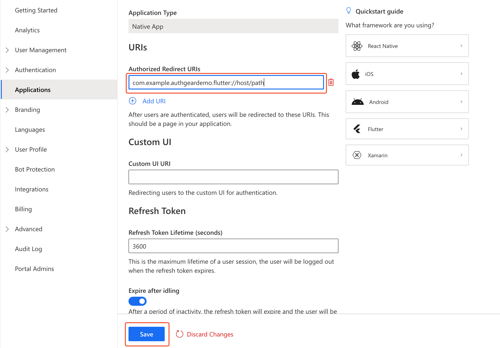

# Flutter SDK

[](https://raw.githubusercontent.com/authgear/docs/refs/heads/main/get-started/native-mobile-app/flutter.md)

This guide provides instructions on integrating Authgear with a Flutter app. Supported platforms include:

* Flutter 2.5.0 or higher
* Android minimum SDK 30 (Android 11 or later)

Follow this guide to add Authgear to your Flutter app in 🕐 10 minutes.


You can find the full code for the demo app for this tutorial in the Github repo [here](https://github.com/authgear/authgear_example_flutter).


## Setup Application in Authgear

Signup for an Authgear Portal account in [https://portal.authgear.com/](https://portal.authgear.com/). Or you can use your self-deployed Authgear.

From the Project listing, create a new Project or select an existing Project. After that, we will need to create an application in the project.

### **Step 1: Create an application in the Portal**

Go to **Applications** on the left menu bar.

<figure><figcaption></figcaption></figure>

You will see the **"New Application"** page or Click **⊕Add Application** in the top tool bar.

Input the name of your application and select **Native App** as the application type. Click "Save".

You will see a list of guides that can help you for setting up, then click "Next".

<figure><figcaption><p>Create Application</p></figcaption></figure>

### **Step 2: Configure the application**

In your IDE, define a custom URI scheme that Authgear will use to redirect users back to your app after they have authenticated , For your demo application for this guide, the URI scheme will be: `com.example.authgeardemo.flutter://host/path`. To learn more about setting up URI Scheme in flutter, visit [https://docs.flutter.dev/development/ui/navigation/deep-linking](https://docs.flutter.dev/development/ui/navigation/deep-linking).

Head back to Authgear Portal, fill in the Redirect URI that you have defined in the previous step.

Click "Save" and note the **Client ID**. and **Endpoint**. You can also obtain them from the Applications list later.



## Add User Authentication to Flutter App using Authgear SDK

In this part of the guide, we'll add user Authentication to a simple demo app using the Authgear Flutter SDK.

The demo app will have a login button that users can click to initiate the authentication flow. It will also include a group of widgets for greeting logged-in users, opening the user settings page, and logout.

### Step 1: Create Flutter App

If you're new to Flutter, follow the official [Flutter documentation](https://docs.flutter.dev/get-started/install) to see how you can install Flutter on your computer.

Run the following command to create a new Flutter project:

```bash
flutter create myapp
cd myapp
```

### Step 2: Install Authgear SDK

Run the following command from the root directory of your Flutter project to install the Authgear SDK:

```bash
flutter pub add flutter_authgear
```

### Step 3: Initialize Authgear

First, import Authgear at the top of `lib/main.dart`:

```dart
import 'package:flutter_authgear/flutter_authgear.dart';
```

Next, create a field variable `_authgear` of type `Authgear` and an `_init()` method in your page's State class:

```dart
late Authgear _authgear;

Future<void> _init() async {
  _authgear = Authgear(endpoint: "<AUTHGEAR_ENDPOINT>", clientID: "<ClIENT_ID>");
  await _authgear.configure();
}
```


**Note:** The **State Class** is the class associated with a stateful page (widget). For example, the following show part of the State class for our demo app after adding the `_authgear` field and an `_init()` method:

```dart
class _MyHomePageState extends State<MyHomePage> {
  late Authgear _authgear;
  
  Future<void> _init() async {
    _authgear = Authgear(endpoint: "<AUTHGEAR_ENDPOINT>", clientID: "<ClIENT_ID>");
    await _authgear.configure();
  }
  
  @override
  Widget build(BuildContext context) {
  //other codes including wigdets for UI
  ...
  }
}
```


Replace "\<AUTHGEAR\_ENDPOINT>" and "\<ClIENT\_ID>" with the client ID and endpoint for the client application you created earlier.

Finally, override the `initState()` method for your State class to call your new `_init()` method. This will initiate a new instance of the Authgear SDK that you'll use to perform operations like starting an authentication flow.

```dart
@override
void initState() {
  super.initState();
  _init();
}
```

### Step 4: Add Login Button

In this step, we'll add a login button and other UI widgets to our demo application.

To do that, first, add a `_userInfo` field variable to the State class:

```dart
UserInfo? _userInfo;
```

Our demo app will use the value of the `_userInfo` variable to determine when to show a login button or the group of widgets for logged-in users.

Next, replace the widget in `body` attribute of `Scaffold` with the following:

```dart
Center(
    child: (_userInfo != null) ?
        loggedInUserScreen(_userInfo!.sub)
        :
        Column(
      mainAxisAlignment: MainAxisAlignment.center,
      children: [
      Text("My Demo App"),
      TextButton(
      onPressed: _onPressedAuthenticate,
      child: Text("Login"),
    )])
    ,
)
```

Now implement the `loggedInUserScreen()` custom widget like this within the State class:

```dart
Widget loggedInUserScreen(String userId) {
  return Column(
    mainAxisAlignment: MainAxisAlignment.center,
    children: [
      Text("Welcome user $userId"),
      TextButton(
          onPressed: _onPressedSettings,
          child: Text("User Settings"),
        ),
      TextButton(
          onPressed: _onPressedLogout,
          child: Text("Logout"),
        )
    ],
  );
}
```

In the next step, we'll implement the `_onPressedAuthenticate()` method.

### Step 5: Start Authentication Flow

Here we will implement the `_onPressedAuthenticate()` method that will be called when a user clicks on the Login button.

Add the following method in the State class:

```dart
Future<void> _onPressedAuthenticate() async {
  try {
    final userInfo = await _authgear.authenticate(redirectURI: "com.example.authgeardemo.flutter://host/path");
    setState(() {
      _userInfo = userInfo;
    });
  } catch (e) {
    print(e);
  } finally {

  }
}
```

The above code calls the `authenticate()` method of the Authgear SDK. This will start a new authentication flow. Replace the value for the redirectURI argument with the redirect URI you registered in your client application.

Create empty `_onPressedSettings()` and `_onPressedLogout()` methods in your State class for now so that you can build application:

```dart
Future<void> _onPressedSettings() async {

}

Future<void> _onPressedLogout() async {

}
```

At this point, the full code for main.dart should look like this:

```dart
import 'package:flutter/material.dart';
import 'package:flutter_authgear/flutter_authgear.dart';

void main() {
  runApp(const MyApp());
}

class MyApp extends StatefulWidget {
  const MyApp({Key? key}) : super(key: key);

  @override
  State<MyApp> createState() => _MyAppState();
}

class _MyAppState extends State<MyApp> {
  late Authgear _authgear;
  UserInfo? _userInfo;

  @override
  void initState() {
    super.initState();
    _init();
  }

  Future<void> _init() async {
    _authgear = Authgear(endpoint: "<AUTHGEAR_ENDPOINT>", clientID: "<CLIENT_ID>");
    await _authgear.configure();
  }

  @override
  Widget build(BuildContext context) {
    return MaterialApp(
      title: "MyApp",
      home: Scaffold(
        appBar: AppBar(title: const Text("MyApp")),
        body: Center(
          child: (_userInfo != null) ?
              loggedInUserScreen(_userInfo!.sub)
              :
              Column(
                mainAxisAlignment: MainAxisAlignment.center,
                children: [
                Text("My Demo App"),
                TextButton(
                onPressed: _onPressedAuthenticate,
                child: Text("Login"),
              )])
          ,
        )
      ),
    );
  }

  Future<void> _onPressedAuthenticate() async {
    try {
      final userInfo = await _authgear.authenticate(redirectURI: "com.example.authgeardemo.flutter://host/path");
      setState(() {
        _userInfo = userInfo;
      });
    } catch (e) {
      print(e);
    } finally {

    }
  }

  Future<void> _onPressedSettings() async {

  }

  Future<void> _onPressedLogout() async {
    
  }

  Widget loggedInUserScreen(String userId) {
    return Column(
      mainAxisAlignment: MainAxisAlignment.center,
      children: [
        Text("Welcome user $userId"),
        TextButton(
            onPressed: _onPressedSettings,
            child: Text("User Settings"),
          ),
        TextButton(
            onPressed: _onPressedLogout,
            child: Text("Logout"),
          )
      ],
    );
  }
}
```

**Checkpoint**

At this point, you can save your work and run the following command to test your app on a mobile device or emulator:

```bash
flutter run
```

When your app runs, you should see the Login button, clicking on it should start a new Authentication. However, you may not be able to complete authentication because we're yet to configure our app to handle redirect from Authgear.

<figure><figcaption><p>demo app preview</p></figcaption></figure>

## Step 6: Setup redirect URI for your app

To finish the integration, setup the app to handle the redirectURI specified in the application. This part requires platform specific integration.

Here you declare the URL schemes supported by your app, so the device can redirect the user to the app after authentication using the redirect URI.

#### Android

Add the following `<activity>` entry to the `/android/app/src/main/AndroidManifest.xml` of your app. The intent system would dispatch the redirect URI to `OAuthRedirectActivity` and the SDK would handle the rest.

```markup
<!-- Your application configuration. Omitted here for brevity -->
<application>
  <!-- Other activities or entries -->

  <!-- Add the following activity -->
  <!-- android:exported="true" is required -->
  <!-- See https://developer.android.com/about/versions/12/behavior-changes-12#exported -->
  <activity android:name="com.authgear.flutter.OAuthRedirectActivity"
            android:exported="true"
            android:launchMode="singleTask">
            <intent-filter>
                <action android:name="android.intent.action.VIEW" />
                <category android:name="android.intent.category.DEFAULT" />
                <category android:name="android.intent.category.BROWSABLE" />
                <!-- Configure data to be the exact redirect URI your app uses. -->
                <!-- Here, we are using com.authgear.example://host/path as configured in the portal -->
                <!-- NOTE: The redirectURI supplied in AuthenticateOptions *has* to match as well -->
                <data android:scheme="com.example.authgeardemo.flutter"
                    android:host="host"
                    android:pathPrefix="/path"/>
            </intent-filter>
  </activity>
</application>
```

You also need to add a `queries` section to `AndroidManifest.xml`.

```xml
<?xml version="1.0" encoding="utf-8"?>
<manifest xmlns:android="http://schemas.android.com/apk/res/android">
  <!-- Other elements such <application> -->
  <queries>
    <intent>
      <action android:name="android.support.customtabs.action.CustomTabsService" />
    </intent>
  </queries>
</manifest>
```

Remove the following line from `AndroidManifest.xml` because this setting conflicts with the SDK:

```xml
android:taskAffinity=""
```

Next, open `/android/app/build.gradle` and set `minSdk` to `30`:

```gradle
android {
    ...
    defaultConfig {
        applicationId = "com.example.myapp"
        minSdk = 30 // specify minSdk to 30
        targetSdk = flutter.targetSdkVersion
        versionCode = flutter.versionCode
        versionName = flutter.versionName
    }
}
```


To learn more about why minSdk is set to 30, see [https://developer.android.com/privacy-and-security/risks/strandhogg#mitigations](https://developer.android.com/privacy-and-security/risks/strandhogg#mitigations)


#### iOS

#### Declare URL Handling in Info.plist

In the `Info.plist` in your project's `ios` folder, add the matching redirect URI by adding the key `CFBundleURLTypes` and the values inside `<dict>` as shown as the following example.

```markup
<?xml version="1.0" encoding="UTF-8"?>
<!DOCTYPE plist PUBLIC "-//Apple//DTD PLIST 1.0//EN" "http://www.apple.com/DTDs/PropertyList-1.0.dtd">
<plist version="1.0">
<dict>
      <!-- Other entries -->
      <key>CFBundleURLTypes</key>
      <array>
              <dict>
                      <key>CFBundleTypeRole</key>
                      <string>Editor</string>
                      <key>CFBundleURLSchemes</key>
                      <array>
                              <string>com.example.authgeardemo.flutter://host/path</string>
                              <!-- Put the redirect URI your app uses here. -->
                      </array>
              </dict>
      </array>
</dict>
</plist>
```

Now if you run your app again, you should be able to login, be redirected back to your app and view the group of widgets that's for logged-in users.

### Step 7: Logout

To log out the user from the current app session, you need to invoke the`logout` method of the SDK.

Update the empty `_onPressedLogout` you added earlier so that it calls the `logout` method.

```dart
Future<void> _onPressedLogout() async {
  await _authgear.logout();    
  setState(() {
      _userInfo = null;
  });
}
```

### Step 8: Open User Settings Page

Authgear provides a pre-built user settings page from which your users can view and edit their profile details, and change security settings like password, and 2FA.

The SDK includes a method that you can use to easily open this user settings page.

Update the empty `_onPressedSettings` method you added earlier so it initiates the process of opening the user settings page.

```dart
Future<void> _onPressedSettings() async {
  await _authgear.open(page: SettingsPage.settings);
}
```

### Step 9: Show User Info

At this point, our application already shows the current user's info (their unique ID, `sub`). However, the Authgear SDK includes a `getUserInfo()` method that you can call explicitly to get an object that contains the current user's information like their email, phone number, name, etc.

Calling this getUserInfo() method can also refresh the current user's access token to make sure that their session state is really `authenticated`, that is, an logged-in user is not using an expired access token.

Update your `_init()` method to check the user's logged-in state and fetch their user info when the state is `SessionState.authenticated`.

```dart
Future<void> _init() async {
  _authgear = Authgear(endpoint: "<AUTHGEAR_ENDPOINT>", clientID: "<CLIENT_ID>");
  await _authgear.configure();
  if (_authgear.sessionState == SessionState.authenticated) {
    final userInfo = await _authgear.getUserInfo();
    setState(() {
      _userInfo = userInfo;
    });
  }
}
```

### Additional Actions

#### Get the Logged In State

When you start launching the application. You may want to know if the user has logged in. (e.g. Show users the login page if they haven't logged in). The `sessionState` reflects the user logged in state in the SDK local state. That means even the `sessionState` is `SessionState.authenticated`, the session may be invalid if it is revoked remotely. After initializing the Authgear SDK, call `fetchUserInfo` to update the `sessionState` as soon as it is proper to do so.

```dart
// After authgear.configure, it only reflect SDK local state.
// value can be SessionState.noSession or SessionState.authenticated
SessionState state = _authgear.sessionState;

UserInfo? userInfo;
try {
  userInfo = await _authgear.getUserInfo();
  // read the userInfo if needed
} catch (e) {
  // failed to fetch user info
  // the refresh token maybe expired or revoked
}
// sessionState is now up to date
// it will change to SessionState.noSession if the session is invalid
state = _authgear.sessionState;
```

The value of `sessionState` can be `SessionState.unknown`, `SessionState.noSession` or `SessionState.authenticated`. Initially, the `sessionState` is `SessionState.unknown`. After a call to `authgear.configure`, the session state would become `SessionState.authenticated` if a previous session was found, or `SessionState.noSession` if such session was not found.

#### Using the Access Token in HTTP Requests

To include the access token to the HTTP requests to your application server, use `wrapHttpClient`.

The wrapped client will include the Authorization header in every HTTP request, and refresh access token automatically.

```dart
final originalClient = ...
final client = _authgear.wrapHttpClient(originalClient);
```

## Next steps

To protect your application server from unauthorized access. You will need to **integrate your backend with Authgear**.


[backend-api](../backend-api/)


## Flutter SDK Reference

For detailed documentation on the Flutter SDK, visit [Flutter SDK Reference](https://authgear.github.io/authgear-sdk-flutter/)
