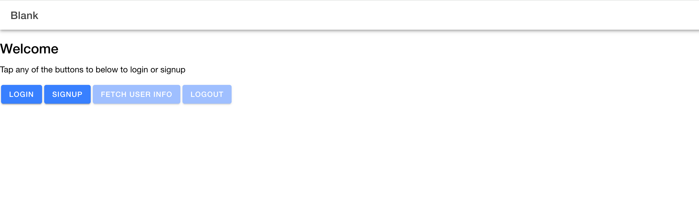
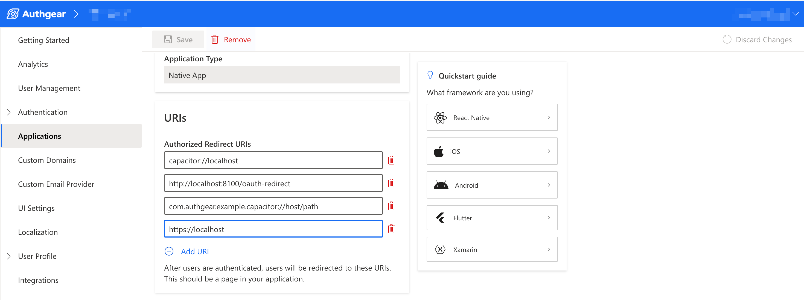

# Ionic SDK

[](https://raw.githubusercontent.com/authgear/docs/refs/heads/main/get-started/native-mobile-app/ionic-sdk.md)

In this post, you'll learn how to use Authgear with your Ionic project using the Authgear Ionic SDK.


You can find the full code for the demo app for this tutorial in [this Github repo](https://github.com/authgear/authgear-example-ionic)


The following are the minimum versions of Android and iOS your native app can target based on the requirement of Capacitor v7:

* iOS 14
* Android 6 (API level 23)

### Objectives (What we'll build)

At the end of this tutorial, we'll build an Ionic app that can do the following:

* Allow users to log in to their account on your Authgear project
* Allow new users to sign up
* Allow signed-in users to view their user info and logout.

The final UI for the app we'll build should look like this:

<figure><figcaption><p>authgear ionic example app landing page</p></figcaption></figure>

### Prerequisites

To follow this guide seamlessly, make sure to have the following:

* Node.js installed on your local machine
* Android Studio (for building the Android client of your application)
* Xcode (for building the iOS client of your application)
* An Authgear account. You can sign up for one for free [here](https://authgear.com/).
* Any code editor (VS Code, Sublime, etc)

Follow this guide to add Authgear to your Ionic app in 🕐 10 minutes.

## Setup Application in  Authgear Portal

In this part, you'll learn how to configure an Authgear client application that you will use in your Ionic project. You'll do this by performing the following steps in the Authgear Portal.

### Step 1: Set up an Authgear Application

First, log in to Authgear Portal at [https://portal.authgear.com/](https://portal.authgear.com/) and select an existing project or create a new one.

In your project, navigate to the **Applications** section then click on **Add Application** to create a new Authgear application. Enter a name for your application and select **Native App** as the Application Type. Next, click **Save** to continue to the configuration page for your new application. Skip the screen that shows you a list of tutorials for different frameworks.

<figure><figcaption><p>Create new authgear client app</p></figcaption></figure>

### Step 2: Add Authorized Redirect URIs

In this step, you'll set up authorized redirect URIs for your application. An authorized redirect URI should be a URI pointing to a page on your Ionic app where you want to redirect users at the end of the authorization flow.

To add a URI, scroll to the **URIs** section of your application configuration page and enter the URI in the text field. You can click the **Add URI** button to add additional URIs.

For our example app, add the following URIs:

* `com.authgear.example.capacitor://host/path`
* `capacitor://localhost`
* `http://localhost:8100/oauth-redirect`
* `https://localhost`

<figure><figcaption><p>authgear-app-redirect-uris</p></figcaption></figure>

Once you're done, click on the **Save** button.

## Add Authgear to an Ionic App

Now that you have your Authgear application configured, we can proceed with creating the Ionic application that will have all the features stated in our objective earlier.

For this tutorial, we'll be implementing an Ionic app using React.

### Step 1: Create Ionic Project

Before you can create an Ionic project, install the Ionic CLI on your computer by running the following command in Terminal or Command Prompt:

```sh
npm install -g @ionic/cli native-run cordova-res
```

Now create a new Ionic project by running the following command:

```sh
ionic start authgear-ionic-example --type=react --capacitor
```

After running the above command, follow the wizard to create a new **blank project**.

Next, open your new project in a code editor and update for `appId` in **capacitor.config.ts** to the following value:

```typescript
appId: 'com.authgear.example.capacitor',
```

This new value for `appId` is the same value we used in the authorized redirect URI earlier.


**Note:** It is important that you update the value for `appId` before you create the Android and iOS projects for your Ionic application. Doing this will enable Capacitor to create your Android and iOS project with the value for appId as the package name and app ID.


Run the following command from the root directory of your new Ionic project to preview your blank project on a browser:

```sh
ionic serve
```

Finally, create the Android and iOS projects for your app by running the following commands from your Ionic project's root folder:

First, install the Android and iOS platforms:

```sh
npm i @capacitor/android @capacitor/ios
```

Then, create the projects:

```sh
npx cap add android
npx cap add ios
```

### Step 2: Install Authgear SDK

In this step, you'll install the Authgear SDK for Ionic (Capacitor) and the Javascript SDK for the web. The web SDK will help you test your application on a web browser.

To install the SDKs, run the following commands in your Terminal or Command Prompt:

**Authgear Ionic SDK**

```bash
npm i @authgear/capacitor
```

**Authgear Web SDK**

```sh
npm i @authgear/web
```

### Step 3: Configure Authgear SDK

In this step, you'll learn how to configure your Ionic project using the details from your Authgear application configuration.

To get started, open **src/pages/Home.tsx** in your code editor then import the Authgear SDK by adding the following code to the top of the file:

```typescript
import authgearWeb, {
  SessionState,
  WebContainer,
  SessionStateChangeReason,
} from "@authgear/web";
import authgearCapacitor, {
  CapacitorContainer,
  Page,
} from "@authgear/capacitor";
```

The above code imports all the components of the Authgear SDK we need for our example app.

Because Ionic apps can run on the web and native mobile platforms, we had to import both Authgear web and Authgear Capacitor SDKs.

Next, add the following constants to **Home.tsx** just below the last import statements:

```typescript
const CLIENT_ID = "<ClIENT_ID>";
const ENDPOINT = "<AUTHGEAR_ENDPOINT>";
const REDIRECT_URI_WEB_AUTHENTICATE = "http://localhost:8100/oauth-redirect";
const REDIRECT_URI_CAPACITOR = "com.authgear.example.capacitor://host/path";
const REDIRECT_URI_WEB_REAUTH = "http://localhost:8100/reauth-redirect";
```

Update the values for the constants (`CLIENT_ID`, `ENDPOINT`)  to the correct values from your client application's configuration page in the Authgear Portal.

Now, just below the constants, add this small utility function that will help to check whether your Ionic app is running natively or on a web browser:

```typescript
function isPlatformWeb(): boolean {
  return Capacitor.getPlatform() === "web";
}
```

Import Capacitor by adding the following to the import section at the top of **Home.tsx**:

```typescript
import { Capacitor } from "@capacitor/core";
```

You will use the above function to determine which instance of the Authgear SDK to call based on the current platform a user is on.

Now implement a new `AuthenticationScreen` component in **Home.tsx** by pasting the following code:

```typescript
function AuthenticationScreen() {

  const [sessionState, setSessionState] = useState<SessionState | null>(() => {
    if (isPlatformWeb()) {
      return authgearWeb.sessionState;
    }
    return authgearCapacitor.sessionState;
  });

  const loggedIn = sessionState === "AUTHENTICATED";
  
  const delegate = useMemo(() => {
    const d = {
      onSessionStateChange: (
        container: WebContainer | CapacitorContainer,
        _reason: SessionStateChangeReason
      ) => {
        setSessionState(container.sessionState);
      },
    };
    return d;
  }, [setSessionState]);
  
    useEffect(() => {
    if (isPlatformWeb()) {
      authgearWeb.delegate = delegate;
    } else {
      authgearCapacitor.delegate = delegate;
    }
  
    return () => {
      if (isPlatformWeb()) {
        authgearWeb.delegate = undefined;
      } else {
        authgearCapacitor.delegate = undefined;
      }
    };
  }, [delegate]);

  return (
    <>
      <div className="container">
          
      </div>
    </>
  );
}
```

Import `useState`, `useMemo`, `useEffect` and `useCallback` at the top of **Home.tsx**:

```typescript
import React, { useState, useEffect, useCallback, useMemo } from "react";
```

The above code also implements a `sessionState` constant and a delegate to let your app know when a user's session state changes.

Next, add the following `configure()` method to the `AuthenticationScreen()` component just before the return statement:

```typescript
const configure = useCallback(async () => {
  try {
    if (isPlatformWeb()) {
      await authgearWeb.configure({
        clientID: CLIENT_ID,
        endpoint: ENDPOINT,
        sessionType: "refresh_token",
        isSSOEnabled: false,
      });
    } else {
      await authgearCapacitor.configure({
        clientID: CLIENT_ID,
        endpoint: ENDPOINT,
      });
    }
    await postConfigure();
  } catch (e) {
    console.error("Authgear Configuration error:", e);
  } 
}, [CLIENT_ID, ENDPOINT]);
```

The above code configures a new instance of the Authgear SDK using the **Client ID** and **Endpoint** for the Authgear client application we created in the first part of this guide.

Next, implement the `postConfigure()` method that was called in the configure() method:

```typescript
const postConfigure = useCallback(async () => {
  const sessionState = isPlatformWeb()
    ? authgearWeb.sessionState
    : authgearCapacitor.sessionState;

  // if user has an existing session, call SDK fetchUserInfo method to get the user's info and refresh access token when necessary
  if (sessionState === "AUTHENTICATED") {
    if (isPlatformWeb()) {
      await authgearWeb.fetchUserInfo();
    } else {
      await authgearCapacitor.fetchUserInfo();
    }
  }
}, []);
```

The `postConfigure()` method checks if the user is already authenticated and calls the fetchUserInfo() method of the Authgear SDK. Calling the fetchUserInfo() method will refresh the user's access token if it is expired.

Now, call the **configure()** method in `useEffect` by adding the following code after the  `postConfigure()` method:&#x20;

```typescript
useEffect(() => {
  configure();
}, []);
```

The above `useEffect` will initialize Authgear on page load.

### Step 4: Add Login Button

In this step, we'll add the Login button and the UI components we want to show authenticated users.

Add the following code to the `<div>` inside the return statement of the `AuthenticationScreen` component:

```tsx
<h1>
  Welcome
</h1>
{!loggedIn ? (
    <IonButton
    className="button"
    // disabled={!initialized || loading || loggedIn}
    onClick={
        (event) => {
            onClickAuthenticate(event, "login")
        }
    }
    >
    Login
</IonButton>
):
(
    <div>
        <p>Welcome user</p>
    </div>
)}
```

Import `IonButton` by adding it to the import for other Ionic components in our app:

```typescript
import { IonContent, IonHeader, IonPage, IonTitle, IonToolbar, IonButton } from '@ionic/react';
```

Finally, add the `<AuthenticationScreen/>` component to the Home component:

```typescript
const Home: React.FC = () => {
  return (
    <IonPage>
      <IonHeader>
        <IonToolbar>
          <IonTitle>Blank</IonTitle>
        </IonToolbar>
      </IonHeader>
      <IonContent fullscreen>
        <IonHeader collapse="condense">
          <IonToolbar>
            <IonTitle size="large">Blank</IonTitle>
          </IonToolbar>
        </IonHeader>
        <AuthenticationScreen />
      </IonContent>
    </IonPage>
  );
};
```

### Step 5: Start Authentication

Here, we'll implement an `authenticate()` method inside the `AuthenticationScreen` component we created in the previous step.

To do this, first, add the following code just before the return statement of the `AuthenticationScreen()` component:

```typescript
const authenticate = useCallback(async (page: string) => {
  try {
    if (isPlatformWeb()) {
      authgearWeb.startAuthentication({
        redirectURI: REDIRECT_URI_WEB_AUTHENTICATE,
        page: page,
      });
    } else {
      const result = await authgearCapacitor.authenticate({
        redirectURI: REDIRECT_URI_CAPACITOR,
        page: page,
      });
    }
  } catch (e) {
    console.error("Authentication error:", e);
  } 
}, []);
```

Calling this `authenticate()` method will initialize an authentication flow. The `page` parameter can be used to specify whether to start the authentication flow on the `login` page or `signup` page.

Finally, implement a  `onClickAuthenticate()` method that will call `authenticate` when the Login button is pressed:

```typescript
const onClickAuthenticate = useCallback(
  (e: MouseEvent<HTMLIonButtonElement>, page: string) => {
    e.preventDefault();
    e.stopPropagation();

    authenticate(page);
  },
  [authenticate]
);
```

Import `MouseEvent`:

```typescript
import type { MouseEvent } from "react";
```

#### Checkpoint

At this point, the complete code for **Home.tsx** should look like this:

```typescript
import {
  IonContent,
  IonHeader,
  IonPage,
  IonTitle,
  IonToolbar,
  IonButton,
} from "@ionic/react";

import React, { useState, useEffect, useCallback, useMemo } from "react";
import { Capacitor } from "@capacitor/core";
import type { MouseEvent } from "react";

import authgearWeb, {
  SessionState,
  WebContainer,
  SessionStateChangeReason,
} from "@authgear/web";
import authgearCapacitor, {
  CapacitorContainer,
  Page,
} from "@authgear/capacitor";
import "./Home.css";

const CLIENT_ID = <ClIENT_ID>";
const ENDPOINT = "<AUTHGEAR_ENDPOINT>";
const REDIRECT_URI_WEB_AUTHENTICATE = "http://localhost:8100/oauth-redirect";
const REDIRECT_URI_CAPACITOR = "com.authgear.example.capacitor://host/path";

function isPlatformWeb(): boolean {
  return Capacitor.getPlatform() === "web";
}

function AuthenticationScreen() {
  const [sessionState, setSessionState] = useState<SessionState | null>(() => {
    if (isPlatformWeb()) {
      return authgearWeb.sessionState;
    }
    return authgearCapacitor.sessionState;
  });

  const loggedIn = sessionState === "AUTHENTICATED";
  const delegate = useMemo(() => {
    const d = {
      onSessionStateChange: (
        container: WebContainer | CapacitorContainer,
        _reason: SessionStateChangeReason
      ) => {
        setSessionState(container.sessionState);
      },
    };
    return d;
  }, [setSessionState]);
  
  useEffect(() => {
    if (isPlatformWeb()) {
      authgearWeb.delegate = delegate;
    } else {
      authgearCapacitor.delegate = delegate;
    }
    
    return () => {
      if (isPlatformWeb()) {
        authgearWeb.delegate = undefined;
      } else {
        authgearCapacitor.delegate = undefined;
      }
    };
  }, [delegate]);

  const configure = useCallback(async () => {
    try {
      if (isPlatformWeb()) {
        await authgearWeb.configure({
          clientID: CLIENT_ID,
          endpoint: ENDPOINT,
          sessionType: "refresh_token",
          isSSOEnabled: false,
        });
      } else {
        await authgearCapacitor.configure({
          clientID: CLIENT_ID,
          endpoint: ENDPOINT,
        });
      }
      await postConfigure();
    } catch (e) {
      console.error("Authgear Configuration error:", e);
    } 
  }, [CLIENT_ID, ENDPOINT]);

  const postConfigure = useCallback(async () => {
    const sessionState = isPlatformWeb()
      ? authgearWeb.sessionState
      : authgearCapacitor.sessionState;

    // if user has an existing session, call SDK fetchUserInfo method to get the user's info and refresh access token when necessary
    if (sessionState === "AUTHENTICATED") {
      if (isPlatformWeb()) {
        await authgearWeb.fetchUserInfo();
      } else {
        await authgearCapacitor.fetchUserInfo();
      }
    }
  }, []);

  useEffect(() => {
    configure();
  }, []);

  const authenticate = useCallback(async (page: string) => {
    try {
      if (isPlatformWeb()) {
        authgearWeb.startAuthentication({
          redirectURI: REDIRECT_URI_WEB_AUTHENTICATE,
          page: page,
        });
      } else {
        const result = await authgearCapacitor.authenticate({
          redirectURI: REDIRECT_URI_CAPACITOR,
          page: page,
        });
      }
    } catch (e) {
      console.error("Authentication error:", e);
    } 
  }, []);


  const onClickAuthenticate = useCallback(
    (e: MouseEvent<HTMLIonButtonElement>, page: string) => {
      e.preventDefault();
      e.stopPropagation();

      authenticate(page);
    },
    [authenticate]
  );

  return (
    <>
      <div className="container">
        <h1>Welcome</h1>
        {!loggedIn ? (
          <IonButton
            className="button"
            onClick={(event) => {
              onClickAuthenticate(event, "login");
            }}
          >
            Login
          </IonButton>
        ) : (
          <div>
            <p>Welcome user</p>
          </div>
        )}
      </div>
    </>
  );
}
const Home: React.FC = () => {
  return (
    <IonPage>
      <IonHeader>
        <IonToolbar>
          <IonTitle>Blank</IonTitle>
        </IonToolbar>
      </IonHeader>
      <IonContent fullscreen>
        <IonHeader collapse="condense">
          <IonToolbar>
            <IonTitle size="large">Blank</IonTitle>
          </IonToolbar>
        </IonHeader>
        <AuthenticationScreen />
      </IonContent>
    </IonPage>
  );
};

export default Home;

```

Save your work and run the command to serve your project on the web or [build it for iOS or Android](ionic-sdk.md#step-10-deploy-app-to-mobile).

You should be able to see the Authentication UI after you click on the Login button. However, you can't complete the authentication flow because we're yet to handle the redirect.

### Step 6: Handle Redirect in App

At the end of an authentication flow, your users will be redirected to the URL you specified in `redirectURI`. In this step, we'll set up the routes and code to process redirects to the URIs.

To handle redirect on web, create a new file **OAuthRedirect.tsx** in **src/pages/** and add the following code to it:

```typescript
import { useCallback, useEffect } from "react";
import authgearWeb from "@authgear/web";
import { useIonRouter } from "@ionic/react";

export default function OAuthRedirect() {
  const router = useIonRouter();

  const finishAuthentication = useCallback(async () => {
    const CLIENT_ID = "<ClIENT_ID>";
    const ENDPOINT = "<AUTHGEAR_ENDPOINT>";

    try {
      await authgearWeb.configure({
        clientID: CLIENT_ID,
        endpoint: ENDPOINT,
        sessionType: "refresh_token",
      });
      await authgearWeb.finishAuthentication();
      router.push("/", "root", "replace");
    } catch (e) {
      console.error(e);
    }
  }, [router]);

  useEffect(() => {
    finishAuthentication();
  }, [finishAuthentication]);

  return (
    <div>
      Finishing authentication. Open the inspector to see if there is any error.
    </div>
  );
}
```

Change the values for `CLIENT_ID` and `ENDPOINT` in the above code to the correct value from your Authgear application configuration page.

Now open **src/App.tsx** and create a new route for `OAuthRedirect` using the following code:

```typescriptreact
<Route exact path="/oauth-redirect">
    <OAuthRedirect />
</Route>
```

Remember to import `OAuthRedirect` in **App.tsx:**

```typescript
import OAuthRedirect from './pages/OAuthRedirect';
```

To handle redirect in the Android project, add the following code to **android/app/src/main/AndroidManifest.xml**:

```xml
<!-- Authgear SDK -->
<activity
    android:name="com.authgear.capacitor.OAuthRedirectActivity"
    android:launchMode="singleTask"
    android:exported="true">
    <intent-filter>
        <action android:name="android.intent.action.VIEW" />
        <category android:name="android.intent.category.DEFAULT" />
        <category android:name="android.intent.category.BROWSABLE" />
        <!-- Configure data to be the exact redirect URI your app uses. -->
        <!-- NOTE: The redirectURI supplied in AuthenticateOptions has to match as well -->
        <data
            android:host="host"
            android:pathPrefix="/path"
            android:scheme="com.authgear.example.capacitor" />
    </intent-filter>
</activity>
```

At this point, if you build your project and run it, you should be able to login successfully.

### Step 7: Implement Logout

To implement Logout, we'll add a Logout button, an onClick handler, and a method that will call the logout() method of the Authgear SDK.

Add a Logout button to `AuthenticationScreen` component just below `<p>Welcome user</p>`:

```tsx
<IonButton className="button" onClick={onClickLogout}>
    Logout
</IonButton>
```

Next, add a `logout()` method to `AuthenticationScreen` component:

```typescript
const logout = useCallback(async () => {
  try {
    if (isPlatformWeb()) {
      await authgearWeb.logout({
        redirectURI: window.location.origin + "/",
      });
    } else {
      await authgearCapacitor.logout();
    }
  } catch (e) {
    console.error("Logout error:", e);
  } 
}, []);
```

Finally, implement the onClick method in `AuthenticationScreen` :

```typescript
const onClickLogout = useCallback(
  (e: MouseEvent<HTMLIonButtonElement>) => {
    e.preventDefault();
    e.stopPropagation();

    logout();
  },
  [logout]
);
```

### Step 8: Get UserInfo

The Authgear SDK offers a `fetchUserInfo()` method that can return details such as User ID, email, phone number, and so on about the current user. In this step, we'll demonstrate how to call `fetchUserInfo` in our app.

First, add a  **Fetch User Info** button to your `AuthenticationScreen` component just below the Logout button:

```tsx
<IonButton className="button" onClick={onClickFetchUserInfo}>
  Fetch User Info
</IonButton>
```

Next, add a `fetchUserInfo()` method to the `AuthenticationScreen` component:

```typescript
const fetchUserInfo = useCallback(async () => {
  try {
    const authgear = isPlatformWeb() ? authgearWeb : authgearCapacitor;
    const userInfo = await authgear.fetchUserInfo();
    alert(JSON.stringify(userInfo, null, 2)); // Keep for demonstration, but consider a better way to display info
  } catch (e) {
    console.error("FetchUserInfo error:", e);
  } 
}, []);
```

Finally, add the method that will handle click on the **Fetch User Info** button:

```typescript
const onClickFetchUserInfo = useCallback(
  (e: MouseEvent<HTMLIonButtonElement>) => {
    e.preventDefault();
    e.stopPropagation();

    fetchUserInfo();
  },
  [fetchUserInfo]
);
```

### Step 9: Open User Settings Screen

Authgear provides a default User Settings page where your users can view details about their profile and change details or security settings like their password.

To allow users to open the settings page from your app, first add a **User Settings** button to you r `AuthenticationScreen` component just below the **Fetch User Info** button:

```tsx
<IonButton
    className="button"
    onClick={onClickUserSettings}
    >
    User Settings
</IonButton>
```

Now add an  `openUserSettings()` method in `AuthenticationScreen` component:

```typescript
const openUserSettings = useCallback(async () => {
  try {
    if (isPlatformWeb()) {
      authgearWeb.open(Page.Settings);
    } else {
      authgearCapacitor.open(Page.Settings);
    }
  } catch (e) {
    console.error("Error:", e)
  } 
}, []);
```

Finally, implement the onClick method for the **User Settings** button:

```typescript
const onClickUserSettings = useCallback(
  (e: MouseEvent<HTMLIonButtonElement>) => {
    e.preventDefault();
    e.stopPropagation();

    openUserSettings();
  },
  [logout]
);
```

### Step 10: Deploy app to mobile

To deploy your app to a mobile device (for example Android) run the following commands:

First build your project by running:

```sh
npm run build
```

Then sync the changes to the mobile project using this command:

```sh
npx cap sync
```

You can run the project by opening the `android` project folder in Android Studio or `ios` folder in Xcode.

You can quickly open the project in Android Studio using the following command:

```sh
npx cap open android
```

Or run the following command to open your project in Xcode for iOS:

```sh
npx cap open ios
```

Once your project builds successfully, you can try the Login, Signup, Fetch User Info, and Logout buttons.

## Conclusion

Authgear Capacitor SDK makes it easier to use Authgear in your Ionic application. It provides many helpful methods and interfaces for interacting with the Authgear service from your Ionic application. To learn more about the SDK check [the SDK Reference](https://authgear.github.io/authgear-sdk-js/docs/capacitor/). Also, check out the complete repo for the Authgear Ionic SDK example app [here](https://github.com/authgear/authgear-sdk-js/tree/master/example/capacitor).
