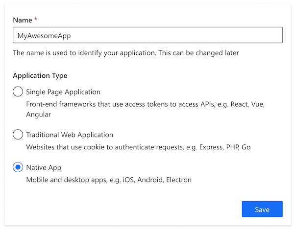
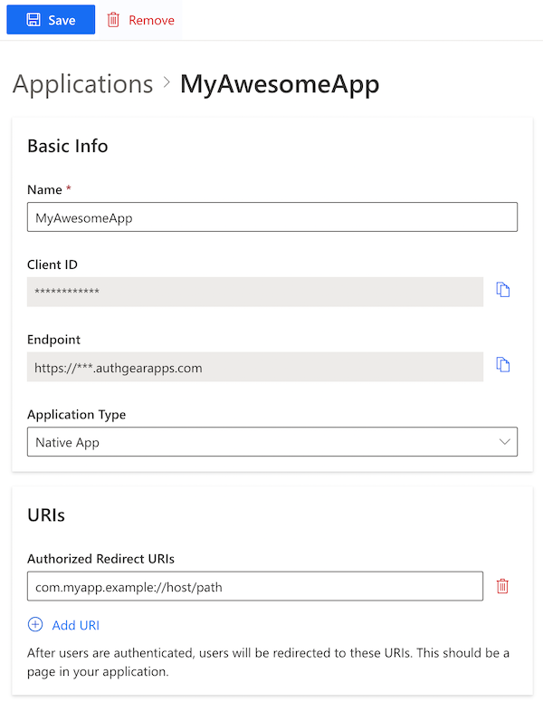

# iOS SDK

This guide provides instructions on integrating Authgear with an iOS app. Supported platforms include:

* iOS 11.0 or higher

## Setup Application in Authgear

Signup for an Authgear Portal account in [https://portal.authgear.com/](https://portal.authgear.com). Or you can use your self-deployed Authgear.

From the Project listing, create a new Project or select an existing Project. After that, we will need to create an application in the project.



**Step 1: Create an application in the Portal**

1. Go to **Applications** on the left menu bar.
2. Click **⊕Add Application** in the top tool bar.
3. Input the name of your application and select **Native App** as the application type. Click "Save".
4. You will see a list of guides that can help you for setting up, then click "Next".



**Step 2: Configure the application**

1. In your IDE (e.g. XCode), define a custom URI scheme that the users will be redirected back to your app after they have authenticated with Authgear, e.g. `com.myapp.example://host/path`.\[^1]
2. Head back to Authgear Portal, fill in the Redirect URI that you have defined in the previous steps.
3. Click "Save" in the top tool bar and keep the **Client ID**. You can also obtain it again from the Applications list later.




If you wish to [validate JSON Web Token (JWT) in your own application server](https://github.com/authgear/docs/blob/master/backend-integration/jwt/README.md), turn on "Issue JWT as access token".\[^2] If you wish to [forward authentication requests to Authgear Resolver Endpoint](https://github.com/authgear/docs/blob/master/backend-integration/nginx/README.md), leave this unchecked. See comparisons in [Backend Integration](https://github.com/authgear/docs/blob/master/backend-integration/README.md).






```
oauth:
  clients:
    - name: your_app_name
      client_id: a_random_generated_string
      redirect_uris:
        - "com.myapp://host/path"
      grant_types:
        - authorization_code
        - refresh_token
      response_types:
        - code
        - none
```



## Install the SDK

### CocoaPods

```swift
pod 'Authgear', :git => 'https://github.com/authgear/authgear-sdk-ios.git'
```

### Swift Package Manager

```swift
dependencies: [
    .package(url: "https://github.com/authgear/authgear-sdk-ios.git")
]
```

## Register URL Scheme for Redirect URI

In your application's `Info.plist` , register your custom URL scheme, (e.g. `com.myapp`).

```markup
<?xml version="1.0" encoding="UTF-8"?>
<!DOCTYPE plist PUBLIC "-//Apple//DTD PLIST 1.0//EN" "http://www.apple.com/DTDs/PropertyList-1.0.dtd">
<plist version="1.0">
    <dict>
        <!-- Other entries -->
        <key>CFBundleURLTypes</key>
        <array>
            <dict>
                <key>CFBundleTypeRole</key>
                <string>Editor</string>
                <key>CFBundleURLSchemes</key>
                <array>
                    <string>{YOUR_CUSTOM_URL_SCHEME}</string>
                </array>
            </dict>
        </array>
    </dict>
</plist>
```

## Configuration Authgear SDK

SDK must be properly configured before use.

```swift
// your_app_endpoint should looks like this https://<yourapp>.authgear.cloud
let authgear = Authgear(clientId: "{your_clien_id}", endpoint: "{your_app_endpoint}")
authgear.configure() { result in
    switch result {
    case .success():
        // configured successfully
    case let .failure(error):
        // failed to configured
    }
}
```

## Trigger authenticate

When the user clicks login/signup on your app, you can use the following code to start authorization.

```swift
// your_redirect_uri is redirect uri registered on the applications page
// e.g. com.myapp://host/path
authgear.authenticate(redirectURI: "{your_redirect_uri}", handler: { result in
    switch result {
    case let .success(userInfo):
        // login successfully
    case let .failure(error):
        if let authgearError = error as? AuthgearError, case .cancel = authgearError {
            // user cancel
        } else {
            // Something went wrong
        }
    }
})
```

Your user is now logged in!

## Get the Logged In State

When you start launching the application. You may want to know if the user has logged in. (e.g. Show users the login page if they haven't logged in). The `sessionState` reflects the user logged in state in the SDK local state. That means even the `sessionState` is `.authenticated`, the session may be invalid if it is revoked remotely. After initializing the Authgear SDK, call `fetchUserInfo` to update the `sessionState` as soon as it is proper to do so.

```swift
// After authgear.configure, it only reflect SDK local state.
// value can be .noSession or .authenticated
var sessionState = authgear.sessionState

authgear.fetchUserInfo { userInfoResult in
    // sessionState is now up to date
    // it will change to .noSession if the session is invalid
    sessionState = authgear.sessionState

    switch userInfoResult {
    case let .success(userInfo):
        // read the userInfo if needed
    case let .failure(error):
        // failed to fetch user info
        // the refresh token maybe expired or revoked
}
```

The value of `sessionState` can be `.unknown`, `.noSession` or `.authenticated`. Initially, the `sessionState` is `.unknown`. After a call to `authgear.configure`, the session state would become `.authenticated` if a previous session was found, or `.noSession` if such session was not found.

## Fetching User Info

In some cases, you may need to obtain current user info through the SDK. (e.g. Display email address in the UI). Use the `fetchUserInfo` function to obtain the user info, see [example](../../how-to-guide/user-profiles/user-profile.md#userinfo-endpoint).

## Using the Access Token in HTTP Requests

Call `refreshAccessTokenIfNeeded` every time before using the access token, the function will check and make the network call only if the access token has expired. Include the access token into the Authorization header of your application request.

```swift
authgear.refreshAccessTokenIfNeeded() { result in
    switch result {
    case .success():
        // access token is ready to use
        // accessToken can be empty
        // it will be empty if user is not logged in or session is invalid

        // include Authorization header in your application request
        if let accessToken = authgear.accessToken {
            // example only, you can use your own networking library
            var urlRequest = URLRequest(url: "YOUR_SERVER_URL")
            urlRequest.setValue(
                "Bearer \(accessToken)", forHTTPHeaderField: "authorization")
            // ... continue making your request
        } else {
            // The user is not logged in, or the token is expired.
        }
    case let .failure(error):
        // Something went wrong
    }
}
```

## Logout

To log out the user from the current app session, you need to invoke the`logout`function.

```swift
authgear.logout { result in
    switch result {
        case .success():
            // logout successfully
        case let .failure(error):
            // failed to login
    }
}
```

## Next steps

To protect your application server from unauthorized access. You will need to **integrate your backend with Authgear**.


[Broken link](broken-reference)


## iOS SDK Reference

For detailed documentation on the iOS SDK, visit [iOS SDK Reference](https://authgear.github.io/authgear-sdk-ios/).

### Footnote

\[^1]: For further instruction on setting up custom URI scheme in iOS, see [https://developer.apple.com/documentation/xcode/defining-a-custom-url-scheme-for-your-app](https://developer.apple.com/documentation/xcode/defining-a-custom-url-scheme-for-your-app) \[^2]: For more explanation on JWT, see [https://en.wikipedia.org/wiki/JSON\_Web\_Token](https://en.wikipedia.org/wiki/JSON_Web_Token)
