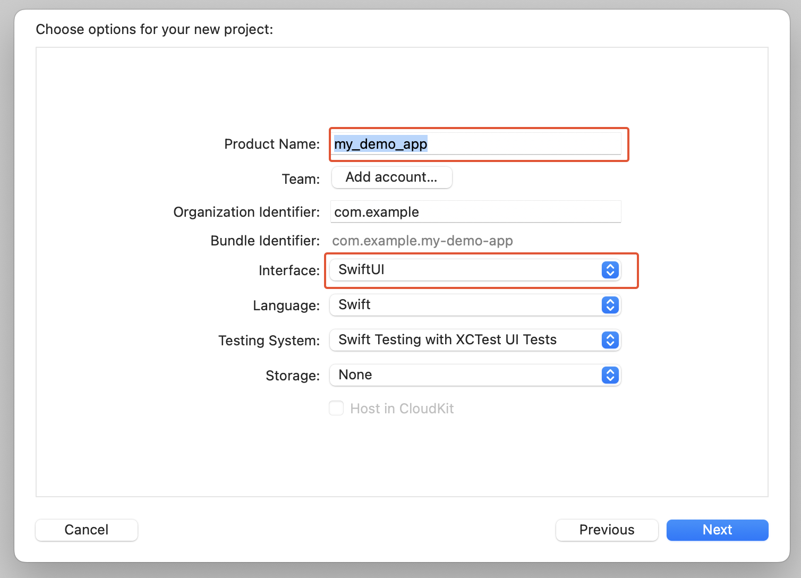
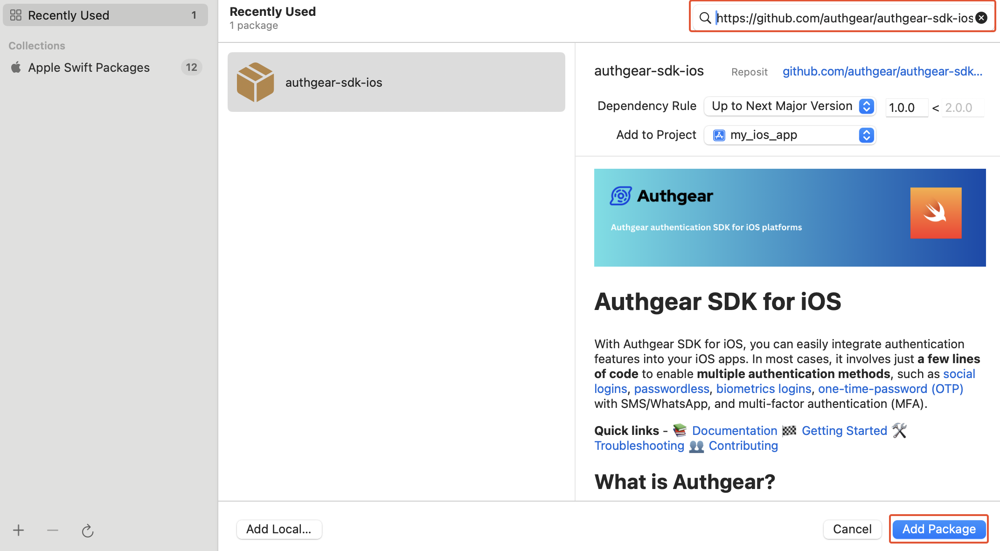
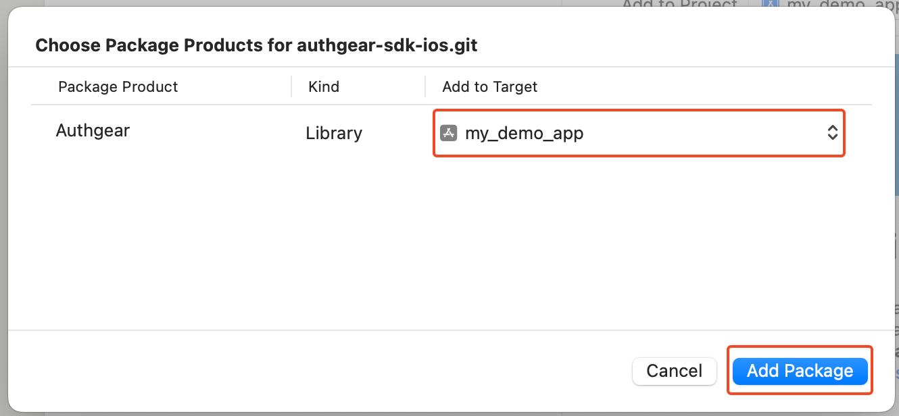
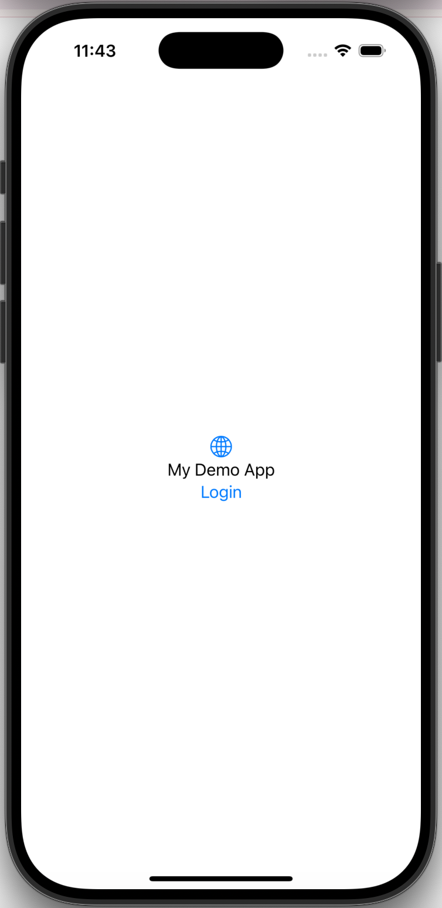
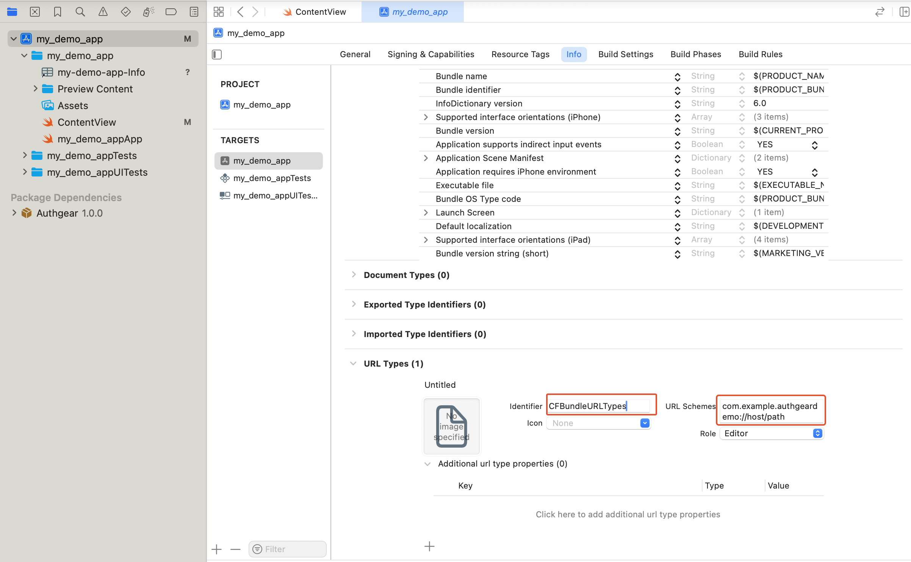

# iOS SDK

This guide provides instructions on integrating Authgear with an iOS app.

The Authgear iOS SDK supports **iOS 11.0 and higher**. This tutorial builds the demo app with Apple's Observation framework (`@Observable`) and Swift Concurrency (`async`/`await`), which require **iOS 17.0 or higher**, **Xcode 16 or later**, and the **Swift 6** language mode. If you need to support older iOS versions, you can apply the same structure using `ObservableObject` and the SDK's completion handlers instead.

Follow this guide to add Authgear to your iOS app in 🕐 10 minutes.


You can find the full code for the demo app for this tutorial in [this Github repo](https://github.com/authgear/authgear-example-ios/)


## Setup Application in Authgear

Sign up for an Authgear Portal account at [https://portal.authgear.com/](https://portal.authgear.com). Or you can use your self-deployed Authgear.

From the Project listing, create a new Project or select an existing Project. After that, we will need to create an Authgear client application in the project.

### **Step 1: Create an application in the Portal**

Go to **Applications** on the left menu bar.

<figure><figcaption></figcaption></figure>

Click **⊕Add Application** in the top toolbar.

Input the name of your application and select **Native App** as the application type. Click "Save".


You will see a list of guides that can help you for setting up, then click "Next".

### **Step 2: Configure the application**

Here you'll need to define a custom URI scheme that Authgear will use to redirect users back to your app after authentication. For our example app, the custom URL scheme is `com.example.authgeardemo`, and the full **Redirect URI** built on top of it is `com.example.authgeardemo://host/path`. For further instructions on setting up a custom URI scheme in iOS, see the official documentation [here](https://developer.apple.com/documentation/xcode/defining-a-custom-url-scheme-for-your-app).

Head back to Authgear Portal, and add `com.example.authgeardemo://host/path` as Redirect URI.

Click "Save" button and note the **Client ID**. and **Endpoint** for your new client application as you'll use them later in your iOS application. You can also obtain the Client ID again from the Applications list later.


## Add Authgear to your iOS Application

In this step, we'll add user authentication to a simple iOS app using the Authgear iOS SDK and the client application we created in the previous steps.

### Pre-requisites

To follow the steps in this guide seamlessly, you should have the following:

* [Xcode](https://developer.apple.com/xcode/) 16 or later
* A project targeting iOS 17.0 or later, using the Swift 6 language mode
* Some knowledge of SwiftUI and Swift Concurrency (`async`/`await`)

### Step 1: Create new iOS project

For the purpose of this guide, we'll create a new project in Xcode. Skip this step if you're adding Authgear to your existing app.

To create a new project, open Xcode and navigate to **File** > **New** > **Project**. Create your new project with the following details:

* **Project Name:** `my_demo_app`
* choose `SwiftUI` as **Interface** Leave other fields unchanged and proceed to create the project.

<figure><figcaption><p>Xcode new project</p></figcaption></figure>

### Step 2: Install Authgear SDK

The Authgear iOS SDK makes it easy to interact with Authgear services from your iOS project.

To add Authgear SDK to your project, in Xcode navigate to **File** > **Add Package Dependencies** and enter `https://github.com/authgear/authgear-sdk-ios.git` in the Package URL text field. Select the **Up to Next Major Version** dependency rule starting from `2.0.0`.

Click **Add Package** to proceed.

<figure><figcaption><p>Xcode package manager</p></figcaption></figure>

On the next screen, select your application under **Add to Target** then click on **Add Package**.

<figure><figcaption><p>xcode add package</p></figcaption></figure>

Alternatively, if your project uses cocoapods, install the SDK using:

```
pod 'Authgear', :git => 'https://github.com/authgear/authgear-sdk-ios.git'
```

### Step 3: Create the authentication model

We'll keep all authentication logic in one place — an `@Observable` model that owns a single `Authgear` instance and exposes a small, UI-friendly state. The view (next step) just renders that state and calls the model's methods.

Create a new Swift file named `AuthenticationModel.swift` and add the following:

```swift
//  AuthenticationModel.swift

import Authgear
import Observation

// Sendable snapshots produced *inside* the SDK's completion handlers so that
// no non-Sendable Authgear type crosses the `await` boundary.
private enum AuthOutcome: Sendable {
    case signedIn(userID: String)
    case cancelled
    case failed(message: String)
}

private enum VoidOutcome: Sendable {
    case ok
    case failed(message: String)
}

@MainActor
@Observable
final class AuthenticationModel {
    enum State: Equatable {
        case loading
        case signedOut
        case signedIn(userID: String)
    }

    private(set) var state: State = .loading

    // Non-nil drives an error alert in the view.
    var errorMessage: String?

    private let authgear: Authgear
    private var didConfigure = false

    init() {
        authgear = Authgear(
            clientId: "<CLIENT_ID>",
            endpoint: "<AUTHGEAR_ENDPOINT>"
        )
    }

    // Configure the SDK once and restore any existing session.
    func configure() async {
        guard !didConfigure else { return }
        didConfigure = true

        let outcome: VoidOutcome = await withCheckedContinuation { continuation in
            authgear.configure { result in
                switch result {
                case .success:
                    continuation.resume(returning: .ok)
                case let .failure(error):
                    continuation.resume(returning: .failed(message: error.localizedDescription))
                }
            }
        }

        switch outcome {
        case .ok:
            // Refresh the session if the user has an existing one.
            if authgear.sessionState == .authenticated {
                await refreshCurrentUser()
            } else {
                state = .signedOut
            }
        case let .failed(message):
            errorMessage = message
            state = .signedOut
        }
    }

    // Start the interactive login flow.
    func logIn() async {
        state = .loading

        let outcome: AuthOutcome = await withCheckedContinuation { continuation in
            authgear.authenticate(redirectURI: "com.example.authgeardemo://host/path") { result in
                switch result {
                case let .success(userInfo):
                    continuation.resume(returning: .signedIn(userID: userInfo.sub))
                case let .failure(error):
                    if let authgearError = error as? AuthgearError,
                       case .cancel = authgearError {
                        continuation.resume(returning: .cancelled)
                    } else {
                        continuation.resume(returning: .failed(message: error.localizedDescription))
                    }
                }
            }
        }

        apply(outcome)
    }

    // Log out and clear the local session.
    func logOut() async {
        state = .loading

        let outcome: VoidOutcome = await withCheckedContinuation { continuation in
            authgear.logout { result in
                switch result {
                case .success:
                    continuation.resume(returning: .ok)
                case let .failure(error):
                    continuation.resume(returning: .failed(message: error.localizedDescription))
                }
            }
        }

        switch outcome {
        case .ok:
            state = .signedOut
        case let .failed(message):
            errorMessage = message
            // The SDK's session state is authoritative after a failed logout.
            if authgear.sessionState == .authenticated {
                await refreshCurrentUser()
            } else {
                state = .signedOut
            }
        }
    }

    // Open the pre-built user settings page.
    func openUserSettings() {
        authgear.open(page: .settings)
    }

    // Refresh the signed-in user's info; downgrades to signed-out if the
    // refresh token is no longer valid.
    private func refreshCurrentUser() async {
        let outcome: AuthOutcome = await withCheckedContinuation { continuation in
            authgear.fetchUserInfo { result in
                switch result {
                case let .success(userInfo):
                    continuation.resume(returning: .signedIn(userID: userInfo.sub))
                case let .failure(error):
                    continuation.resume(returning: .failed(message: error.localizedDescription))
                }
            }
        }

        apply(outcome)
    }

    private func apply(_ outcome: AuthOutcome) {
        switch outcome {
        case let .signedIn(userID):
            state = .signedIn(userID: userID)
        case .cancelled:
            state = .signedOut
        case let .failed(message):
            errorMessage = message
            state = .signedOut
        }
    }
}
```

Replace **"\<CLIENT\_ID>"** and **"\<AUTHGEAR\_ENDPOINT>"** with the client ID and endpoint from the configuration page of the client project you [created earlier](ios.md#step-2-configure-the-application).


**Why the `AuthOutcome` / `VoidOutcome` enums?** The Authgear SDK ships completion-handler APIs, and its result types (`UserInfo`, `SessionState`, `AuthgearError`) are not `Sendable`. To stay clean under the Swift 6 language mode, each call is wrapped with `withCheckedContinuation`, and the completion closure captures **only** the continuation and resumes with a small `Sendable` value extracted inside the closure. That way no non-`Sendable` SDK type crosses the `await` boundary, so the model compiles under strict concurrency checking without extra annotations.

In the demo app repo, the client ID, endpoint, and redirect URI are factored into a small `Constants.swift` enum instead of being hard-coded in the initializer — a good pattern for real projects.


Here's what each method does:

* `configure()` — initializes the SDK once (guarded by `didConfigure`) and, if a previous session exists, refreshes it so returning users land straight on the signed-in screen.
* `logIn()` — runs the interactive authentication flow. User cancellation is handled distinctly from real errors, so cancelling the login sheet doesn't raise an error alert.
* `logOut()` — ends the current session. On failure it treats the SDK's `sessionState` as authoritative rather than assuming the user is signed out.
* `openUserSettings()` — opens Authgear's pre-built User Settings page, where users can view and modify their profile attributes and security settings.
* `refreshCurrentUser()` — calls `fetchUserInfo` to update `sessionState` and retrieve the user's `sub` (a unique user ID). This also detects a session that has been revoked remotely: `sessionState` becomes `.noSession` and the model drops back to signed-out.

### Step 4: Build the ContentView

Now replace the contents of `ContentView.swift` with a state-driven view that observes the model. It triggers `configure()` from `.task` when the view first appears, wraps the async actions in `Task {}`, and surfaces any `errorMessage` with an `.alert`:

```swift
//  ContentView.swift

import SwiftUI

struct ContentView: View {
    @State private var model = AuthenticationModel()

    var body: some View {
        VStack(spacing: 16) {
            switch model.state {
            case .loading:
                ProgressView()
            case .signedOut:
                signedOutView
            case let .signedIn(userID):
                signedInView(userID: userID)
            }
        }
        .padding()
        .task {
            await model.configure()
        }
        .alert(
            "Something went wrong",
            isPresented: Binding(
                get: { model.errorMessage != nil },
                set: { isPresented in
                    if !isPresented { model.errorMessage = nil }
                }
            ),
            presenting: model.errorMessage
        ) { _ in
            Button("OK", role: .cancel) {}
        } message: { message in
            Text(message)
        }
    }

    private var signedOutView: some View {
        VStack(spacing: 16) {
            Image(systemName: "globe")
                .imageScale(.large)
                .foregroundStyle(.tint)
            Text("My Demo App")
            Button("Login") {
                Task { await model.logIn() }
            }
        }
    }

    private func signedInView(userID: String) -> some View {
        VStack(spacing: 16) {
            Text("Welcome user \(userID)")
            Button("User Settings") {
                model.openUserSettings()
            }
            Button("Logout") {
                Task { await model.logOut() }
            }
        }
    }
}

#Preview {
    ContentView()
}
```

The view has no direct SDK calls — it only reads `model.state` and invokes the model's methods. When signed out it shows the **Login** button; while an operation is in flight it shows a `ProgressView`; once signed in it greets the user and offers **User Settings** and **Logout**.

#### Checkpoint

Run your app now. It should launch and settle on the **Login** screen. Tapping **Login** will attempt to open the authentication page — but it won't return to your app yet. We'll register the redirect URI scheme next.

<figure><figcaption></figcaption></figure>

### Step 5: Register the URI Scheme for the Redirect URI

For Authgear to redirect back into your app after authentication, register the custom URL **scheme** — the part of the redirect URI before `://`. For our redirect URI `com.example.authgeardemo://host/path`, the scheme is `com.example.authgeardemo`.

Open your project's `Info.plist` or project settings UI in Xcode and add the following:



Navigate to **Targets** > **{Your project}** > **Info** and expand the **URL Types** section.

Add a new URL scheme with the following details:

**Identifier**: `CFBundleURLTypes`

**URL Schemes**: `com.example.authgeardemo`

**Role**: Editor

<figure><figcaption><p>xcode project properties</p></figcaption></figure>



<pre><code>&#x3C;?xml version="1.0" encoding="UTF-8"?>
&#x3C;!DOCTYPE plist PUBLIC "-//Apple//DTD PLIST 1.0//EN" "http://www.apple.com/DTDs/PropertyList-1.0.dtd">
&#x3C;plist version="1.0">
<strong>    &#x3C;dict>
</strong>        &#x3C;!-- Other entries -->
        &#x3C;key>CFBundleURLTypes&#x3C;/key>
        &#x3C;array>
            &#x3C;dict>
                &#x3C;key>CFBundleTypeRole&#x3C;/key>
                &#x3C;string>Editor&#x3C;/string>
                &#x3C;key>CFBundleURLName&#x3C;/key>
                &#x3C;string>CFBundleURLTypes&#x3C;/string>
                &#x3C;key>CFBundleURLSchemes&#x3C;/key>
                &#x3C;array>
                    &#x3C;string>com.example.authgeardemo&#x3C;/string>
                &#x3C;/array>
            &#x3C;/dict>
        &#x3C;/array>
    &#x3C;/dict>
&#x3C;/plist>
</code></pre>




Register the bare scheme `com.example.authgeardemo` in `CFBundleURLSchemes` — **not** the full redirect URI `com.example.authgeardemo://host/path`. `CFBundleURLSchemes` expects only the scheme (the text before `://`). The full redirect URI is what you register in the Authgear Portal and pass to `authenticate(redirectURI:)`.


### Step 6: Run and test

Run your app again and try logging in. Because the redirect scheme is now registered, Authgear will redirect back to your app after authentication and the view will switch to the signed-in screen.

Try the full flow:

* **Login** — completes authentication and shows "Welcome user &#x3C;sub>".
* **User Settings** — opens Authgear's pre-built settings page.
* **Logout** — ends the session and returns to the Login screen.

If configuration fails (for example, a wrong endpoint) or authentication errors out, the `.alert` you added in Step 4 surfaces the message instead of failing silently.

## Understanding session state

You may want to know whether the user has logged in (for example, to show a Login button only when they haven't).

The `sessionState` reflects the user's logged-in state in the SDK's local state. Even if `sessionState` is `.authenticated`, the session may be invalid if it was revoked remotely. Hence, after initializing the SDK, call `fetchUserInfo` to update `sessionState` as soon as it is proper to do so — which is exactly what `configure()` → `refreshCurrentUser()` does in the model above.

The value of `sessionState` can be `.unknown`, `.noSession` or `.authenticated`. Initially it is `.unknown`. After a call to `authgear.configure`, it becomes `.authenticated` if a previous session was found, or `.noSession` if no such session existed.

## Using the Access Token in HTTP Requests

Call `refreshAccessTokenIfNeeded` every time before using the access token; it checks and makes a network call only if the access token has expired. Then include the access token in the `Authorization` header of your request. As with the other SDK calls, you can bridge the completion handler into `async`/`await` with a continuation:

```swift
func callProtectedAPI() async throws {
    try await withCheckedThrowingContinuation { (continuation: CheckedContinuation<Void, Error>) in
        authgear.refreshAccessTokenIfNeeded { result in
            continuation.resume(with: result)
        }
    }

    // The access token is ready to use. It can be empty if the user is not
    // logged in or the session is invalid.
    guard let accessToken = authgear.accessToken else {
        // The user is not logged in, or the token is expired.
        return
    }

    // Example only — use your own networking library.
    var urlRequest = URLRequest(url: URL(string: "YOUR_SERVER_URL")!)
    urlRequest.setValue("Bearer \(accessToken)", forHTTPHeaderField: "authorization")
    // ... continue making your request
}
```

## Next steps

To protect your application server from unauthorized access. You will need to **integrate your backend with Authgear**.


[backend-api](../backend-api/)


## iOS SDK Reference

For detailed documentation on the iOS SDK, visit [iOS SDK Reference](https://authgear.github.io/authgear-sdk-ios/).
