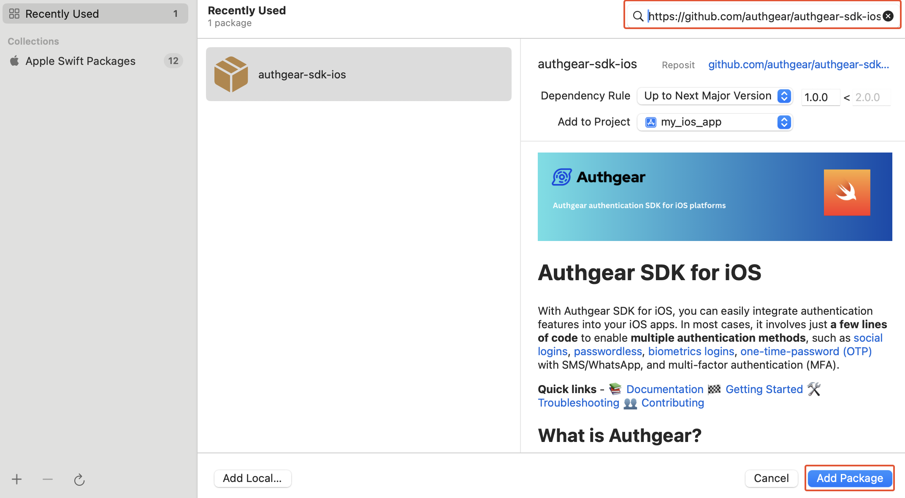

# iOS SDK

This guide provides instructions on integrating Authgear with an iOS app. Supported platforms include:

* iOS 11.0 or higher

Follow this guide to add Authgear to your iOS app in 🕐 10 minutes.


You can find the full code for the demo app for this tutorial in [this Github repo](https://github.com/authgear/authgear-example-ios/)


## Setup Application in Authgear

Sign up for an Authgear Portal account at [https://portal.authgear.com/](https://portal.authgear.com). Or you can use your self-deployed Authgear.

From the Project listing, create a new Project or select an existing Project. After that, we will need to create an Authgear client application in the project.

### **Step 1: Create an application in the Portal**

Go to **Applications** on the left menu bar.

<figure><figcaption></figcaption></figure>

Click **⊕Add Application** in the top toolbar.

Input the name of your application and select **Native App** as the application type. Click "Save".

.png>)

You will see a list of guides that can help you for setting up, then click "Next".

### **Step 2: Configure the application**

Here you'll need to define a custom URI scheme that Authgear will use to redirect users back to your app after authentication. For our example app, this URL Scheme will be `com.example.authgeardemo://host/path`. For further instructions on setting up a custom URI scheme in iOS, see the official documentation [here](https://developer.apple.com/documentation/xcode/defining-a-custom-url-scheme-for-your-app).

Head back to Authgear Portal, and add `com.example.authgeardemo://host/path` as Redirect URI.

Click "Save" button and note the **Client ID**. and **Endpoint** for your new client application as you'll use them later in your iOS application. You can also obtain the Client ID again from the Applications list later.

.png>)

## Add Authgear to your iOS Application

In this step, we'll add user authentication to a simple iOS app using the Authgear iOS SDK and the client application we created in the previous steps.

### Pre-requisites

To follow the steps in this guide seamlessly, you should have the following:

* [Xcode](https://developer.apple.com/xcode/) (Latest Version)
* Some knowledge of SwiftUI

### Step 1: Create new iOS project

For the purpose of this guide, we'll create a new project in Xcode. Skip this step if you're adding Authgear to your existing app.

To create a new project, open Xcode and navigate to **File** > **New** > **Project**. Create your new project with the following details:

* **Project Name:** `my_demo_app`
* choose `SwiftUI` as **Interface** Leave other fields unchanged and proceed to create the project.

<figure><figcaption><p>Xcode new project</p></figcaption></figure>

### Step 2: Install Authgear SDK

The Authgear iOS SDK makes it easy to interact with Authgear services from your iOS project.

To add Authgear SDK to your project, in Xcode navigate to **File** > **Add Package Dependencies** and enter `https://github.com/authgear/authgear-sdk-ios.git` in the Package URL text field.

Click **Add Package** to proceed.

<figure><figcaption><p>Xcode package manager</p></figcaption></figure>

On the next screen, select your application under **Add to Target** then click on **Add Package**.

<figure><figcaption><p>xcode add package</p></figcaption></figure>

Alternatively, if your project uses cocoapods, install the SDK using:

```
pod 'Authgear', :git => 'https://github.com/authgear/authgear-sdk-ios.git'
```

### Step 3: Initialize Authgear SDK

In this step, we'll initialize an instance of the Authgear SDK when the user interface of our app loads.


In a production app, you may want to initialize Authgear at the entry point of your app. E.g. For SwiftUI projects, this is usually a file with a name like YourProjectNameApp.swift or AppDelegate for storyboard projects.


For our demo app, add the following code to `ContentView.swift`

1. First import Authgear iOS SDK:

```swift
import Authgear
```

2. In `struct ContentView: View {}`, initialize an instance of `Authgear()` and call the `.configure()` method in an `.onAppear()` modifier attached to `VStack` like this:

```swift
private var authgear: Authgear = Authgear(clientId: "<ClIENT_ID>", endpoint: "<AUTHGEAR_ENDPOINT>")
var body: some View {
    VStack {
        Image(systemName: "globe")
            .imageScale(.large)
            .foregroundStyle(.tint)
        Text("My Demo App")
    }
    .padding()
    .onAppear() {
        authgear.configure() { result in
            switch result {
            case .success():
                // configured successfully
                print("// configured successfully")
            case let .failure(error):
                // failed to configured
                print("config failed", error)
            }
        }
    }
}
```

Replace **"\<CLIENT\_ID>"** and **"\<AUTHGEAR\_ENDPOINT>"** with the client ID and endpoint from the configuration page of the client project you [created earlier](ios.md#step-2-configure-the-application).

### Step 4: Add Login Button

Now let's add the Login button and other UI elements for the demo app.

Add the following views to `VStack`:

```swift
VStack {
    if isLoading {
        ProgressView()
    }
    if loginState == SessionState.authenticated {
        Text("Welcome user \(userId ?? "user")")
        Button(action: openUserSettings) {
            Text("User Settings")
        }
        Button(action: logout) {
            Text("Logout")
        }
    } else {
        Image(systemName: "globe")
            .imageScale(.large)
            .foregroundStyle(.tint)
        Text("My Demo App")
        Button(action: startAuthentication) {
            Text("Login")
        }
    }
}
```

In addition to the Login button, we've included a ProgressView and a block with views we want only logged-in users to see. Create the `isLoading` , `userId` and `loginState` variables that the if-statement and Text view depend on at the top of the class just after `private var authgear: Authgear = Authgear(...)`:

```swift
@State private var loginState: SessionState = .unknown
@State private var isLoading: Bool = false
@State private var userId: String? = ""
```

### Step 5: Start Authentication Flow

Implement a `startAuthentication()` method in your `ContentView` class that will call the `authenticate()` method of the Authgear SDK:

```swift
func startAuthentication() {
    isLoading = true
    authgear.authenticate(redirectURI: "com.example.authgeardemo://host/path", handler: { result in
        switch result {
        case let .success(userInfo):
            // login successfully
            loginState = authgear.sessionState
            userId = userInfo.sub
            isLoading = false
        case let .failure(error):
            if let authgearError = error as? AuthgearError, case .cancel = authgearError {
                // user cancel
                isLoading = false
            } else {
                // Something went wrong
                isLoading = false
            }
        }
    })
}
```

In order to get your app to build at this point, add empty declarations for logout and openUserSettings methods:

```swift
func logout() {
}
    
func openUserSettings() {
}
```

The full code for `ContentView.swift` at this point should look like this:

```swift
//  ContentView.swift

import SwiftUI
import Authgear
struct ContentView: View {
    
    private var authgear: Authgear = Authgear(clientId: "<ClIENT_ID>", endpoint: "<AUTHGEAR_ENDPOINT>")
    @State private var loginState: SessionState = .unknown
    @State private var isLoading: Bool = false
    @State private var userId: String? = ""
    
    var body: some View {
        VStack {
            if isLoading {
                ProgressView()
            }
            if loginState == SessionState.authenticated {
                Text("Welcome user \(userId ?? "user")")
                Button(action: openUserSettings) {
                    Text("User Settings")
                }
                Button(action: logout) {
                    Text("Logout")
                }
            } else {
                Image(systemName: "globe")
                    .imageScale(.large)
                    .foregroundStyle(.tint)
                Text("My Demo App")
                Button(action: startAuthentication) {
                    Text("Login")
                }
            }
        }
        .padding()
        .onAppear() {
            authgear.configure() { result in
                switch result {
                case .success():
                    // configured successfully
                    print("// configured successfully")
                case let .failure(error):
                    // failed to configured
                    print("config failed", error)
                }
            }
        }
    }
    
    func startAuthentication() {
        isLoading = true
        authgear.authenticate(redirectURI: "com.example.authgeardemo://host/path", handler: { result in
            switch result {
            case let .success(userInfo):
                // login successfully
                userId = userInfo.sub
                loginState = authgear.sessionState
                isLoading = false
            case let .failure(error):
                if let authgearError = error as? AuthgearError, case .cancel = authgearError {
                    // user cancel
                    isLoading = false
                } else {
                    // Something went wrong
                    isLoading = false
                }
            }
        })
    }
    
    func logout() {
    }
    
    func openUserSettings() {
    }
}

#Preview {
    ContentView()
}
```

#### Checkpoint

Run your app now. When you click on the **Login** button, you should be redirected to the user authentication page.

<figure><figcaption></figcaption></figure>

### Step 6: Register URI Schema for Redirect URI

Open your project's `Info.plist` or project settings UI in Xcode and add the following:



Navigate to **Targets** > **{Your project}** > **Info** and expand the **URL Types** section.

Add a new URL scheme with the following details:

**Identifier**: `CFBundleURLTypes`

**URL Schemes**: `com.example.authgeardemo://host/path`

**Role**: Editor

<figure><figcaption><p>xcode project properties</p></figcaption></figure>



<pre><code>&#x3C;?xml version="1.0" encoding="UTF-8"?>
&#x3C;!DOCTYPE plist PUBLIC "-//Apple//DTD PLIST 1.0//EN" "http://www.apple.com/DTDs/PropertyList-1.0.dtd">
&#x3C;plist version="1.0">
<strong>    &#x3C;dict>
</strong>        &#x3C;!-- Other entries -->
        &#x3C;key>CFBundleURLTypes&#x3C;/key>
        &#x3C;array>
            &#x3C;dict>
                &#x3C;key>CFBundleTypeRole&#x3C;/key>
                &#x3C;string>Editor&#x3C;/string>
                &#x3C;key>CFBundleURLSchemes&#x3C;/key>
                &#x3C;array>
                    &#x3C;string>com.example.authgeardemo://host/path&#x3C;/string>
                &#x3C;/array>
            &#x3C;/dict>
        &#x3C;/array>
    &#x3C;/dict>
&#x3C;/plist>
</code></pre>



Now run your app again and try logging in. Because we've set up a redirect URL, Authgear should redirect back to our app correctly.

### Step 7: Implement Logout method

Implement the logout method that will be executed when the Logout button is clicked by updating the empty logout function we added in the previous step:

```swift
func logout() {
    isLoading = true
    authgear.logout { result in
        switch result {
            case .success():
                // logout successfully
                isLoading = false
            loginState = authgear.sessionState
            case let .failure(error):
                print("failed to logout", error)
                isLoading = false// failed to login
        }
    }
}
```

Now clicking on the Logout button will call Authgear SDK's logout method and end the current user session.

### Step 8: Show the user information

In some cases, you may need to obtain current user info through the SDK. (e.g. Display email address in the UI). Use the `fetchUserInfo` function to obtain the user info, see [example](../../reference/apis/oauth-2.0-and-openid-connect-oidc/userinfo.md).

The Authgear SDK can return the current user's details via the UserInfo object. The authenticate method returns this userInfo object as demonstrated earlier in our app's `startAuthentication()` method. You can also call the SDK's `.fetchUserInfo()` method to get the UserInfo object.

Add a new `getCurrentUser()` method to your `ContentView` class:

```swift
func getCurrentUser() {
    isLoading = true
    authgear.fetchUserInfo { userInfoResult in
        // sessionState is now up to date
        // it will change to .noSession if the session is invalid
        loginState = authgear.sessionState
        
        switch userInfoResult {
        case let .success(userInfo):
            // read the userInfo if needed
            userId = userInfo.sub
            isLoading = false
        case let .failure(error):
            // failed to fetch user info
            // the refresh token maybe expired or revoked
            print("the refresh token maybe expired or revoked", error)
            isLoading = false
        }
    
    }
}
```

Now call the new `getCurrentUser()` method in the `.onAppear()` modifier of the `VStack` like this:

```swift
.onAppear() {
    authgear.configure() { result in
        switch result {
        case .success():
            // configured successfully
            // refresh access token if user has an existing session
            if authgear.sessionState == SessionState.authenticated {
                getCurrentUser()
            }
        case let .failure(error):
            // failed to configured
            print("config failed", error)
        }
    }
}
```

This will make your app refresh the access token and greet users who are already logged in with their `sub` (a unique user ID) when the launch the app. You can read other user attributes like email address, phone number, full name, etc. from [userInfo](../../reference/apis/oauth-2.0-and-openid-connect-oidc/userinfo.md).

### Step 9: Open User Settings page

Authgear offers a pre-built User Settings page that user's can use to view, and modify their profile attributes and security settings.

Implement the empty `openUserSettings()` method we added in the previous step to call the `.open()` method of the Authgear SDK:

```swift
func openUserSettings() {
    authgear.open(page: SettingsPage.settings)
}
```

## Get the Logged In State

When you start launching the application. You may want to know if the user has logged in. (e.g. Show users a Login button if they haven't logged in).

The `sessionState` reflects the user logged-in state in the SDK local state. That means even if the `sessionState` is `.authenticated`, the session may be invalid if it is revoked remotely. Hence, after initializing the Authgear SDK, call `fetchUserInfo` to update the `sessionState` as soon as it is proper to do so. We demonstrated how to use `sessionState`, and `fetchUserInfo`, to get a user's true logged-in state and retrieve their UserInfo in [Step 8](ios.md#step-8-show-the-user-information).

The value of `sessionState` can be `.unknown`, `.noSession` or `.authenticated`. Initially, the `sessionState` is `.unknown`. After a call to `authgear.configure`, the session state would become `.authenticated` if a previous session was found, or `.noSession` if such session was not found.

## Using the Access Token in HTTP Requests

Call `refreshAccessTokenIfNeeded` every time before using the access token, the function will check and make the network call only if the access token has expired. Include the access token in the Authorization header of your application request.

```swift
authgear.refreshAccessTokenIfNeeded() { result in
    switch result {
    case .success():
        // access token is ready to use
        // accessToken can be empty
        // it will be empty if user is not logged in or session is invalid

        // include Authorization header in your application request
        if let accessToken = authgear.accessToken {
            // example only, you can use your own networking library
            var urlRequest = URLRequest(url: "YOUR_SERVER_URL")
            urlRequest.setValue(
                "Bearer \(accessToken)", forHTTPHeaderField: "authorization")
            // ... continue making your request
        } else {
            // The user is not logged in, or the token is expired.
        }
    case let .failure(error):
        // Something went wrong
    }
}
```

## Next steps

To protect your application server from unauthorized access. You will need to **integrate your backend with Authgear**.


[backend-api](../backend-api/)


## iOS SDK Reference

For detailed documentation on the iOS SDK, visit [iOS SDK Reference](https://authgear.github.io/authgear-sdk-ios/).
