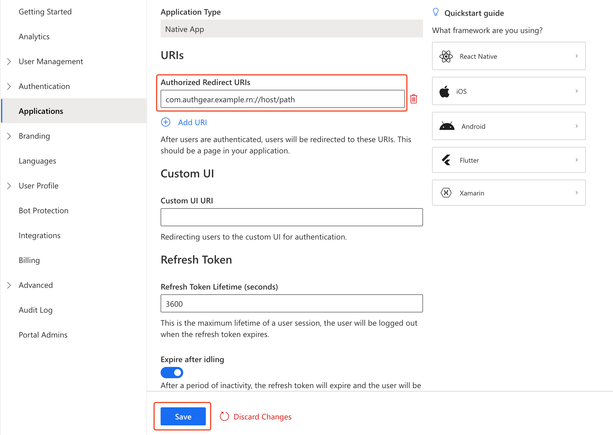

# React Native SDK

[](https://raw.githubusercontent.com/authgear/docs/refs/heads/main/get-started/native-mobile-app/react-native.md)

This guide provides instructions on integrating Authgear with a React Native app. Supported platforms include:

* React Native 0.60.0 or higher

Follow this guide to add Authgear to your React Native app in 🕐 10 minutes.


You can find the full code for the demo app for this tutorial in the Github repo [here](https://github.com/authgear/authgear-example-react-native).



React Native have opt-in support for the [New Architecture](https://reactnative.dev/docs/new-architecture-intro) since 0.68. Given that the New Architecture is still considered as unstable, we do not support it at the moment.


## Video Guide for React Native



## Setup Application in Authgear

Signup for an Authgear Portal account in [https://portal.authgear.com/](https://portal.authgear.com/). Or you can use your self-deployed Authgear.

From the Project listing, create a new Project or select an existing Project. After that, we will need to create an application in the project.

### **Step 1: Create an application in Authgear Portal**

Go to **Applications** on the left menu bar.

<figure><figcaption><p>authgear navigate to applications</p></figcaption></figure>

You'll see the "**New Application**" page, or Click **⊕Add Application** in the top tool bar.

Input the name of your application and select **Native App** as the application type. Click "**Save**".

On the next screen, you will see a list of guides that can help you with setting up, click "**Next**" to continue.

.png>)

### **Step 2: Configure the application**

In your IDE, define a custom URI scheme that will be used to redirect users back to your app after they have authenticated with Authgear. For example, in our example app, we will define the following URI scheme:

```
com.authgear.example.rn://host/path
```

For further instruction on setting up custom URI scheme in React Native, see [https://reactnative.dev/docs/linking](https://reactnative.dev/docs/linking)

Now head back to Authgear Portal, and add the URI that you have defined (`com.authgear.example.rn://host/path` for this example) as an **Authorized Redirect URI**.

Click "**Save**" and note the **Client ID** and **Endpoint** for your Authgear client application. You can also obtain it again from the **Applications** list later.



## Add User Authentication to React Native App using Authgear SDK

In this section, we'll walk through the steps to create a new React Native app and use the Authgear SDK to add user authentication to the app.

### Step 1: Create a React Native app

Run the following command to create a new React Native project:

```bash
npx @react-native-community/cli init myapp
cd myapp
```

For a more detailed guide on how to create a project and set up a development environment for React Native, follow the [official documentation of React Native](https://reactnative.dev/docs/getting-started).

### Step 2: Install the SDK

Run the following commands from the root directory of your React Native project to install the Authgear SDK:

```bash
npm install --exact @authgear/react-native
(cd ios && pod install)
```

### Step 3: Initialize Authgear

In this step, we'll implement the code to initialize an instance of the Authgear SDK which we will be using to interact with the Authgear client application we created earlier.

First, open the `App.tsx` file in your project then add the following import statements at the top:

```typescript
import React, { useCallback, useEffect, useMemo, useState } from 'react';
import authgear, { Page, ReactNativeContainer, SessionState, SessionStateChangeReason } from "@authgear/react-native";
```

Add the following code at the top inside the `App()` function in `App.tsx` to configure a new Authgear instance and set up a `delegate` that will help our app to know the current state of a user's session (whether they're logged in or not):

```typescript
const [sessionState, setSessionState] = useState<SessionState | null>(() => {
  return authgear.sessionState;
});

const loggedIn = sessionState === "AUTHENTICATED";
const delegate = useMemo(() => {
  const d = {
    onSessionStateChange: (
      container: ReactNativeContainer,
      _reason: SessionStateChangeReason
    ) => {
      setSessionState(container.sessionState);
    },
    sendWechatAuthRequest: () => {},
  };
  return d;
}, [setSessionState]);

useEffect(() => {
  authgear.delegate = delegate;

  return () => {
      authgear.delegate = undefined;
  };
}, [delegate]);

const postConfigure = useCallback(async () => {
  const sessionState = authgear.sessionState;

  // if user has an existing session, call SDK fetchUserInfo method to get the user's info and refresh access token when necessary
  if (sessionState === "AUTHENTICATED") {
    await authgear.fetchUserInfo();
  }
}, []);

useEffect(() => {
  const configure = async () => {
    try {
      await authgear
      .configure({
        clientID: "<CLIENT_ID>",
        endpoint: "<AUTHGEAR_ENDPOINT>",
      });
      await postConfigure();
    } catch (error) {
      console.log("Error:" + error);
    }
  };

  configure();
}, [postConfigure]);
```

Replace `<CLIENT_ID>` and `<AUTHGEAR_ENDPOINT>` with the Client ID and Endpoint for your Authgear client application.

The above code includes a `postConfigure()` method that helps to get the true session state for a user that was previously logged in.

### Step 4: Add Login Button

Replace the content for the `return` statement in the `App()` function inside the `App.tsx` file with the following:

```tsx
return (
  <SafeAreaView>
    <StatusBar />
      <View style={{justifyContent: 'center', alignItems: 'center'}}>
      {!loggedIn ?
        <View>
          <Text style={{paddingTop: 50, paddingBottom: 16, fontSize: 40}}>Welcome</Text>
          <Button onPress={authenticate} title="Login" />
        </View> :
        <View>
          <Text style={{paddingTop: 50, paddingBottom: 16}}>Welcome User</Text>
        </View>
      }
      </View>
  </SafeAreaView>
);
```

Import the necessary components at the top `App.tsx`:

```typescript
import {
  Alert,
  Button,
  SafeAreaView,
  StatusBar,
  Text,
  View,
} from 'react-native';
```

### Step 5: Start Authentication Flow

In this step, you will implement an `authenticate()` method that calls the `authenticate()` method of the Authgear SDK. The Login button we added in the previous step calls this `authenticate()` method to start an authentication flow.

Add the following code to the `App()` function just after the `useEffect()` for the `configure()` method in step 3:

```typescript
const authenticate = useCallback(async () => {
  try {
    authgear
        .authenticate({
          redirectURI: "com.authgear.example.rn://host/path",
        });
  } catch (error) {
    console.log("Authentication Error:" + error);
  }
}, []);
```

#### Checkpoint

At this point the complete code in your `App.tsx` should look like this:

```tsx
import React, {useCallback, useEffect, useMemo, useState} from 'react';
import authgear, {
  Page,
  ReactNativeContainer,
  SessionState,
  SessionStateChangeReason,
} from '@authgear/react-native';

import {Alert, Button, SafeAreaView, StatusBar, Text, View} from 'react-native';

function App(): React.JSX.Element {
  const [sessionState, setSessionState] = useState<SessionState | null>(() => {
    return authgear.sessionState;
  });

  const loggedIn = sessionState === 'AUTHENTICATED';
  const delegate = useMemo(() => {
    const d = {
      onSessionStateChange: (
        container: ReactNativeContainer,
        _reason: SessionStateChangeReason,
      ) => {
        setSessionState(container.sessionState);
      },
      sendWechatAuthRequest: () => {},
    };
    return d;
  }, [setSessionState]);

  useEffect(() => {
    authgear.delegate = delegate;

    return () => {
      authgear.delegate = undefined;
    };
  }, [delegate]);

  const postConfigure = useCallback(async () => {
    const sessionState = authgear.sessionState;

    // if user has an existing session, call SDK fetchUserInfo method to get the user's info and refresh access token when necessary
    if (sessionState === 'AUTHENTICATED') {
      await authgear.fetchUserInfo();
    }
  }, []);

  useEffect(() => {
    const configure = async () => {
      try {
        await authgear.configure({
          clientID: '<CLIENT_ID>',
          endpoint: '<AUTHGEAR_ENDPOINT>',
        });
        await postConfigure();
      } catch (error) {
        console.log('Error:' + error);
      }
    };

    configure();
  }, [postConfigure]);

  const authenticate = useCallback(async () => {
    try {
      authgear.authenticate({
        redirectURI: 'com.authgear.example.rn://host/path',
      });
    } catch (error) {
      console.log('Authentication Error:' + error);
    }
  }, []);

  return (
    <SafeAreaView>
      <StatusBar />
      <View style={{justifyContent: 'center', alignItems: 'center'}}>
        {!loggedIn ? (
          <View>
            <Text style={{paddingTop: 50, paddingBottom: 16, fontSize: 40}}>
              Welcome
            </Text>
            <Button onPress={authenticate} title="Login" />
          </View>
        ) : (
          <View>
            <Text style={{paddingTop: 50, paddingBottom: 16}}>
              Welcome User
            </Text>
          </View>
        )}
      </View>
    </SafeAreaView>
  );
}

export default App;
```

Now save your work and try running your app on Android or iOS using any of the following commands:

**Android**

```
npm run android
```

**iOS**

```
npm run ios
```

When your app opens, if you click on the Login button, you should be redirected to the Authentication UI. However, you can't complete authentication because we are yet to handle the redirect URI.

### Step 6: Setup Redirect URI

To finish the integration, set up the app to handle the redirect URI specified in your Authgear client application. This part requires platform-specific integration.

#### Android

Add the following `activity` entry to the `android/app/src/main/AndroidManifest.xml` of your React Native project. The intent system would dispatch the redirect URI to `OAuthRedirectActivity` and the sdk would handle the rest.

```xml
<!-- Your application configuration. Omitted here for brevity -->
<application>
  <!-- Other activities or entries -->

  <!-- Add the following activity -->
  <!-- android:exported="true" is required -->
  <!-- See https://developer.android.com/about/versions/12/behavior-changes-12#exported -->
  <activity android:name="com.authgear.reactnative.OAuthRedirectActivity"
            android:exported="true"
            android:launchMode="singleTask">
            <intent-filter>
                <action android:name="android.intent.action.VIEW" />
                <category android:name="android.intent.category.DEFAULT" />
                <category android:name="android.intent.category.BROWSABLE" />
                <!-- Configure data to be the exact redirect URI your app uses. -->
                <!-- Here, we are using com.authgear.example://host/path as configured in the portal -->
                <!-- NOTE: The redirectURI supplied in AuthenticateOptions *has* to match as well -->
                <data android:scheme="com.authgear.example.rn"
                    android:host="host"
                    android:pathPrefix="/path"/>
            </intent-filter>
  </activity>
</application>
```

You also need to add a `queries` section to `AndroidManifest.xml`.

```xml
<?xml version="1.0" encoding="utf-8"?>
<manifest xmlns:android="http://schemas.android.com/apk/res/android">
  <!-- Other elements such <application> -->
  <queries>
    <intent>
      <action android:name="android.support.customtabs.action.CustomTabsService" />
    </intent>
  </queries>
</manifest>
```

#### iOS

#### Declare URL Handling in Info.plist

In `ios/<your_project>/Info.plist`, add the matching redirect URI.

```markup
<?xml version="1.0" encoding="UTF-8"?>
<!DOCTYPE plist PUBLIC "-//Apple//DTD PLIST 1.0//EN" "http://www.apple.com/DTDs/PropertyList-1.0.dtd">
<plist version="1.0">
<dict>
      <!-- Other entries -->
      <key>CFBundleURLTypes</key>
      <array>
              <dict>
                      <key>CFBundleTypeRole</key>
                      <string>Editor</string>
                      <key>CFBundleURLSchemes</key>
                      <array>
                              <string>com.authgear.example.rn</string>
                      </array>
              </dict>
      </array>
</dict>
</plist>
```

<details>

<summary>Optional: Handle deep links for WeChat Login</summary>

Skip this part if you don't need support for "Login with WeChat".

Alternatively, use any popular deep-linking library then implement code to forward the deep link to our SDK in the JavaScript side for your React Native app.

To handle WeChat deep links, in `AppDelegate.m`, add the following code snippet:

```objectivec
// Other imports...
#import <authgear-react-native/AGAuthgearReactNative.h>

// Other methods...

// For handling deeplink
- (BOOL)application:(UIApplication *)app
            openURL:(NSURL *)url
            options:
                (NSDictionary<UIApplicationOpenURLOptionsKey, id> *)options {
    return [AGAuthgearReactNative application:app openURL:url options:options];
}

// For handling deeplink
// deprecated, for supporting older devices (iOS < 9.0)
- (BOOL)application:(UIApplication *)application
              openURL:(NSURL *)url
    sourceApplication:(NSString *)sourceApplication
          annotation:(id)annotation {
    return [AGAuthgearReactNative application:application
                                      openURL:url
                            sourceApplication:sourceApplication
                                  annotation:annotation];
}

// for handling universal link
- (BOOL)application:(UIApplication *)application
    continueUserActivity:(NSUserActivity *)userActivity
      restorationHandler:
          (void (^)(NSArray<id<UIUserActivityRestoring>> *_Nullable))
              restorationHandler {
    return [AGAuthgearReactNative application:application
                        continueUserActivity:userActivity
                          restorationHandler:restorationHandler];
}
```

</details>

### Step 7: Logout

Now let's add a Logout feature to our example app so users can logout and end their session.

We'll add a Logout button and implement a `logout()` method that calls the corresponding `logout()` method of the Authgear SDK:

Add a `logout()` method to your `App()` function after the authenticate() method you added earlier:

```typescript
const logout = useCallback( () => {
    try {
      authgear
      .logout();
    } catch (error) {
      console.log("Error:" + error);
    }
}, []);
```

Next, add the Logout button and call the logout() method from onPress. Add the button to the return statement for `App()` just below `<Text style={{paddingTop: 50, paddingBottom: 16}}> Welcome User</Text>` :

```tsx
<Button onPress={logout} title="Logout" />
```

Save your code and run the app. Click the Logout button and the user should be logged out.

### Step 8: Show User Info

The Authgear SDK includes a `fetchUserInfo()` method that returns details such as user ID, email, phone number, etc about the current user.

In this step, we'll add a **Show User Info** button to our app. This button will call the fetchUserInfo() to demonstrate how the method works.

Add a `showUserInfo()` method to your `App()` function just below the `logout()` method:

```typescript
const showUserInfo = useCallback(async () => {
  try {
    const userInfo = await authgear.fetchUserInfo();
    Alert.alert('User Info', JSON.stringify(userInfo, null, 2));
  } catch (error) {
    console.log('Error:' + error);
  }
}, []);
```

The `showUserInfo()` method calls the `fetchUserInfo()` method of the Authgear SDK and displays the data returned in an `Alert`.

Next, add the **Show User Info** button to the return statement of `App()` just below the Logout button from the previous step:

```tsx
<View style={{height: 8}} />
<Button onPress={showUserInfo} title="Show User Info" />
```

### Step 9: Open User Settings Page

Authgear offers a pre-built User Settings page for users of your application to view and modify their profile and security details.

In this step, we'll use the `open()` method in the Authgear SDK to open this User Settings page when a logged-in user clicks on a button.

Add an `openSettings()` method to your `App()` function just below the showUserInfo() from the previous step:

```typescript
const openSettings = useCallback(() => {
  try {
    authgear.open(Page.Settings);
  } catch (error) {
    console.log('Error:' + error);
  }
}, []);
```

Next, add a **User Settings** button to the return statement of `App()` just below the Show User Info button:

```tsx
<View style={{height: 8}} />
<Button onPress={openSettings} title="User Settings" />
```

Now run your app and you should be able to access the User Settings page when you click on the **User Settings** button.

### Additional Actions

#### Get the Logged-In State

When you start launching the application. You may want to know if the user has logged in. (e.g. Show users the login page if they haven't logged in).

The `sessionState` reflects the user logged-in state in the SDK local state. That means even if the `sessionState` is `AUTHENTICATED`, the session may be invalid if it is revoked remotely. Hence, after initializing the Authgear SDK, call `fetchUserInfo` to update the `sessionState` as soon as it is proper to do so. We demonstrated this in our example app using the `postConfigure()` method.

```javascript
// After authgear.configure, it only reflect SDK local state.
// value can be NO_SESSION or AUTHENTICATED
let sessionState = authgear.sessionState;

if (sessionState === "AUTHENTICATED") {
    authgear
        .fetchUserInfo()
        .then((userInfo) => {
            // sessionState is now up to date
        })
        .catch((e) => {
            // sessionState is now up to date
            // it will change to NO_SESSION if the session is invalid
        });
}
```

The value of `sessionState` can be `UNKNOWN`, `NO_SESSION` or `AUTHENTICATED`. Initially, the `sessionState` is `UNKNOWN`. After a call to `authgear.configure()`, the session state would become `AUTHENTICATED` if a previous session was found, or `NO_SESSION` if such session was not found.

#### Using the Access Token in HTTP Requests

To include the access token in the HTTP requests to your application server, there are two ways to achieve this.

#### Option 1: Using fetch function provided by Authgear SDK

Authgear SDK provides the `fetch` function for you to call your application server. The `fetch` function will include the Authorization header in your application request, and handle refresh access token automatically. `authgear.fetch` implement [fetch](https://fetch.spec.whatwg.org).

```javascript
authgear
    .fetch("YOUR_SERVER_URL")
    .then(response => response.json())
    .then(data => console.log(data));
```

#### Option 2: Add the access token to your HTTP

You can access the access token through `authgear.accessToken`. Call `refreshAccessTokenIfNeeded()` every time before using the access token. The `refreshAccessTokenIfNeeded()` function will check and make the network call to refresh the access token only if it has expired.

Include the access token in the Authorization header of your application request.

```javascript
authgear
    .refreshAccessTokenIfNeeded()
    .then(() => {
        // access token is ready to use
        // accessToken can be string or undefined
        // it will be empty if user is not logged in or session is invalid
        const accessToken = authgear.accessToken;

        // include Authorization header in your application request
        const headers = {
            Authorization: `Bearer ${accessToken}`
        };
    });
```

## Next steps

To protect your application server from unauthorized access. You will need to [integrate Authgear to your backend](../backend-api/).


[backend-api](../backend-api/)


## JavaScript SDK Reference

For detailed documentation on the JavaScript React Native SDK, visit [@authgear/react-native Reference](https://authgear.github.io/authgear-sdk-js/docs/react-native/)
