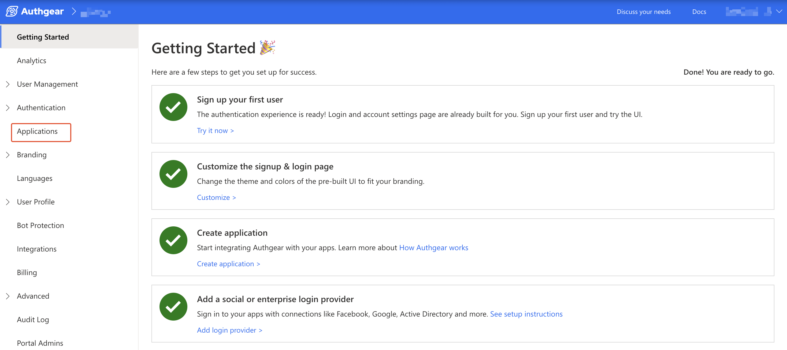

# Express

[](https://raw.githubusercontent.com/authgear/docs/refs/heads/main/get-started/regular-web-app/express.md)

Authgear makes it easy to add user authentication to a regular web app that is not powered by any framework. You can do this by integrating Authgear into your application as an OIDC identity provider.

In this post, you'll learn how to add user authentication to an Express.js application using Authgear.

### What You Will Learn

* How to create an Authgear Application.
* How to add User Login to an Express app using Authgear.
* How to request user info from Authgear.

### Pre-requisites

You'll need the following to follow along with this tutorial:

* Node.js Installed
* A free Authgear account. Sign up for one [here](https://portal.authgear.com/).

Follow this guide to add user authentication to an Express application using Authgear in 🕐 **15-minute**.


**Check out and clone** [**the Sample Project on GitHub**](https://github.com/authgear/authgear-example-express)**.**


## Setup Application in Authgear

Login to your Authgear account (you can sign up for one [here](https://portal.authgear.com/)) to perform the steps in this section.

### Create an application in the Portal

In this step, we'll create the Authgear client application that we'll use later to connect Authgear to the Express application.

After you log in to Authgear Portal, select a project then navigate to **Applications** on the left menu bar.

<figure><figcaption><p>navigate to applications</p></figcaption></figure>

Next, click on the **⊕Add Application** button on the top toolbar to open the **New Application** page.

Enter an application name (for example: "My App") and select `OIDC/SAML Client Application` as the Application Type. Click Save to create the app.

<figure><figcaption><p>new app form oidc app</p></figcaption></figure>

On the next screen, you'll see links to tutorials for different frameworks. Click **Next** to skip to the application configuration page.


Note the Client ID and Client Secret for your new application as you'll use in a later step to configure your Express app.


### Configure Authorize Redirect URI

The Authorized Redirect URI should be a page on your Express application where you make an HTTP(S) request to the Authgear token endpoint and exchange an Authorization Code for an Access Token.

For our demo Express application for this guide, this URL will be `http://localhost:3000/auth-redirect`. So, scroll to the URI section of your application configuration page in the Authgear Portal and add `http://localhost:3000/auth-redirect` as an authorized redirect URI.

<figure><figcaption><p>authgear set redirect uri</p></figcaption></figure>

Click **Save** to keep your changes.

## How to Add User Authentication to Express.js App using Authgear

In this section, we'll be building a simple Express app that has the following features:

* A landing page with a login link that takes users to the login route.
* A `/start-login` route that initiates the authentication flow.
* Logic that exchanges the authorization code from Authgear for an access token.
* A page that uses that access token to fetch user info from Authgear.
* A logout button to end the current user session.
* Refresh access token.

### Step 1: Create Express App

It is now time to create the Express app that will be connecting to our Authgear client application. Run the following commands to create a new folder for the project and set it as your current working directory:

```sh
# create project directory
mkdir my-express-app
#set project directory as current working directory
cd my-express-app
```

#### Install basic project dependencies

Next, install the Express npm package and other dependency packages like `axios`, `nodemon`, `session`, and `dotenv`.

We'll be using the `axios` library to make HTTP requests in the example app. We'll also use `nodemon` to add hot reload to our development environment. Run the following commands from the root of your Express project directory to install Express and other dependencies:

```sh
# Generate package.json
npm init -y
# Install Express 
npm install express
# Install axios
npm install axios
# Install express-session
npm install express-session
# Install dotenv
npm install dotenv
# Install Nodemon (Used to add hot road to JavaScript development)
npm install -D nodemon
```

#### Create `app.js` file

Once Express and the other dependencies are installed, create a new `app.js` file in the root of your project folder and add the following code to the file:

```javascript
//app.js
const express = require('express');
const axios = require("axios");
const session = require("express-session");
require("dotenv").config();

const app = express();
const port = process.env.PORT || 3000;
app.use(express.urlencoded({ extended: true }));
app.use(
  session({
    secret: "your_strong_secret_key", // Replace with a strong, randomly generated secret
    cookie: {},
  })
);

app.get("/", async (req, res) => {
    res.send(`
        <div style="max-width: 650px; margin: 16px auto; background-color: #EDEDED; padding: 16px;">
          <p>Hi there!</p>
          <p>This demo app shows you how to add user authentication to your Express app using Authgear</p>
            <p>Checkout <a href="https://docs.authgear.com">docs.authgear.com</a> to learn more about adding Authgear to your apps.</p>
          <a href="/login">Login</a>
        </div>
      `);
  });

app.get("/login", async(req, res) => {
    // TODO add implementation here
});

app.get("/auth-redirect", async(req, res) => {
    // TODO add implementation here
});

app.listen(port, () => {
    console.log(`server started on port ${port}!`);
});
```

#### **Update package.json**

Add the following code to the `scripts` section of the `package.json` file in the root directory of your Express project:

```json
"start": "node app.js",
"dev": "nodemon app.js"
```

#### Checkpoint

Now run the `npm run dev` command and you should get a page like this on a web browser when you visit `localhost:3000`:

<figure><figcaption><p>express demo app homepage</p></figcaption></figure>

### Step 2: Implement Login Route

Here we'll be implementing the login route in our Express app. This route will initiate the authentication flow by redirecting the user's browser to the login page (AuthUI). This process involves redirecting the user to your Authgear project/client application's authorization URL (`https://<AUTHGEAR_ENDPOINT>/oauth2/authorize` ).

Update the code for the `app.get("/login", ...)` route to the following:

```javascript
app.get("/login", async(req, res) => {
    const scopes = "openid offline_access";
    const authorizedUrl = new URL("/oauth2/authorize", process.env.AUTHGEAR_ENDPOINT);
    authorizedUrl.searchParams.set('client_id', process.env.AUTHGEAR_CLIENT_ID);
    authorizedUrl.searchParams.set('redirect_uri', process.env.AUTHGEAR_REDIRECT_URL);
    authorizedUrl.searchParams.set('response_type', 'code');
    authorizedUrl.searchParams.set('scope', scopes);
    res.redirect(authorizedUrl);
});
```

Create a `.env` file on the root directory of your project and add your Authgear client application configuration (Client ID, secret, endpoint) using the following fields:

```
AUTHGEAR_CLIENT_ID=<CLIENT_ID>
AUTHGEAR_CLIENT_SECRET=<CLIENT_SECRET>
AUTHGEAR_ENDPOINT=<AUTHGEAR_ENDPOINT>
AUTHGEAR_REDIRECT_URL=http://localhost:3000/auth-redirect
```

You can get the value for Client ID and Client Secret from the configuration page for the client application you created in the earlier step, [Create an application in the Portal](express.md#create-an-application-in-the-portal). The Authgear Endpoint looks like `https://project_id.authgear.cloud`if you are using Authgear Cloud version.

Now if you save your code and restart your app, clicking on the Login link should redirect to the Authgear authorization page.

<figure><figcaption><p>authui login page</p></figcaption></figure>

On successful login, an authorization code will be sent back to your Express application.

### Step 3: Exchange Authorization Code For Access Token

After the user logs in and grants authorization to your app on the Login page, they are redirected back to the [redirect URL you specified earlier](express.md#configure-authorize-redirect-uri). In addition to this redirect, an authorization code is sent via a `code` URL query parameter.

In this step, we will be exchanging the authorization code for an access code that users can later use to access protected resources.

Update the code for the `app.get("/auth-redirect", ...)` route to the following:

```javascript
app.get("/auth-redirect", async(req, res) => {
        if (req.query.code != null) {
            const data = {
              client_id: process.env.AUTHGEAR_CLIENT_ID,
              client_secret: process.env.AUTHGEAR_CLIENT_SECRET,
              code: req.query.code,
              grant_type: 'authorization_code',
              response_type: 'code',
              redirect_uri: process.env.AUTHGEAR_REDIRECT_URL
            };
        
            try {
              const tokenUrl = new URL("/oauth2/token", process.env.AUTHGEAR_ENDPOINT);
              const getToken = await axios.post(tokenUrl, data, {
                headers: { "Content-Type": "application/x-www-form-urlencoded" }
              });
        
              const accessToken = getToken.data.access_token;
        
              req.session.access_token = accessToken;
              res.redirect("/");

            } catch (error) {
              res.send("An error occurred! Login could not complete. Error data: " + error);
            }
          } else {
            res.send("No Authorization code in URL");
          }
        
});
```

The above code sends an HTTP POST request to the token endpoint (`https://<AUTHGEAR_ENDPOINT>/oauth2/token`). The authorization code we got from the previous step is sent along with other client credentials in the HTTP request body. The header should contain `"Content-Type": "application/x-www-form-urlencoded"`

A valid access token is returned in the response to the HTTP(S) request in `response.data.access_token`. In the above code sample, we've saved this access token temporally using express-session so we can access it from `"/"` route after redirecting the user.

We can now use this access token to make authenticated requests to protected resources in our app or from the Authgear User Info endpoint. In the next step, we'll attempt to get the current user's info from Authgear using the access token.

### Step 4: Get User Info

Authgear provides an endpoint where your application can request user info (`https://<AUTHGEAR_ENDPOINT>/oauth2/userinfo`). This endpoint will return the user's details on Authgear like their email address, gender, full name, and more.

To get user info in our example app, update the `app.get("/", ...)` `app.js`, to use the following conditional statement to render a different block of code when a valid access token is set for the current session:

```javascript
app.get("/", async (req, res) => {
  if (req.session.access_token != null) {
    const accessToken = req.session.access_token;
    //Now use access token to get user info.
  try {
        const userInfoUrl = new URL(
            "/oauth2/userinfo",
            process.env.AUTHGEAR_ENDPOINT
          );
          const getUserInfo = await axios.get(userInfoUrl, {
            headers: { Authorization: "Bearer " + accessToken },
          });
          const userInfo = getUserInfo.data;
          res.send(`
              <div style="max-width: 650px; margin: 16px auto; background-color: #EDEDED; padding: 16px;">
                <p>Welcome ${userInfo.email}</p>
                <p>User Info:</p>
                <div>
                  <pre>${JSON.stringify(userInfo, null, 2)}</pre>
                </div>
                  <p> 
                      <a href="/logout">Logout</a>
                  </p>
              </div>
          `);
    }
    catch (error) {
        res.send("Unable to get User Info: " + error);
    }
  } else {
    res.send(`
            <div style="max-width: 650px; margin: 16px auto; background-color: #EDEDED; padding: 16px;">
              <p>Hi there!</p>
              <p>This demo app shows you how to add user authentication to your Express app using Authgear</p>
                <p>Checkout <a href="https://docs.authgear.com">docs.authgear.com</a> to learn more about adding Authgear to your apps.</p>
              <a href="/login">Login</a>
            </div>
          `);
  }
});
```

Here our app sends another HTTP(S) request, but this time to the user info endpoint and the request type is GET. The access token is sent as a _Bearer_ authorization header.

At this point, save all changes and restart the application. Try logging in all over again, at the end you should be greeted with "Welcome \[your email address]" and a dump of the response from the UserInfo endpoint if the access token in your authorization header is valid.

<figure><figcaption><p>express demo</p></figcaption></figure>

### Step 5: Logout

To allow your users log out, add a new `/logout` route to your Express application. Within the route, you'll implement code that will call express-session `destroy()` method to delete the access token from the session. Then you'll redirect the user to Authgear's logout endpoint to log the user's session on Authgear.

To redirect the user back to your Express app after they logout, add `http://localhost:3000` as a Post Logout Redirect URI for your client application in Authgear Portal.

<figure><figcaption><p>set post logout redirect uri</p></figcaption></figure>

Your implementation of the logout route should look like this:

```javascript
app.get("/logout", async (req, res) => {
  const accessToken = req.session.access_token;
  const endSessionUrl = new URL(
    "/oauth2/end_session",
    process.env.AUTHGEAR_ENDPOINT
  );
  endSessionUrl.searchParams.set("post_logout_redirect_uri", "http://localhost:3000");
  
  // Remove access token, and refresh token from express-session
  req.session.destroy();
  
  res.set("Authorization", "Bearer " + accessToken);
  res.redirect(endSessionUrl);
});
```

Finally, place a link to the logout route below the `</prev>` tag using the following code:

```html
<a href="/logout">Logout</a>
```

### Step 6: Refresh Access Token

An access token is usually only valid for a short period. However, you can use the refresh token, also included in the response from the token endpoint in [step 3](express.md#step-3-exchange-authorization-code-for-access-token) to request a new access token.


Note that you must include `offline_access` in the scope parameter of your authorization request to get a refresh token from Authgear.


We recommend that you check that an access token is still valid before using it in your authorization header to access protected resources like the User Info endpoint.

To add the capability of refreshing an expired access token to our Express app, add the following function to app.js:

```javascript
const refreshAccessTokenIfExpired = async (refreshToken, expiresAt, req) => {
    const currentTime = (new Date(Date.now()).getTime());
    if (expiresAt<currentTime) {
        const tokenUrl = new URL("/oauth2/token", process.env.AUTHGEAR_ENDPOINT);
        const data = {
            client_id: process.env.AUTHGEAR_CLIENT_ID,
            client_secret: process.env.AUTHGEAR_CLIENT_SECRET,
            grant_type: "refresh_token",
            refresh_token: refreshToken
          };

          try {
            const getToken = await axios.post(tokenUrl, data, {
              headers: { "Content-Type": "application/x-www-form-urlencoded" },
            });
        
            const accessToken = getToken.data.access_token;
            const expiresAt = new Date(Date.now()).getTime() + getToken.data.expires_in * 1000;
        
            req.session.access_token = accessToken;
            req.session.expire_at = expiresAt;
            return accessToken;
          } catch (error) {
            throw new Error('Failed to refresh access token: ' + error);
          }
    } else {
        return req.session.access_token;
    }
};
```

Next, find the following line within the `app.get("/auth-redirect", ...)` route:

```javascript
req.session.access_token = accessToken;
```

Add the following code just after the above line:

```javascript
req.session.expire_at = new Date(Date.now()).getTime() + getToken.data.expires_in * 1000;
req.session.refresh_token = getToken.data.refresh_token;
```

The above code will store the values of `refresh_token` and `expires_in` that were returned in [step 3](express.md#step-3-exchange-authorization-code-for-access-token) in express-session. To convert expire\_in to a time in the future, we multiply it by 1000 and add that to the current time.

Finally, find the following line in the `app.get("/", ...)` route:

```javascript
const accessToken = req.session.access_token;
```

Replace the above line with the following code:

```javascript
const accessToken = await refreshAccessTokenIfExpired(req.session.refresh_token, req.session.expire_at, req);
```

Now our Express app gets an access token by first calling the new `refreshAccessTokenIfExpired()` method. If the current access token is expired, the method will make a request to Authgear's token endpoint for a new access token. This request needs to have a `grant_type` of `refresh_token`, and the `refresh_token` should be included in the POST request body.

See more about refreshing access tokens [here](../../api-reference/tokens/refresh-token.md).

## Next steps, Calling an API <a href="#next-steps-calling-an-api" id="next-steps-calling-an-api"></a>

To access restricted resources on your backend application server, the HTTP requests should include the access token in their Authorization headers.

For example:

```javascript
axios.get("https://<your_backend_url>", {
        headers: { Authorization: "Bearer " + accessToken },
      });
```

### Conclusion

And there you have it, you've successfully added user authentication to your Express app using Authgear as the OAuth provider.

You can add so much more to your app with the new Authgear authentication, like protecting your own app endpoint with the access code. You can also store the access token securely to persist the user session using express-session and cookies.

Here's a link to the complete code for [our example code on Github](https://github.com/authgear/authgear-example-express).
