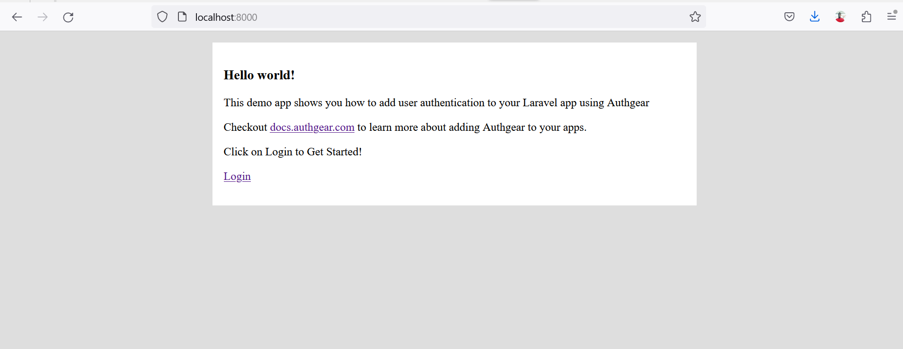
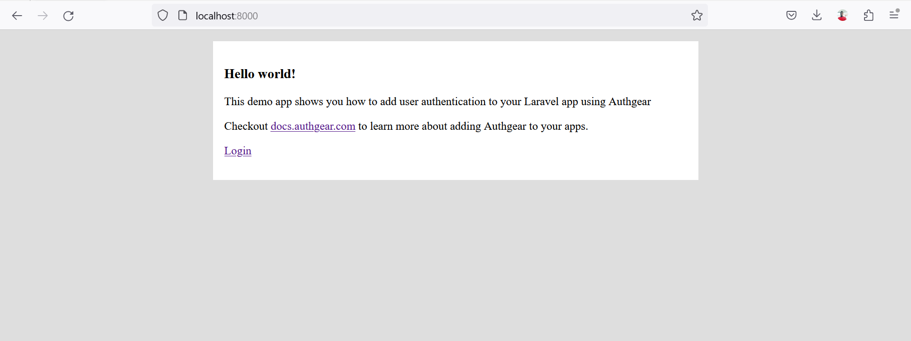

# Laravel

In this guide, you'll learn how to add user authentication to a Laravel app using Authgear as an OIDC provider.

Authgear supports multiple ways to allow users to log in to apps such as passwordless sign-in, phone OTP, and 2FA. In this post, we'll show you how to enable all these options in your Laravel app without worrying about the underlying logic.

### What You Will Learn

* How to create an Authgear Application.
* How to request OAuth 2.0 authorization code from Authgear.
* How to get user info from Authgear using OAuth 2.0 access code.
* Link user info from Authgear with Laravel's default Breeze authentication.

### Pre-requisites

To follow along with the example, you should have the following in place:

* A free Authgear account. [Sign up](https://accounts.portal.authgear.com/signup) if you don't have an account yet.
* A Laravel project.

#### What We Will Build

The example app we'll build in this post uses the default Laravel Breeze authentication kit. This kit provides the starter code for email and password user authentication systems.

We will be using Authgear to handle and process authentication data instead of the default Breeze database. By doing so, we get all the benefits of Authgear including more security and flexibility.&#x20;

<figure><figcaption></figcaption></figure>

### How to Add User Authentication to Laravel with Authgear as an OAuth Provider

In this section, we'll walk through the complete steps for building the example app.

#### Step 1: Configure Authgear Application

Before we can use Authgear as an OAuth identity provider, we need to set up an application on the Authgear portal.

To do that, log in to Authgear then select a project. Next, navigate to the Applications section for your project. Create a new application or configure an existing one with **OIDC Client Application** as Application Type as shown below:

<figure><figcaption></figcaption></figure>

Once you're done, click on **Save** to go to the application configuration page. This page reveals the application credentials and OAuth 2.0 endpoints.

<figure><figcaption></figcaption></figure>

Note down details like the Client ID, Client Secret, and the endpoints as you'll use them later in your Laravel project.

#### Step 2: Add a Redirect URI

While you're still on the application configuration page, scroll down to the URL section then click on Add URI. Enter `localhost:8000/oauth/callback` in the text field if you will be running your Laravel app on your local machine. Once you're done, click **Save**.

The redirect URI we provided above should be a valid page on our Laravel app as Authgear will redirect users to the page after authorization.

#### Step 3: Create a Laravel Project

Now create a new Laravel project on your computer by running the following command:

```sh
composer create-project laravel/laravel authgear-laravel-example
```

Once your project is created, open the project folder in your preferred code editor and replace the content of `resources/views/welcome.blade.php` with the following code:

```html
<!DOCTYPE html>
<html lang="en">
<head>
    <meta charset="UTF-8">
    <meta name="viewport" content="width=device-width, initial-scale=1.0">
    <title>PHP Demo - Home</title>
</head>
<body style="background-color: #DEDEDE">
    <div style="max-width: 650px; margin: 16px auto; background-color: #FFFFFF; padding: 16px;">
        <h3>Hello world!</h3>
        <p>This demo app shows you how to add user authentication to your Laravel app using Authgear</p>
        <p>Checkout <a href="https://docs.authgear.com">docs.authgear.com</a> to learn more about adding Authgear to your apps.</p>
        
        <p><a href="/login">Login</a></p>
    </div>
</body>
</html>
```

Alternatively, you can create a new `index.blade.php` file in the resources folder and add the above code inside it. Then, update the `web.php` route file to render the new file instead of `welcome.blade.php`.

Next, run the `php artisan serve` command in the terminal to test your application. At this point, your application should look like the following screenshot when you access localhost:8000 on a browser:

<figure><figcaption></figcaption></figure>

#### Step 4: Install Laravel Breeze

Breeze is the official user authentication starter kit for Laravel. What that means is that Breeze helps you set up the database, routes, controller, and user interface for a user registration and user login system.

To install Breeze on your Laravel project, run the following command:

```sh
composer require laravel/breeze --dev
```

After that, run the following command to enable Breeze to set up all the resources for the user authentication system in your project:

```sh
php artisan breeze:install
```

During the setup, select `blade` as the stack and leave the other options as default.

Once the setup is complete, navigate around your project file structure and you should notice some new folders and files related to authentication were added. Some of these new folders/files include an **Auth** sub-folder in the **controllers** folder, another **auth** sub-folder inside the views folder, and some database migration files.

Before we continue, let's add an extra `oauth_uid` field to the `users` table migration file. This field will store a user's unique ID from Authgear after successful login.

Open the `create_users_table...` file that is inside the `database/migrations/` folder (this file will have a date value at the end of its name) and add the following code to a new line inside the `Schema::create()` method:

```php
$table->string('oauth_uid')->nullable();
```

Add the MySQL database `DB_DATABASE`, `DB_USERNAME`, and `DB_PASSWORD` for the database you wish to use with your Laravel project in your Laravel project's `.env` file.

Finally, create the users and other tables by running the following command:

```bash
php artisan migrate
```

#### Step 5: Send OAuth User Authorization Request

In this step, we'll create a new route that will handle the task of redirecting users from our app to Authgear's OAuth authorization page where they can grant our app authorization to their data on Authgear. If you've used other OAuth 2.0 providers before, for example, signing in to a website using Google OAuth, you may already be familiar with an authorization page.

First, create a new controller that will handle all OAuth operations in our Laravel app by running the following command:

```sh
php artisan make:controller OAuthController
```

Before we start implementing the logic for our new controller, we need to install a PHP OAuth 2.0 client package. This package will simplify the process of interacting with Authgear's OAuth endpoints. Run the following commands to install the package:

```sh
composer require league/oauth2-client
```

Now, back to implementing the controller; open the new **OAuthController** file (from the `app/Http/Controllers` folder) and add the following code to it:

```php
use \League\OAuth2\Client\Provider\GenericProvider;
use Illuminate\Support\Facades\Auth;
use Illuminate\Support\Facades\Hash;
use App\Models\User;

class OAuthController extends Controller {

    public $provider;

    public function __construct ()
    {
        $appUrl = env("AUTHGEAR_PROJECT_URL", "");
        $this->provider = new GenericProvider([
            'clientId'                => env("AUTHGEAR_APP_CLIENT_ID", ""),
            'clientSecret'            => env("AUTHGEAR_APP_CLIENT_SECRET", ""),
            'redirectUri'             => env("AUTHGEAR_APP_REDIRECT_URI", ""),
            'urlAuthorize'            => $appUrl.'/oauth2/authorize',
            'urlAccessToken'          => $appUrl.'/oauth2/token',
            'urlResourceOwnerDetails' => $appUrl.'/oauth2/userInfo',
            'scopes' => 'openid offline_access'
        ]);
    }

    public function startAuthorization() {
        $authorizationUrl = $this->provider->getAuthorizationUrl();
        return redirect($authorizationUrl);
    }

	public function handleRedirect() {

	}
}
```

Next, add your Authgear Application's Client ID, Client Secret, and the redirect URI you specified earlier to your Laravel project's **.env** file using the following keys:

```
AUTHGEAR_PROJECT_URL=""
AUTHGEAR_APP_CLIENT_ID=""
AUTHGEAR_APP_CLIENT_SECRET=""
AUTHGEAR_APP_REDIRECT_URI="http://localhost:8000/oauth/callback"
```

**Note:** Your Authgear project URL is the hostname of any of your endpoint URLs. For example, the project URL for a project with an authorization endpoint: `https://laravel-app.authgear.cloud/oauth2/authorize`  will be `https://laravel-app.authgear.cloud`.

Now let's create a route in our Laravel project that will call the `startAuthorization()` method.

Open the `routes/web.php` file and add new routes using the following code:

```php
Route::get('/login', [OAuthController::class, 'startAuthorization']);

Route::get('/oauth/callback', [OAuthController::class, 'handleRedirect']);
```

We've included a second route for the redirect URI (callback), we'll implement this route in the next step.

Before we continue, let's clean up some of the additional routes added by the Breeze package that we won't be needing for this example. Open the `routes/auth.php` file and delete the following lines:

```php
Route::get('login', [AuthenticatedSessionController::class, 'create'])
                ->name('login');
                
Route::post('login', [AuthenticatedSessionController::class, 'store']);
```

At this point accessing the `/login` route should redirect to the Authgear authorization page.

<figure><figcaption></figcaption></figure>

#### Step 6: Implement Redirect URI Page

Update the empty `handleRedirect()` method in OAuthController to the following:

```php
public function handleRedirect() {

        // if code is set, get access token
        $accessToken = null;
        if (isset($_GET['code'])) {
            $code = $_GET['code'];

            try {
                $accessToken = $this->provider->getAccessToken('authorization_code', [
                    'code' => $code
                ]);

            } catch (\League\OAuth2\Client\Provider\Exception\IdentityProviderException $e) {

                // Failed to get the access token or user details.
                exit($e->getMessage());

            }
        }
}
```

The above code gets the authorization code sent in the redirect URL from Authgear after user authorization and exchanges it for an access token. With this access token, our application can access protected resources like the user info endpoint.

#### Step 7: Link User Info to Laravel User Authentication

In this step, we'll use the access token we got from the last step to get the current user's info from Authgear.

First, add the following code at the end of the `handleRedirect()` method:

```php
//Use access token to get user info
if (isset($accessToken)) {
    $resourceOwner = $this->provider->getResourceOwner($accessToken);
    $userInfo = $resourceOwner->toArray();

}
```

The `getResourceOwner()` method will call Authgear's UserInfo endpoint.

If you dump the userInfo variable (`dd($userInfo)`), you should get an output similar to this:

```json
[ 
  "custom_attributes" => []
  "email" => "users-email@gmail.com"
  "email_verified" => true
  "https://authgear.com/claims/user/can_reauthenticate" => true
  "https://authgear.com/claims/user/is_anonymous" => false
  "https://authgear.com/claims/user/is_verified" => true
  "sub" => "e1234323-f123-4b99-91d8-c2ca55a6a3dc"
  "updated_at" => 1683898685
  "x_web3" => []
]
```

The above array contains the user's info from Authgear. We'll proceed to use this information to link the Authgear user to a default (Breeze) Laravel authentication account. As a result, our app can start a regular Laravel authenticated user session and allow access to protected routes.

To implement the above feature, find the following line in **OAuthController.php**:

```php
$userInfo = $resourceOwner->toArray();
```

Add the following code after the above line:

```php
if (empty($userInfo['email'])) {
    return redirect('/')->withErrors(['msg' => 'Only profile with email is supported!']);
}
//check if user already registered
$oldUser = User::query()->whereEmail($userInfo['email'])->first();
if (!empty($oldUser)) {

    //if old user has the same Authgear sub (uuid), skip register and log them in.
    if ($userInfo['sub'] == $oldUser->oauth_uid) {
        Auth::guard('web')->login($oldUser);
        session(['accessToken' => $accessToken]);
        session(['refreshToken' => $accessToken->getRefreshToken()]);
    } else {
        //if sub is different,
        //ask user to login to existing account and link the existing account to link new authgear profile
        return redirect('/')->withErrors(['msg' => 'Email already registered please log in to link your account.']);
    }
} else {
    $user = User::create([
        'name' => $userInfo['email'],
        'email' => $userInfo['email'],
        'oauth_uid' => $userInfo['sub'],
        'password' => Hash::make($userInfo['sub'] . "-" . $userInfo['email'])
    ]);

    Auth::guard('web')->login($user);
    session(['accessToken' => $accessToken]);
    session(['refreshToken' => $accessToken->getRefreshToken()]);
}

// Redirect user to a protected route
return redirect('/dashboard');
```

Find the complete code for the OAuthController [here](https://github.com/authgear/authgear-example-laravel/blob/main/app/Http/Controllers/OAuthController.php).

#### Step 8: Using Refresh Token

OAuth 2.0 access tokens expire after some time. The refresh token on the other hand live longer. As a result, you can use the refresh token to request a new access token. In this step, we'll do exactly that in our Laravel application.

First, app/Http/Controllers/ProfileController.php and update the content of the edit() method to the following:

```php
public function edit(Request $request): View
{
    $appUrl = env("AUTHGEAR_PROJECT_URL", "");
    $provider = new GenericProvider([
        'clientId'                => env("AUTHGEAR_APP_CLIENT_ID", ""),
        'clientSecret'            => env("AUTHGEAR_APP_CLIENT_SECRET", ""),
        'redirectUri'             => env("AUTHGEAR_APP_REDIRECT_URI", ""),
        'urlAuthorize'            => $appUrl . '/oauth2/authorize',
        'urlAccessToken'          => $appUrl . '/oauth2/token',
        'urlResourceOwnerDetails' => $appUrl . '/oauth2/userInfo',
        'scopes' => 'openid offline_access'
    ]);

    $accessToken = session('accessToken');

    if ($accessToken->hasExpired()) {
        $refreshToken = session('refreshToken');
        $accessToken = $provider->getAccessToken('refresh_token', [
            'refresh_token' => $refreshToken
        ]);
        session(['accessToken' => $accessToken]);
    }
    $resourceOwner = $provider->getResourceOwner($accessToken);
    $userInfo = $resourceOwner->toArray();


    return view('profile.edit', [
        'user' => $request->user(), 'authgearUserInfo' => $userInfo,
    ]);
}
```

The above code checks if the current access token is expired using the `hasExpired()` method. If the condition is true, we call the `getAccessToken()` method with the refresh token to get a new access token.

The value of the current access token is updated to the new access token.

Next, this edit() method also displays the current user's profile details from your Authgear project on the UI. To implement this, add the following code to **resources/views/profile/edit.blade.php**, just below the line with "`<div class="max-w-7xl mx-auto sm:px-6 lg:px-8 space-y-6">`":

```html
<div class="p-4 sm:p-8 bg-white shadow sm:rounded-lg">
    <div class="max-w-xl">
        <h2>Authgear user data</h2>
        <p>Email: {{ $authgearUserInfo['email'] }}</p>
        <p>UUID: {{ $authgearUserInfo['sub'] }}</p>
    </div>
</div>
```

At this point, if we run our app and click on the login link on the landing page, we should be redirected to the Authgear authorization page. After granting authorization, we are directed to the callback route of our Laravel app. If authentication is successful we should be redirected to the default Breeze-protected dashboard page that looks like this:

<figure><figcaption></figcaption></figure>

#### Step 9: Logout

To log a user out, we'll delete all existing PHP session data and then call the Authgear token revoke endpoint.

First, add a new logout function to the OAuthController.php file using the following code:

```php
public function logout(Request $request)
{
    Auth::guard('web')->logout();

    $request->session()->invalidate();

    $request->session()->regenerateToken();

    if (session('accessToken') != null) {
        $options = [];
        $options['headers']['content-type'] = 'application/x-www-form-urlencoded';
        $options['body'] = http_build_query(['token'=>session('refreshToken')]);
        $request = $this->provider->getRequest(
            'POST',
            env("AUTHGEAR_PROJECT_URL", "") . '/oauth2/revoke',
            $options
        );
        $this->provider->getResponse($request);
    
        session(['accessToken' => null]);
        session(['refreshToken' => null]);
    }

    return redirect('/');
}
```

Then, open routes/web.php and update the logout route to the following:

```php
Route::post('logout', [OAuthController::class, 'logout'])
                ->name('logout');
```

### What's Next

You should try enabling the different login methods on Authgear from the Portal to enjoy features like 2FA, passwordless login, and more without updating anything on the code for your app.

Find the complete code for the example app in our [Laravel Example Github repo](https://github.com/authgear/authgear-example-laravel).
