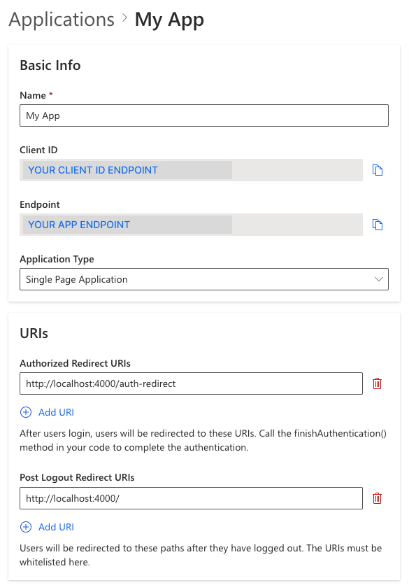
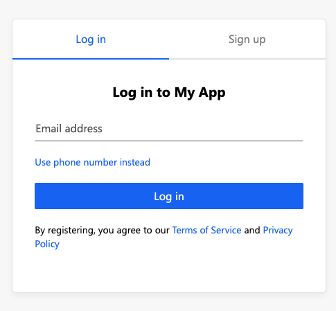
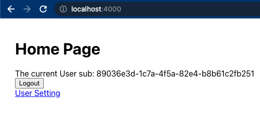

# Angular

Authgear helps you add user logins to your Angular apps. It provides prebuilt login page and user settings page that accelerate the development.

Follow this :clock1: **15 minutes** tutorial to create a simple app using Angular with Authgear SDK.


**Check out and clone** [<mark style="color:orange;">**the Sample Project on GitHub**</mark>](https://github.com/authgear/authgear-example-angular)**.**



This tutorial targets **Angular 17 and above**, which use [standalone components](https://angular.dev/guide/components) and bootstrap the app without `NgModule`. The sample project is built with Angular 22 (standalone, zoneless change detection). If you are on an older Angular version that still uses `NgModule`, adapt the steps accordingly.


**Table of Content**

* [Setup Application in Authgear](angular.md#setup-application-in-authgear)
* [Create a simple Angular project](angular.md#step-1-create-a-simple-angular-project)
* [Install Authgear SDK to the project](angular.md#step-2-install-authgear-sdk-to-the-project)
* [Implement User Service](angular.md#step-3-implement-the-user-service)
* [Implement the Auth Redirect page](angular.md#step-4-implement-the-auth-redirect)
* [Add a Login button](angular.md#step-6-add-a-login-button)
* [Show the user information](angular.md#step-7-show-the-user-information)
* [Add a Logout button](angular.md#step-8-add-an-logout-button)
* [Open User Settings](angular.md#step-9-open-user-settings)
* [Calling an API](angular.md#next-steps-calling-an-api)

## Setup Application in Authgear

Signup for an account in [https://portal.authgear.com/](https://portal.authgear.com/) and create a Project.

After that, we will need to create an Application in the Project Portal.

### Create an application in the Portal

1. Go to **Applications** on the left menu bar.
2. Click **⊕Add Application** in the top tool bar.
3. Input the name of your application, e.g. "MyAwesomeApp".
4. Select **Single Page Application** as the application type
5. Click "Save" to create the application

### Configure Authorize Redirect URI

The Redirect URI is a URL in you application where the user will be redirected to after login with Authgear. In this path, make a **finish authentication** call to complete the login process.

For this tutorial, add `http://localhost:4000/auth-redirect` to Authorize Redirect URIs.

### Configure Post Logout Redirect URI

The Post Logout Redirect URI is the URL users will be redirected after they have logged out. The URL must be whitelisted.

For this tutorial, add `http://localhost:4000/` to Post Logout Redirect URIs.

**Save** the configuration before next steps.



## Step 1: Create a simple Angular project

Here are some recommended steps to scaffold an Angular project. You can skip this part if you are adding Authgear to an existing project. See [#step-2-install-authgear-sdk-to-the-project](angular.md#step-2-install-authgear-sdk-to-the-project "mention") in the next section.

#### Install the Angular CLI

To install the Angular CLI, open a terminal window and run the following command:

```bash
npm install -g @angular/cli
```


For Windows clients, please find your reference in [https://angular.dev/tools/cli/setup-local](https://angular.dev/tools/cli/setup-local) for more information on installing the Angular CLI.


#### Create initial workspace

Run the following cli command to create a new workspace and initial app called `my-app` with routing enabled.

```bash
# Create a workspace called my-app
ng new my-app --routing --defaults
# Move into the project directory
cd my-app
```

On Angular 17+, this scaffolds a standalone application. The important generated files are:

* `src/main.ts` — bootstraps the app with `bootstrapApplication(AppComponent, appConfig)`
* `src/app/app.config.ts` — the application providers (this is where we will configure Authgear and the router)
* `src/app/app.routes.ts` — the route definitions


Newer versions of the Angular CLI generate component and service files **without** the `.component` / `.service` suffix (for example `app.ts` and class `App` instead of `app.component.ts` and class `AppComponent`). This tutorial and the sample project use the suffixed names. The code is identical either way — just match the file names and class names your CLI generated.


#### Edit script for launching the app

In the `package.json` file, edit the `start` script in the `script` section

```bash
# before
"start": "ng serve"

# after
"start": "ng serve --port 4000"
```

The `start` script run the app in development mode on port 4000 instead of the default one.

#### Edit the `app.component.html` file

By default, the Angular CLI generated an initial application for us, but for simplicity, we recommend to modify some of these files to scratch.

In the `src/app/app.component.html` file, remove all the lines and add the following line:

```html
<div>Hello world</div>
```

#### Run your initial app

Run `npm start` now to run the project and you will see "Hello world" on `http://localhost:4000`.

## Step 2: Install Authgear SDK to the project

Run the following command within your Angular project directory to install the Authgear Web SDK

```bash
npm install --save-exact @authgear/web
```

Authgear must be configured **before** any other SDK call (for example `finishAuthentication()` or `fetchUserInfo()`), and configuration is asynchronous. The cleanest way to guarantee this in Angular is to run `authgear.configure()` during app initialization, so the app only renders after Authgear is ready.

In `src/app/app.config.ts`, register an app initializer that calls `configure`:

```typescript
// src/app/app.config.ts
import {
  ApplicationConfig,
  provideAppInitializer,
  provideBrowserGlobalErrorListeners,
} from '@angular/core';
import { provideRouter } from '@angular/router';
import authgear from '@authgear/web';

import { routes } from './app.routes';

export const appConfig: ApplicationConfig = {
  providers: [
    provideBrowserGlobalErrorListeners(),
    provideRouter(routes),
    // Configure Authgear before the app renders. configure() must complete
    // before any other SDK call, so blocking bootstrap here avoids a race in
    // which the redirect page or home page runs before the SDK is ready.
    provideAppInitializer(async () => {
      try {
        await authgear.configure({
          endpoint: '<your_app_endpoint>',
          clientID: '<your_client_id>',
          sessionType: 'refresh_token',
        });
      } catch (e) {
        // Don't block bootstrap if Authgear is unreachable; the app will
        // render in the logged-out state and login can be retried.
        console.error(e);
      }
    }),
  ],
};
```

The Authgear container instance takes `endpoint` and `clientID` as parameters. They can be obtained from the application page created in [#setup-application-in-authgear](angular.md#setup-application-in-authgear "mention").

Because the initializer is awaited, by the time any route renders Authgear is ready to use.


Run **`npm start`** now and you should see a page with "Hello World" and no error message in the console if Authgear SDK is configured successfully


## Step 3: Implement the User Service

Since we want to reference the logged in state in anywhere of the app, let's put the state in a **service** with `user.service.ts` in the `/src/app/services/` folder.

In `user.service.ts`, it will have an `isLoggedIn` state. The state is auto updated using the `onSessionStateChange` callback, which is stored in the `delegate` of the local SDK container. We expose the state as an Angular [signal](https://angular.dev/guide/signals) so the UI updates reactively (this also works with zoneless change detection, the default on newer Angular versions).

```typescript
// src/app/services/user.service.ts
import { Injectable, signal } from '@angular/core';
import authgear from '@authgear/web';

@Injectable({
  providedIn: 'root',
})
export class UserService {
  // By default the user is not logged in
  readonly isLoggedIn = signal(false);

  constructor() {
    // When the sessionState changed, logged in state will also be changed
    authgear.delegate = {
      onSessionStateChange: (container) => {
        // sessionState is now up to date
        // value of sessionState can be "NO_SESSION" or "AUTHENTICATED"
        const sessionState = container.sessionState;
        this.isLoggedIn.set(sessionState === 'AUTHENTICATED');
      },
    };
  }
}
```

The `onSessionStateChange` delegate fires while `configure()` runs, so the `UserService` must be instantiated **before** `configure()` — otherwise it would miss the initial state of an already-authenticated user. Update the app initializer in `src/app/app.config.ts` to inject the service first:

```typescript
// src/app/app.config.ts
import { inject, provideAppInitializer } from '@angular/core';
import authgear from '@authgear/web';
import { UserService } from './services/user.service';

// ...

    provideAppInitializer(async () => {
      // Instantiate UserService first so its onSessionStateChange delegate is
      // registered before configure() runs and can observe the initial state.
      inject(UserService);
      try {
        await authgear.configure({
          endpoint: '<your_app_endpoint>',
          clientID: '<your_client_id>',
          sessionType: 'refresh_token',
        });
      } catch (e) {
        console.error(e);
      }
    }),
```

## Step 4: Implement the Auth Redirect

Next, we will add an "auth-redirect" page for handling the authentication result after the user have been authenticated by Authgear.

Create the `auth-redirect` component using the following command:

```bash
ng generate component auth-redirect
```

We will inject the router to navigate after the redirect is handled.

Call the Authgear `finishAuthentication()` function in the Auth Redirect component to send a token back to Authgear server in exchange for access token and refresh token. Don't worry about the technical jargons, `finishAuthentication()` will do all the hard work for you and and save the authentication data.

When the authentication is finished, the `isLoggedIn` state from the UserService will automatic set to `true`. Finally, navigate back to root (`/`) which is our Home page.

The final `auth-redirect.component.ts` will look like this

```typescript
// src/app/auth-redirect/auth-redirect.component.ts
import { Component, OnInit, inject } from '@angular/core';
import { Router } from '@angular/router';
import authgear from '@authgear/web';

@Component({
  selector: 'app-auth-redirect',
  templateUrl: './auth-redirect.component.html',
  styleUrl: './auth-redirect.component.css',
})
export class AuthRedirectComponent implements OnInit {
  private readonly router = inject(Router);

  ngOnInit(): void {
    authgear
      .finishAuthentication()
      .catch((e) => console.error(e))
      .then(() => {
        this.router.navigate(['']);
      });
  }
}
```

## Step 5: Add Routes to the App

Next, we will add a "Home" page . Create a `home` component using the following command:

```bash
ng generate component home
```

Then import **HomeComponent** and **AuthRedirectComponent** as routes. We can add those routes in the `app.routes.ts` file that was generated with the workspace:

```typescript
// src/app/app.routes.ts
import { Routes } from '@angular/router';
import { HomeComponent } from './home/home.component';
import { AuthRedirectComponent } from './auth-redirect/auth-redirect.component';

export const routes: Routes = [
  { path: '', component: HomeComponent },
  { path: 'auth-redirect', component: AuthRedirectComponent },
];
```

The router is already provided in `app.config.ts` via `provideRouter(routes)` (added in Step 2). Make sure the root component renders the routed component by importing `RouterOutlet` and using it in the template.

```typescript
// src/app/app.component.ts
import { Component } from '@angular/core';
import { RouterOutlet } from '@angular/router';

@Component({
  selector: 'app-root',
  imports: [RouterOutlet],
  templateUrl: './app.component.html',
  styleUrl: './app.component.css',
})
export class AppComponent {}
```

Replace the lines in `src/app/app.component.html` with the following:

```html
<router-outlet></router-outlet>
```

The file structure should now look like

```
src
├── (...)
├── main.ts
└── app
    ├── app.config.ts
    ├── app.routes.ts
    ├── app.component.ts
    ├── app.component.html
    ├── (...)
    ├── auth-redirect
    │   ├── auth-redirect.component.ts
    │   ├── auth-redirect.component.html
    │   └── (...)
    ├── home
    │   ├── home.component.ts
    │   ├── home.component.html
    │   └── (...)
    └── services
        └── user.service.ts
```

## Step 6: Add a Login button

First we will import the Authgear dependency and inject the UserService in `home.component.ts`. Then add the `startLogin` method which will call `startAuthentication(options)`. This will redirect the user to the login page.

```typescript
// src/app/home/home.component.ts
import { Component, inject } from '@angular/core';
import { UserService } from '../services/user.service';
import authgear, { PromptOption } from '@authgear/web';

@Component({
  selector: 'app-home',
  templateUrl: './home.component.html',
  styleUrl: './home.component.css',
})
export class HomeComponent {
  readonly user = inject(UserService);

  startLogin(): void {
    authgear
      .startAuthentication({
        redirectURI: 'http://localhost:4000/auth-redirect',
        prompt: PromptOption.Login,
      })
      .then(
        () => {
          // started authorization, user should be redirected to Authgear
        },
        (err) => {
          // failed to start authorization
          console.error(err);
        }
      );
  }
}
```


`prompt` takes a `PromptOption` enum value (for example `PromptOption.Login`) in `@authgear/web` v5 and above. Importing and using the enum keeps the call type-safe.


Then you can add a button which will trigger the `startLogin` method in `home.component.html`:

```html
<h1>Home Page</h1>
<button type="button" (click)="startLogin()">Login</button>
```

You can now run **`npm start`** and you will be redirected to the Authgear Login page when you click the Login button.



## Step 7: Show the user information

The Authgear SDK helps you get the information of the logged in users easily.

In the last step, the user is successfully logged in so let's try to print the user ID (sub) of the user in the Home page.

In `home` component, we will add a simple Loading splash and a greeting message printing the Sub ID. We will add two conditional elements such that they are only shown when user is logged in. We can also change the login button to show only if the user is not logged in.

Make use of `isLoggedIn` from the `UserService` to control the components on the page. Fetch the user info by `fetchUserInfo()` and access its `sub` property. We store the loading and greeting state as signals so the template stays reactive.

```typescript
// src/app/home/home.component.ts
import { Component, OnInit, inject, signal } from '@angular/core';
import { UserService } from '../services/user.service';
import authgear, { PromptOption } from '@authgear/web';

@Component({
  selector: 'app-home',
  templateUrl: './home.component.html',
  styleUrl: './home.component.css',
})
export class HomeComponent implements OnInit {
  readonly user = inject(UserService);

  readonly isLoading = signal(false);
  readonly greetingMessage = signal('');

  async updateGreetingMessage() {
    this.isLoading.set(true);
    try {
      if (this.user.isLoggedIn()) {
        const userInfo = await authgear.fetchUserInfo();
        this.greetingMessage.set('The current User sub: ' + userInfo.sub);
      }
    } finally {
      this.isLoading.set(false);
    }
  }

  ngOnInit(): void {
    this.updateGreetingMessage().catch((e) => {
      console.error(e);
    });
  }

  startLogin(): void {
    authgear
      .startAuthentication({
        redirectURI: 'http://localhost:4000/auth-redirect',
        prompt: PromptOption.Login,
      })
      .then(
        () => {
          // started authorization, user should be redirected to Authgear
        },
        (err) => {
          // failed to start authorization
          console.error(err);
        }
      );
  }
}
```

In the `home.component.html`, use the new `@if` control flow and read each signal by calling it:

```html
<h1>Home Page</h1>
@if (isLoading()) {
  <span>Loading</span>
}
@if (greetingMessage()) {
  <span>{{ greetingMessage() }}</span>
}
@if (!user.isLoggedIn()) {
  <div>
    <button type="button" (click)="startLogin()">Login</button>
  </div>
}
```

Run the app again, the User ID (sub) of the user should be printed on the Home page.

## Step 8: Add a Logout button

Finally, let's add an Logout button when user is logged in.

In `home.component.html`, we will add a conditional element in the markup:

```html
@if (user.isLoggedIn()) {
  <div>
    <button type="button" (click)="logout()">Logout</button>
  </div>
}
```

And add the `logout` method:

```typescript
logout(): void {
  authgear
    .logout({
      redirectURI: 'http://localhost:4000/',
    })
    .then(
      () => {
        this.greetingMessage.set('');
      },
      (err) => {
        console.error(err);
      }
    );
}
```

Run the app again, we can now logout by clicking the logout button.

## Step 9: Open User Settings

Authgear provide a built-in UI for the users to set their attributes and change security settings.

Use the `open` function to open the setting page at `<your_app_endpoint>/settings`

In `home.component.html` append a conditional link to the logout button section.

```html
@if (user.isLoggedIn()) {
  <div>
    <button type="button" (click)="logout()">Logout</button>
    <br />
    <a target="_blank" rel="noreferrer" (click)="userSetting($event)" href="#">
      User Setting
    </a>
  </div>
}
```

And add the `userSetting` method (note the added `Page` import):

```typescript
import authgear, { Page, PromptOption } from '@authgear/web';

async userSetting(event: MouseEvent) {
  event.preventDefault();
  event.stopPropagation();
  await authgear.open(Page.Settings);
}
```

This the resulting `home.component.ts`:

```typescript
// src/app/home/home.component.ts
import { Component, OnInit, inject, signal } from '@angular/core';
import { UserService } from '../services/user.service';
import authgear, { Page, PromptOption } from '@authgear/web';

@Component({
  selector: 'app-home',
  templateUrl: './home.component.html',
  styleUrl: './home.component.css',
})
export class HomeComponent implements OnInit {
  readonly user = inject(UserService);

  readonly isLoading = signal(false);
  readonly greetingMessage = signal('');

  async updateGreetingMessage() {
    this.isLoading.set(true);
    try {
      if (this.user.isLoggedIn()) {
        const userInfo = await authgear.fetchUserInfo();
        this.greetingMessage.set('The current User sub: ' + userInfo.sub);
      }
    } finally {
      this.isLoading.set(false);
    }
  }

  ngOnInit(): void {
    this.updateGreetingMessage().catch((e) => {
      console.error(e);
    });
  }

  startLogin(): void {
    authgear
      .startAuthentication({
        redirectURI: 'http://localhost:4000/auth-redirect',
        prompt: PromptOption.Login,
      })
      .then(
        () => {
          // started authorization, user should be redirected to Authgear
        },
        (err) => {
          // failed to start authorization
          console.error(err);
        }
      );
  }

  logout(): void {
    authgear
      .logout({
        redirectURI: 'http://localhost:4000/',
      })
      .then(
        () => {
          this.greetingMessage.set('');
        },
        (err) => {
          console.error(err);
        }
      );
  }

  async userSetting(event: MouseEvent) {
    event.preventDefault();
    event.stopPropagation();
    await authgear.open(Page.Settings);
  }
}
```

This is the resulting home.component.html:

```html
<h1>Home Page</h1>
@if (isLoading()) {
  <span>Loading</span>
}
@if (greetingMessage()) {
  <span>{{ greetingMessage() }}</span>
}
@if (!user.isLoggedIn()) {
  <div>
    <button type="button" (click)="startLogin()">Login</button>
  </div>
}
@if (user.isLoggedIn()) {
  <div>
    <button type="button" (click)="logout()">Logout</button>
    <br />
    <a target="_blank" rel="noreferrer" (click)="userSetting($event)" href="#">
      User Setting
    </a>
  </div>
}
```



## Next steps, Calling an API

To access restricted resources on your backend application server, the HTTP requests should include the access token in their Authorization headers. The Web SDK provides a `fetch` function which automatically handle this, or you can get the token with `authgear.accessToken`.

#### Option 1: Using fetch function provided by Authgear SDK

Authgear SDK provides the `fetch` function for you to call your application server. This `fetch` function will include the Authorization header in your application request, and handle refresh access token automatically. The `authgear.fetch` implements [fetch](https://fetch.spec.whatwg.org/).

```javascript
authgear
    .fetch("YOUR_SERVER_URL")
    .then(response => response.json())
    .then(data => console.log(data));
```

#### Option 2: Add the access token to the HTTP request header

You can get the access token through `authgear.accessToken`. Call `refreshAccessTokenIfNeeded` every time before using the access token, the function will check and make the network call only if the access token has expired. Include the access token into the Authorization header of the application request.

```javascript
authgear
    .refreshAccessTokenIfNeeded()
    .then(() => {
        // access token is ready to use
        // accessToken can be string or undefined
        // it will be empty if user is not logged in or session is invalid
        const accessToken = authgear.accessToken;

        // include Authorization header in your application request
        const headers = {
            Authorization: `Bearer ${accessToken}`
        };
    });
```
