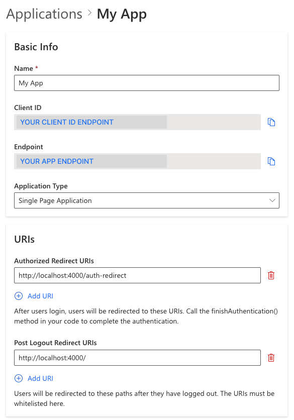
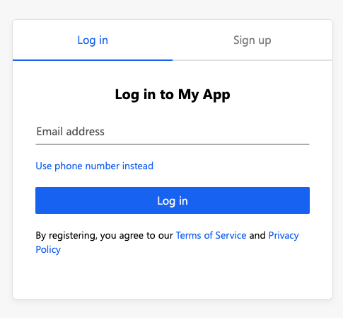
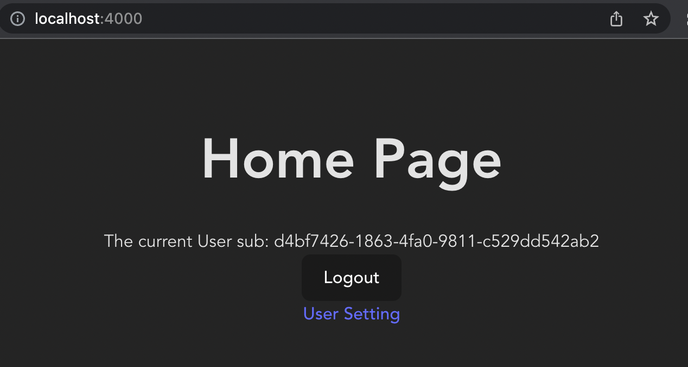

# Vue

Authgear helps you add user logins to your Vue apps. It provides prebuilt login page and user settings page that accelerate the development.

Follow this :clock1: **15 minutes** tutorial to create a simple app using Vue with Authgear SDK.


**Check out and clone** [<mark style="color:orange;">**the Sample Project on GitHub**</mark>](https://github.com/authgear/authgear-example-vue)**.**


**Table of Content**

* [Setup Application in Authgear](vue.md#setup-application-in-authgear)
* [Create a simple Vue project](vue.md#step-1-create-a-simple-vue-project)
* [Create routes for the project](vue.md#step-2-create-routes-for-the-project)
* [Install Authgear SDK to the project](vue.md#step-3-install-authgear-sdk-to-the-project)
* [Implement Context Provider](vue.md#step-4-implement-the-context-provider)
* [Implement the Auth Redirect page](vue.md#step-5-implement-the-auth-redirect)
* [Add a Login button](vue.md#step-7-add-a-login-button)
* [Show the user information](vue.md#step-8-show-the-user-information)
* [Add a Logout button](vue.md#step-9-add-a-logout-button)
* [Open User Settings](vue.md#step-10-open-user-settings)
* [Calling an API](vue.md#finally-calling-an-api)

## Setup Application in Authgear

Signup for an account in [https://portal.authgear.com/](https://portal.authgear.com/) and create a Project.

After that, we will need to create an Application in the Project Portal.

### Create an application in the Portal

1. Go to **Applications** on the left menu bar.
2. Click **⊕Add Application** in the top tool bar.
3. Input the name of your application, e.g. "MyAwesomeApp".
4. Select **Single Page Application** as the application type
5. Click "Save" to create the application

### Configure Authorize Redirect URI

The Redirect URI is a URL in you application where the user will be redirected to after login with Authgear. In this path, make a **finish authentication** call to complete the login process.

For this tutorial, add `http://localhost:4000/auth-redirect` to Authorize Redirect URIs.

### Configure Post Logout Redirect URI

The Post Logout Redirect URI is the URL users will be redirected after they have logged out. The URL must be whitelisted.

For this tutorial, add `http://localhost:4000/` to Post Logout Redirect URIs.

**Save** the configuration before next steps.



## Step 1: Create a simple Vue project

Here are some recommended steps to scaffold a Vue project. You can skip this part if you are adding Authgear to an existing project. See [#step-3-install-authgear-sdk-to-the-project](vue.md#step-3-install-authgear-sdk-to-the-project "mention") in the next section.

#### Install basic project dependencies

Create the project folder and install the dependencies. We will use `vite` as the build tool and the `vue-router` package. Also, we will use TypeScript in this tutorial.

```bash
# Create a brand new project using vite
npm create vite@latest my-app -- --template vue-ts
# Move into the project directory
cd my-app
# Install dependencies
npm install
# Install vue-router
npm install --save-exact vue-router
```

#### Add port configuration for development mode

As we are using port 4000 for this tutorial, we need to add the port information to the config. In the `vite.config.ts` file, modify the file with the following lines:

```typescript
// vite.config.ts
import { defineConfig } from "vite";
import vue from "@vitejs/plugin-vue";

// https://vitejs.dev/config/
export default defineConfig({
  plugins: [vue()],
  server: {
    port: 4000,
  },
});
```

After doing so, when you run `npm run dev` , the server will be running on port 4000.

#### Create the `Home.vue` file

Create a new file called `Home.vue` in the `src/components` folder with simply showing `Hello World` on the screen.

```tsx
// src/components/Home.vue
<script setup lang="ts"></script>

<template><div>Hello World</div></template>
```

#### Edit the `App.vue` file

The `App.vue` file is generated by `Vite` already but some sections might not being needed for this tutorial.

```tsx
// src/components/App.vue
<script setup lang="ts">
import Home from "./components/Home.vue";
</script>

<template>
  <Home />
</template>
```

#### Delete unnecessary files

Some of the files might not being used and thus can be deleted. You can perform the following script to delete these files:

```bash
rm -rf src/assets src/components/HelloWorld.vue
```

#### File structure

The file structure in your project is now:

```bash
my-app
├── node_modules
│   └── (...)
├── package-lock.json
├── package.json
├── vite.config.ts
├── (...)
└── src
    ├── components
    │   └── Home.vue
    ├── App.vue
    ├── main.ts
    └── (...)
```

Run `npm run dev` now to run the project and you will see default page with the title `Vite + Vue` and a count button on `http://localhost:4000`.

## Step 2: Create routes for the project

Create a `AuthRedirect.vue` file in the `src/components` folder with the same content as `src/components/Home.vue` at this moment.

Create a file called `router.ts` in the `src/` folder. We will import `Home` and `AuthRedirect` component as the route and we will implement these components later. The content of this file will look like this:

```typescript
// src/router.ts
import { createRouter, createWebHistory } from "vue-router";

export const history = createWebHistory();
export const router = createRouter({
  history,
  routes: [
    {
      path: "/",
      // We will implement this component later
      component: () => import("./components/Home.vue"),
    },
    {
      path: "/auth-redirect",
      // We will implement this component later
      component: () => import("./components/AuthRedirect.vue"),
    },
  ],
});
```

## Step 3: Install Authgear SDK to the project

Run the following command within your Vue project directory to install the Authgear Web SDK

```bash
npm install --save-exact @authgear/web
```

In `src/main.ts` , import `authgear` and call the `configure` function to initialize an Authgear instance on application loads. We will also import `router` and use it to build routes for us.

```typescript
// src/main.ts
import { createApp } from "vue";
import './style.css'
import App from "./App.vue";
import { router } from "./router";
import authgear from "@authgear/web";

const app = createApp(App);

async function init() {
  try {
    // configure Authgear container instance
    await authgear.configure({
      endpoint: "<your_app_endpoint>",
      clientID: "<your_client_id>",
      sessionType: "refresh_token",
    });
  } finally {
    app.use(router);
    app.mount("#app");
  }
}

init().catch((e) => {
  // Error handling
  console.error(e)
});
```

The Authgear container instance takes `endpoint` and `clientID` as parameters. They can be obtained from the application page created in [#setup-application-in-authgear](vue.md#setup-application-in-authgear "mention").

It is recommend to render the app after `configure()` resolves. So by the time the app is rendered, Authgear is ready to use.


Run **`npm run dev`** now and you should see the same page and no error message in the console if Authgear SDK is configured successfully


## Step 4: Implement the Context Provider

Since we want to reference the logged in state in anywhere of the app, let's put the state in a **context provider** with `UserProvider.vue` in the `/src/contexts` folder.

In `UserProvider.vue`, it will have a `isLoggedIn` boolean value. The `isLoggedIn` boolean state can be auto updated using the `onSessionStateChange` callback. This callback can be stored in `delegate` which is in the local SDK container.

```tsx
// src/context/UserProvider.vue
<script lang="ts">
import {
  defineComponent,
  InjectionKey,
  provide,
  readonly,
  ref,
  Ref,
  toRefs,
} from "vue";
import authgear from "@authgear/web";

export interface UserContextValue {
  isLoggedIn: Ref<boolean>;
}

export const UserStateSymbol: InjectionKey<UserContextValue> =
  Symbol("UserState");

export default defineComponent({
  setup() {
    const isLoggedIn = ref(false);

    const state: UserContextValue = {
      isLoggedIn,
    };

    authgear.delegate = {
      onSessionStateChange: (container) => {
        const sessionState = container.sessionState;
        if (sessionState === "AUTHENTICATED") {
          isLoggedIn.value = true;
        } else {
          isLoggedIn.value = false;
        }
      },
    };

    provide<UserContextValue>(UserStateSymbol, toRefs(readonly(state)));

    return { state };
  },
});
</script>

<template>
  <slot />
</template>

```

## Step 5: Implement the Auth Redirect

Next, we will add an "AuthRedirect" page for handling the authentication result after the user have been authenticated by Authgear.

Create the `AuthRedirect.vue` component file in the `src/components/` folder.

Call the Authgear `finishAuthentication()` function in the Auth Redirect component to send a token back to Authgear server in exchange for access token and refresh token. Don't worry about the technical jargons, `finishAuthentication()` will do all the hard work for you and and save the authentication data.

When the authentication is finished, the `isLoggedIn` state from the UserContextProvider will automatic set to `true`. Finally, navigate back to root (`/`) which is our Home page.

The final `AuthRedirect.vue` will look like this

```tsx
// src/components/AuthRedirect.vue
<script setup lang="ts">
import { onMounted } from "vue";
import authgear from "@authgear/web";
import { router } from "../router";

onMounted(() => {
  async function updateToken() {
    try {
      await authgear.finishAuthentication();
    } finally {
      router.replace({ path: "/" });
    }
  }
  updateToken().catch((e) => console.error(e));
});
</script>

<template></template>

```

## Step 6: Apply Routes and Context Provider to the App

As we have already configure the routes in the previous section, we can simply add `<router-view />` tag to the `App.vue`. We can then Import **UserProvider** and wrap the `router-view` with it.

Your final `App.vue` should look like this:

```tsx
// src/App.vue
<script setup lang="ts">
import UserProvider from "./contexts/UserProvider.vue";
</script>

<template>
  <UserProvider>
    <router-view />
  </UserProvider>
</template>
```

The file structure should now look like

```
src
├── App.vue
├── main.ts
├── router.ts
├── vite-env.d.ts
├── contexts
│   └── UserProvider.vue
└── components
    ├── AuthRedirect.vue
    └── Home.vue
```

## Step 7: Add a Login button

First we will import the Authgear dependency. Then add the login button which will call `startAuthentication(ConfigureOptions)` through `startLogin` callback on click. This will redirect the user to the login page.

```tsx
// src/components/Home.vue
<script setup lang="ts">
import authgear from "@authgear/web";

const startLogin = () => {
  authgear
    .startAuthentication({
      redirectURI: "http://localhost:4000/auth-redirect",
      prompt: "login",
    })
    .then(
      () => {
        // started authorization, user should be redirected to Authgear
      },
      (err) => {
        // failed to start authorization
        console.error(err);
      }
    );
};
</script>

<template>
  <h1>Home Page</h1>
  <button @click="startLogin">Login</button>
</template>
```

You can now run **`npm run dev`** and you will be redirected to the Authgear Login page when you click the Login button.



## Step 8: Show the user information

The Authgear SDK helps you get the information of the logged in users easily.

In the last step, the user is successfully logged in so let's try to print the user ID (sub) of the user in the Home page.

In `Home.vue`, we will add a simple Loading splash and a greeting message printing the Sub ID. We will add two conditional elements such that they are only shown when user is logged in. We can also change the login button to show only if the user is not logged in.

Make use of `isLoggedIn` from the `UserProvider` to control the components on the page. Fetch the user info by `fetchInfo()` and access its `sub` property.

The Login button can be also rendered conditionally which only visible if the user is not logged in.

```tsx
// src/components/Home.vue  
<script setup lang="ts">
import authgear from "@authgear/web";
import { inject, onMounted, ref } from "vue";
import { UserStateSymbol } from "../contexts/UserProvider.vue";

const { isLoggedIn } = inject(UserStateSymbol)!;
const isLoading = ref(false);
const greetingMessage = ref("");

onMounted(() => {
  async function updateGreetingMessage() {
    isLoading.value = true;
    try {
      if (isLoggedIn.value) {
        const userInfo = await authgear.fetchUserInfo();
        greetingMessage.value = "The current User sub: " + userInfo.sub;
      }
    } finally {
      isLoading.value = false;
    }
  }

  updateGreetingMessage().catch((e) => {
    console.error(e);
  });
});

const startLogin = () => {
  authgear
    .startAuthentication({
      redirectURI: "http://localhost:4000/auth-redirect",
      prompt: "login",
    })
    .then(
      () => {
        // started authorization, user should be redirected to Authgear
      },
      (err) => {
        // failed to start authorization
        console.error(err);
      }
    );
};
</script>

<template>
  <h1>Home Page</h1>
  <span v-if="isLoading">Loading...</span>
  <span v-if="greetingMessage">{{ greetingMessage }}</span>
  <div v-if="!isLoggedIn">
    <button @click="startLogin">Login</button>
  </div>
</template>

```

Run the app again, the User ID (sub) of the user should be printed on the Home page.

## Step 9: Add a Logout button

Finally, let's add an Logout button when user is logged in.

In `Home.vue`, we will add a conditional elements in the template:

```tsx
<div v-if="isLoggedIn">
  <button @click="logout">Logout</button>
</div>
```

And add the `logout` callback:

```tsx
const logout = () => {
  authgear
    .logout({
      redirectURI: "http://localhost:4000/",
    })
    .then(
      () => {
        greetingMessage.value = "";
      },
      (err) => {
        console.error(err);
      }
    );
};
```

Run the app again, we can now logout by clicking the logout button.

## Step 10: Open User Settings

Authgear provide a built-in UI for the users to set their attributes and change security settings.

Use the `open` function to open the setting page at `<your_app_endpoint>/settings`

In `Home.vue` append a conditional link to the logout button section.

```tsx
<div v-if="isLoggedIn">
  <button @click="logout()">Logout</button>
  <br />
  <a
    target="_blank"
    rel="noreferrer"
    @click.stop.prevent="userSetting"
    href="#"
  >
    User Setting
  </a>
</div>
```

And add the `userSetting` callback:

```tsx
import authgear, { Page } from "@authgear/web";

const userSetting = async () => {
  await authgear.open(Page.Settings);
};
```

This the the resulting `Home.vue`:

```tsx
// src/components/Home.vue
<script setup lang="ts">
import authgear, { Page } from "@authgear/web";
import { inject, onMounted, ref } from "vue";
import { UserStateSymbol } from "../contexts/UserProvider.vue";

const { isLoggedIn } = inject(UserStateSymbol)!;
const isLoading = ref(false);
const greetingMessage = ref("");

onMounted(() => {
  async function updateGreetingMessage() {
    isLoading.value = true;
    try {
      if (isLoggedIn.value) {
        const userInfo = await authgear.fetchUserInfo();
        greetingMessage.value = "The current User sub: " + userInfo.sub;
      }
    } finally {
      isLoading.value = false;
    }
  }

  updateGreetingMessage().catch((e) => {
    console.error(e);
  });
});

const startLogin = () => {
  authgear
    .startAuthentication({
      redirectURI: "http://localhost:4000/auth-redirect",
      prompt: "login",
    })
    .then(
      () => {
        // started authorization, user should be redirected to Authgear
      },
      (err) => {
        // failed to start authorization
        console.error(err);
      }
    );
};

const logout = () => {
  authgear
    .logout({
      redirectURI: "http://localhost:4000/",
    })
    .then(
      () => {
        greetingMessage.value = "";
      },
      (err) => {
        console.error(err);
      }
    );
};

const userSetting = async () => {
  await authgear.open(Page.Settings);
};
</script>

<template>
  <h1>Home Page</h1>
  <span v-if="isLoading">Loading...</span>
  <span v-if="greetingMessage">{{ greetingMessage }}</span>
  <div v-if="!isLoggedIn">
    <button @click="startLogin">Login</button>
  </div>
  <div v-if="isLoggedIn">
    <button @click="logout">Logout</button>
    <br />
    <a
      target="_blank"
      rel="noreferrer"
      @click.stop.prevent="userSetting"
      href="#"
    >
      User Setting
    </a>
  </div>
</template>

```



## Next steps, Calling an API

To access restricted resources on your backend application server, the HTTP requests should include the access token in their Authorization headers. The Web SDK provides a `fetch` function which automatically handle this, or you can get the token with `authgear.accessToken`.

#### Option 1: Using fetch function provided by Authgear SDK

Authgear SDK provides the `fetch` function for you to call your application server. This `fetch` function will include the Authorization header in your application request, and handle refresh access token automatically. The `authgear.fetch` implements [fetch](https://fetch.spec.whatwg.org/).

```javascript
authgear
    .fetch("YOUR_SERVER_URL")
    .then(response => response.json())
    .then(data => console.log(data));
```

#### Option 2: Add the access token to the HTTP request header

You can get the access token through `authgear.accessToken`. Call `refreshAccessTokenIfNeeded` every time before using the access token, the function will check and make the network call only if the access token has expired. Include the access token into the Authorization header of the application request.

```javascript
authgear
    .refreshAccessTokenIfNeeded()
    .then(() => {
        // access token is ready to use
        // accessToken can be string or undefined
        // it will be empty if user is not logged in or session is invalid
        const accessToken = authgear.accessToken;

        // include Authorization header in your application request
        const headers = {
            Authorization: `Bearer ${accessToken}`
        };
    });
```
