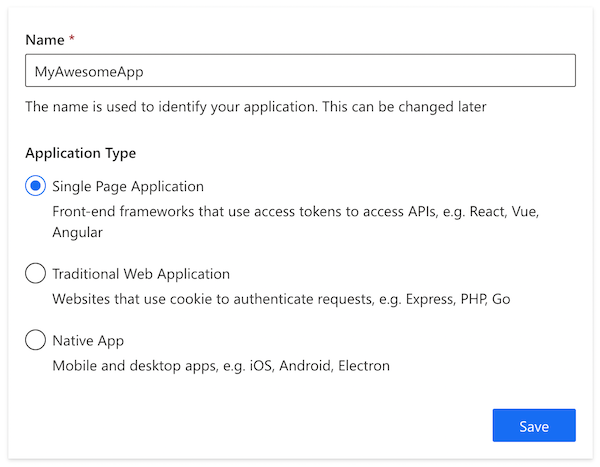
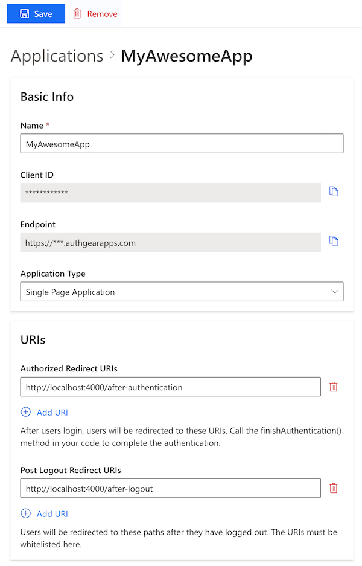
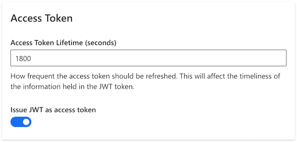

# JavaScript (Web)

In this guide, you'll learn how to integrate Authgear into your website using the [Token Approach](https://docs.authgear.com/get-started/authentication-approach/token-based). In the token approach, the Authgear server returns an access token and refresh token to your SPA application after successful user authentication. Your application can send this access token in subsequent HTTP requests to access protected resources. The alternative to the token approach is the [Cookies Approach](https://docs.authgear.com/get-started/authentication-approach/cookie-based) which involves  Authgear setting cookies after successful authentication. Your application will send the cookies in subsequent requests to access protected resources.

This guide uses the Authgear Web SDK for integrating Authgear with a Web app. Supported browsers include:

* Last 2 Firefox major versions
* Last 2 Chrome major versions
* Last 2 Edge major versions
* Last 3 Safari major versions

## Setup Application in Authgear

Signup for an Authgear Portal account in [https://portal.authgear.com/](https://portal.authgear.com/). Or you can use your self-deployed Authgear.

From the Project listing, create a new Project or select an existing Project. After that, we will need to create an application in the project.



**Step 1: Create an application in the Portal**

1. Go to **Applications** on the left menu bar.
2. Click **⊕Add Application** in the top tool bar.
3. Input the name of your application and select the application type **Single Page Application** or **Traditional Web Application**. Click "Save".
4. You will see a list of guides that can help you for setting up, then click "Next".



**Step 2: Configure the application**

1. Decide the paths in your website that users will be redirected to after they have authenticated or logged out with Authgear.
   * For after authentication (**Authorized Redirect URIs**). e.g.`https://yourdomain.com/after-authentication` , or `http://localhost:4000/after-authentication` for local development.
   * For after logging out (**Post Logout Redirect URIs**). e.g.`https://yourdomain.com/after-logout` , or `http://localhost:4000/after-logout` for local development.
2. Fill in the **Authorized Redirect URIs** and **Post Logout Redirect URIs** that you have defined in the previous steps.
3. Click "Save" in the top tool bar and keep the **Client ID**. You can also obtain it again from the applications list later.




If you want to validate JWT access token in your server, under **Access Token**, turn on **Issue JWT as access token**. If you will forward incoming requests to Authgear Resolver Endpoint for authentication, leave this unchecked. See comparisons in [Backend Integration](../backend-api/backend-integration.md).




**Step 3: Setup a custom domain (Required for** [**Cookie-based authentication**](../authentication-approach/cookie-based.md)**)**

1. Go to **Custom Domains**
2. Add your custom domain in **Input New Domain**
3. Follow the instructions to verify and configure the custom domain.
4. Click "Activate" to change the domain status to "Active". The custom domain will be your new Authgear endpoint.


For cookie-based authentication, users will log in via the custom domain e.g. _"auth.yourdomain.com"_ . So that a session cookie of your domain is set for the client and all your websites under _"\*.yourdomain.com"_ would share the same session cookies automatically.




```
oauth:
  clients:
    - name: mywebsite
      client_id: a_random_generated_string
      redirect_uris:
        - "https://yourdomain.com/auth-redirect"
      post_logout_redirect_uris:
        - "https://yourdomain.com/after-logout"
      grant_types:
        - authorization_code
        - refresh_token
      response_types:
        - code
        - none
```



## Install the Authgear Web SDK

The Web JS SDK is available as [an npm package](https://www.npmjs.com/package/@authgear/web). Install the package in your project directory

#### NPM

```bash
npm install --save --save-exact @authgear/web
```

#### Yarn

```bash
yarn add @authgear/web --exact
```

## Initialize the Authgear SDK

The SDK must be properly configured before use. Call the `configure` method every time your page loads up.

```javascript
import authgear from "@authgear/web";

authgear
  .configure({
    // custom domain endpoint or default endpoint
    // default domain should be something like: https://<yourapp>.authgear.cloud
    endpoint: "<your_app_endpoint>",
    // Client ID of your application
    clientID: "<your_client_id>",
    // sessionType can be "refresh_token" or "cookie", default "refresh_token"
    sessionType: "refresh_token",
  })
  .then(
    () => {
      // configure successfully.
    },
    (err) => {
      // failed to configure.
    }
  );
  
```

The SDK should be [configured](https://authgear.github.io/authgear-sdk-js/docs/web/interfaces/configureoptions) according to the authentication approach of your choice

* **Token-based authentication**
  * `sessionType` should be set to `refresh_token`
* **Cookie-based authentication**
  * `endpoint` must be a custom domain endpoint
  * `sessionType` should be set to `cookie`

## Login to the application

### Step 1: Start the auth flow

When the user clicks login/signup on your website, make a **start authorization** call to redirect them to the login/signup page.

```javascript
import authgear from "@authgear/web";

authgear
  .startAuthentication({
    // configure redirectURI which users will be redirected to
    // after they have authenticated with Authgear
    // you can use any path in your website
    // make sure it is in the "Redirect URIs" list of the Application
    redirectURI: "https://yourdomain.com/auth-redirect",
    prompt: "login",
  })
  .then(
    () => {
      // started authorization, user should be redirected to Authgear
    },
    (err) => {
      // failed to start authorization
    }
  );
  
```

By default, Authgear will not ask user to login again if user has already logged in. You can optionally set `prompt` to `login` if you want the user always reach the login page and login again.

### Step 2: Handling auth result in the redirectURI

After the user authenticates on the login page, the user will be redirected to the `redirectURI` with a `code` parameter in the URL query. In the `redirectURI` of your application, make a **finish authorization** call to handle the authentication result. This will attempt to exchange the `code` for the access token and user info.

Once authorization succeed, the application should navigate the user to other URL such as the user's home page and remove the `code` query parameters.

```javascript
import authgear from "@authgear/web";

authgear.finishAuthentication().then(
  (userInfo) => {
    // authorized successfully
    // you should navigate the user to another path
  },
  (err) => {
    // failed to finish authorization
  },
);
```

Now, your user is logged in!

## Get the Logged In State

When you start launching the application. You may want to know if the user has logged in. (e.g. Redirect users to log in if they haven't logged in). The `sessionState` reflects the user logged in state in the SDK local state. That means even the`sessionState` is `AUTHENTICATED`, the session may be invalid if it is revoked remotely. After initializing the Authgear SDK, call `fetchUserInfo` to update the `sessionState` as soon as it is proper to do so.

```javascript
// After authgear.configure, it only reflect SDK local state.
// value can be NO_SESSION or AUTHENTICATED
let sessionState = authgear.sessionState;

if (sessionState === "AUTHENTICATED") {
    authgear
        .fetchUserInfo()
        .then((userInfo) => {
            // sessionState is now up to date
        })
        .catch((e) => {
            // sessionState is now up to date
            // it will change to NO_SESSION if the session is invalid
        });
}
```

The value of `sessionState` can be `UNKNOWN`, `NO_SESSION` or `AUTHENTICATED`. Initially the `sessionState` is `UNKNOWN`. After a call to `authgear.configure`, the session state would become `AUTHENTICATED` if a previous session was found, or `NO_SESSION` if such session was not found.

## Fetching User Info

In some cases, you may need to obtain current user info through the SDK. (e.g. Display email address in the UI). Use the `fetchUserInfo` function to obtain the user info, see [example](../../how-to-guide/user-profiles/user-profile.md#userinfo-endpoint).

## Log the user out

Use the `logout` function to log out the user. The user will be redirected to your Authgear endpoint to log out their session. You should provide the `redirectURI` for the user to return to your app.

```javascript
import authgear from "@authgear/web";

authgear
  .logout({
    // user will navigate to the redirectURI after logged out
    // make sure it is in the "Post Logout Redirect URIs" in the application portal
    redirectURI: "https://yourdomain.com",
  })
  .then(
    () => {
      // logged out successfully
    },
    (err) => {
      // failed to logout
    }
  );
```

## Calling an API

### Token-based authentication

To include the access token to the HTTP requests to your application server, there are two ways to achieve this.

#### Option 1: Using fetch function provided by Authgear SDK

Authgear SDK provides the `fetch` function for you to call your application server. This `fetch` function will include the Authorization header in your application request, and handle refresh access token automatically. The `authgear.fetch` implements [fetch](https://fetch.spec.whatwg.org/).

```javascript
authgear
    .fetch("YOUR_SERVER_URL")
    .then(response => response.json())
    .then(data => console.log(data));
```

#### Option 2: Add the access token to the HTTP request header

You can get the access token through `authgear.accessToken`. Call `refreshAccessTokenIfNeeded` every time before using the access token, the function will check and make the network call only if the access token has expired. Include the access token into the Authorization header of the application request.

```javascript
authgear
    .refreshAccessTokenIfNeeded()
    .then(() => {
        // access token is ready to use
        // accessToken can be string or undefined
        // it will be empty if user is not logged in or session is invalid
        const accessToken = authgear.accessToken;

        // include Authorization header in your application request
        const headers = {
            Authorization: `Bearer ${accessToken}`
        };
    });
```

## Next steps

To protect your application server from unauthorized access. You will need to [integrate Authgear to your backend](https://docs.authgear.com/get-started/backend-api/backend-integration).


[backend-integration.md](../backend-api/backend-integration.md)


## JavaScript SDK Reference

For detailed documentation on the JavaScript Web SDK, visit [@authgear/web Reference](https://authgear.github.io/authgear-sdk-js/docs/web/)
