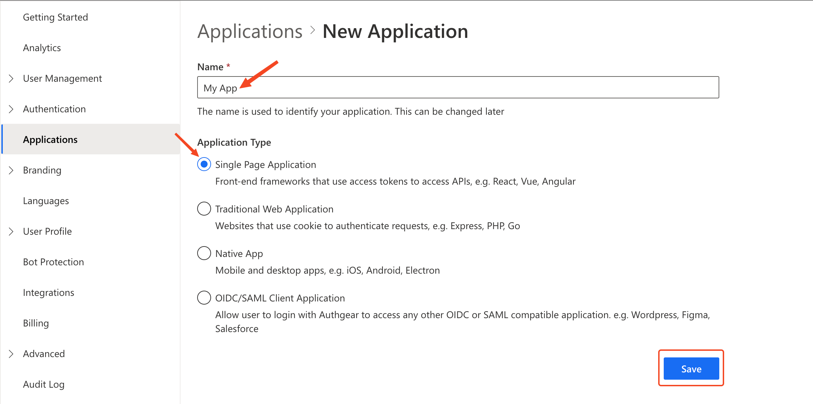
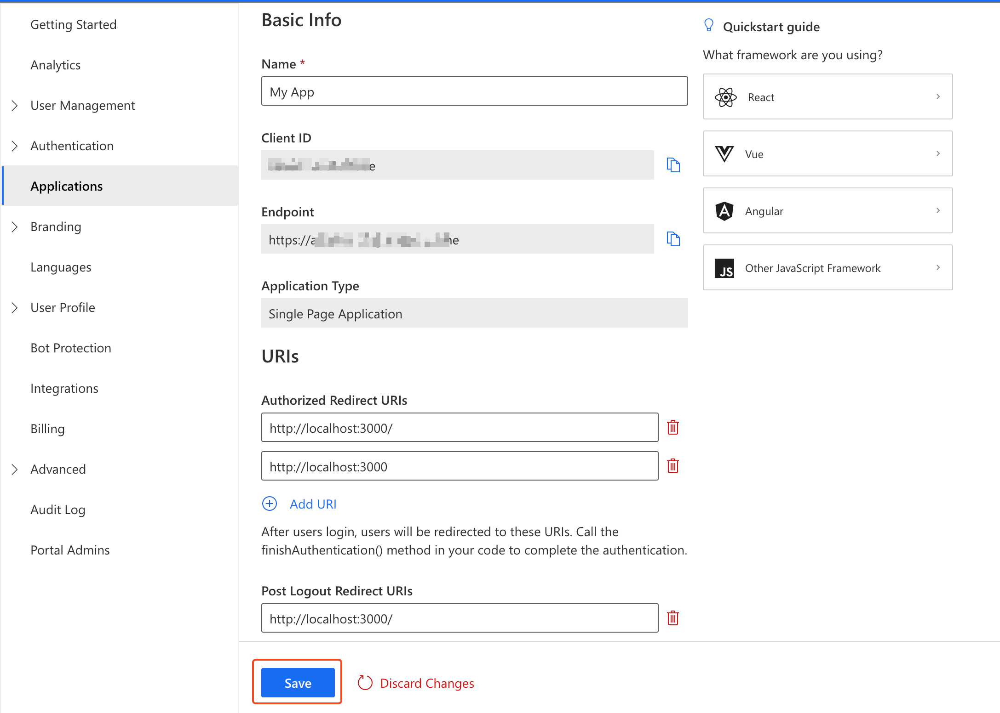
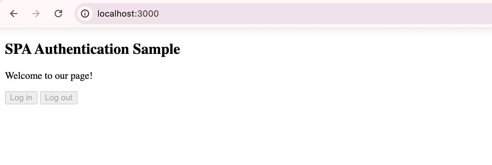
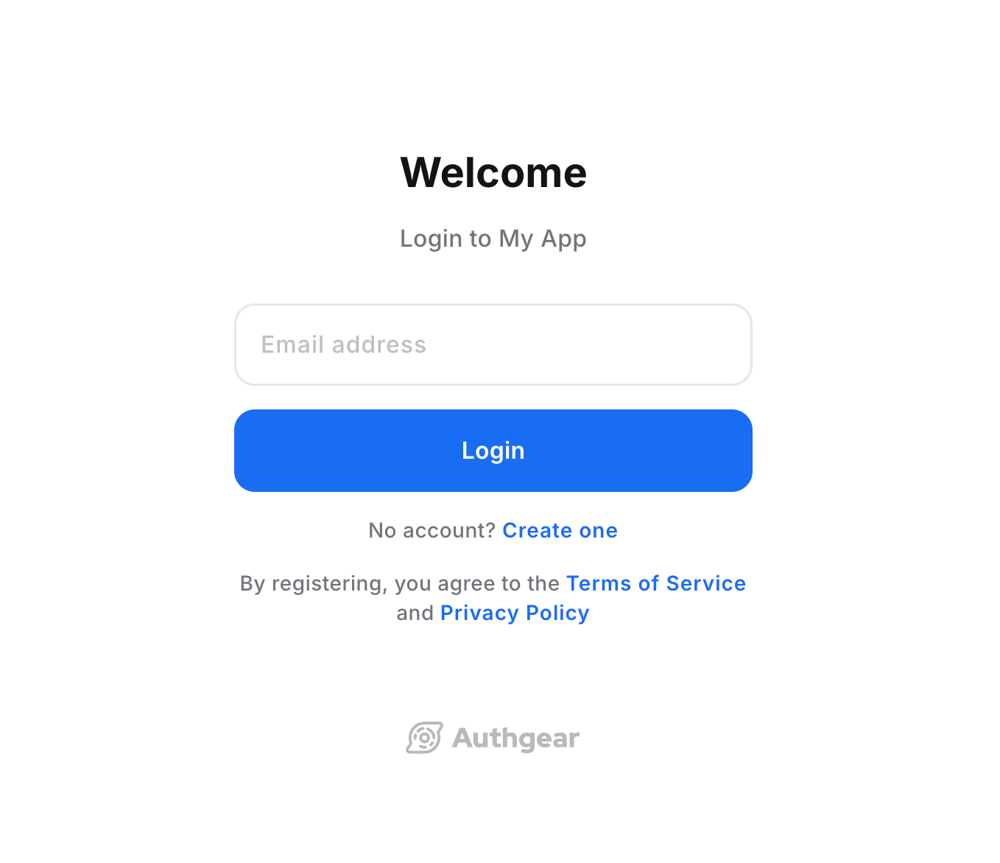

# JavaScript (Web)

In this guide, you'll learn how to integrate Authgear into your website using the [Token Approach](https://docs.authgear.com/get-started/authentication-approach/token-based). In the token approach, the Authgear server returns an access token and a refresh token to your SPA application after successful user authentication.&#x20;

Your application can send the access token in subsequent HTTP requests to access protected resources.

Follow this guide to add Authgear SDK to any web application in under 🕐 **10 minutes**.


See and clone the full code for the demo app for this tutorial in [<mark style="color:orange;">**the Github Repo here**</mark>](https://github.com/authgear/authgear-example-spa-js).


This guide uses the Authgear Web SDK for integrating Authgear with a SPA Web app. Supported browsers include:

* Last 2 Firefox major versions
* Last 2 Chrome major versions
* Last 2 Edge major versions
* Last 3 Safari major versions

## Setup Application in Authgear

Signup for an Authgear Portal account in [https://portal.authgear.com/](https://portal.authgear.com/). Or you can use your self-deployed Authgear.

From the Project listing, create a new Project or select an existing Project. After that, we will need to create an application in the project.

### **Step 1: Create an application in the Portal**

Go to **Applications** on the left menu bar.

<figure><figcaption></figcaption></figure>

Click **⊕Add Application** in the top toolbar.

Input the name of your application and select the application type **Single Page Application**. Click the **Save** button to proceed.

<figure><figcaption><p>create spa application authgear portal</p></figcaption></figure>

On the next screen you will see a list of tutorials for different frameworks, click on **Next** to skip to your client application configuration page.

### **Step 2: Configure the application**

First, decide the paths in your website that users will be redirected to after they have authenticated with Authgear.

To run the demo app in this tutorial offline, scroll to the URIs section of your client application page add the following URI:

Under **Authorized Redirect URIs** add `http://localhost:3000/` &#x20;


Note that the trailing "/" in the above URLs must be included.




Click on the **Save** button to keep your changes.

## Add Authgear to any web page using JavaScript

In this section, we'll create a simple web page and use the Authgear Web JavaScript SDK to add user authentication to the page.

### Step 1: Create a Basic Single Page Web Application

For this guide, we'll create a basic web application with only one page. Follow these steps to set up the application. First, create a new directory on your computer for the project. You can do this in a terminal using the following commands:

```bash
mkdir my-webapp
cd my-webapp
```

### Step 2: Create Web Server

We'll create an Express.js server in the web project directory so that we can access the HTML page in a web browser using `http://localhost:3000`. Run the following commands from the root of your web project directory to install Express.

First, generate a package.json file in your project directory:

```bash
npm init -y
```

Install the Express npm package:

```bash
npm install express
```

Install Nodemon (used for adding hot road to JavaScript development):

```sh
npm install -D nodemon
```

Now create a `server.js` file in the root folder of your project. Add the following code to server.js:

```javascript
const express = require("express");
const { join } = require("path");
const app = express();

// Serve static assets from the /public folder
app.use(express.static(join(__dirname, "public")));

// Serve the index page for all other requests
app.get("/*", (_, res) => {
  res.sendFile(join(__dirname, "index.html"));
});

// Listen on port 3000
app.listen(3000, () => console.log("Application running on port 3000"));
```

Next, open the `package.json` in your project directory and add the following lines in the script section:

```json
"start": "node server.js",
"dev": "nodemon server.js"
```


Note that the above you may use your preferred tool/environment to serve the HTML file and skip the step of creating an Express server.


### Step 3: Create Web Page

Create a new file called `index.html` in the root of your project directory. Add the following code to the file:

```html
<!DOCTYPE html>
<html>
  <head>
    <meta charset="UTF-8" />
    <title>Authgear SPA SDK Sample</title>
    <link rel="stylesheet" type="text/css" href="/css/main.css" />
  </head>

  <body>
    <h2>SPA Authentication Sample</h2>
    <p>Welcome to our page!</p>
    <button id="btn-login" disabled="true" onclick="login()">Log in</button>
    <button id="btn-logout" disabled="true" onclick="logout()">Log out</button>
  </body>
</html>
```

The content `index.html` is a simple web page that contains some text, a Log in button, and a Log out button. In later steps, we will implement the `onclick` events for both steps such that each calls the correct function from the Authgear Web JavaScript SDK.

### Step 4: Install Authgear Web JavaScript SDK

#### CDN

The Web JS SDK is available on a CDN that you can include in any webpage using the following script tag:

```html
<script src="https://unpkg.com/@authgear/web@2.2.0/dist/authgear-web.iife.js"></script>
```

The Web JS SDK is also available as [an npm package](https://www.npmjs.com/package/@authgear/web). That can be installed using any of the following commands:

#### NPM

```bash
npm install --save --save-exact @authgear/web
```

#### Yarn

```bash
yarn add @authgear/web --exact
```

We recommend that you use the npm package to add Authgear to your web application when you're using build tools like Vite and Webpack, and when building with frameworks like React, Vue, Angular, etc.

The easiest way to add a JavaScript library such as the Authgear SDK to a generic Single Page Application (a basic `.html` file page), is to use a CDN. Hence, we'll use the CDN method to add the Authgear Web JavaScript SDK to our demo application for this tutorial.&#x20;

To install the Authgear SDK, add the Authgear SDK CDN \<script> tag to `index.html`  on a new line just before the `</body>` . Your index.html should look like this at this point:

```html
<!DOCTYPE html>
<html>
  <head>
    <meta charset="UTF-8" />
    <title>Authgear SPA SDK Sample</title>
    <link rel="stylesheet" type="text/css" href="/css/main.css" />
  </head>

  <body>
    <h2>SPA Authentication Sample</h2>
    <p>Welcome to our page!</p>
    <button id="btn-login" disabled="true" onclick="login()">Log in</button>
    <button id="btn-logout" disabled="true" onclick="logout()">Log out</button>
    <script src="https://unpkg.com/@authgear/web@2.2.0/dist/authgear-web.iife.js"></script>
  </body>
</html>
```

With that, we have added the Authgear SDK to a basic HTML page and we are ready to start making calls to its functions.

#### Checkpoint

At this point, the structure of your project folder should look like this:

```
my-webapp
├── index.html
├── server.js
└── package.json
```

To test your progress so far save your files then run the `npm run dev` command. Next open `localhost:3000` on your preferred web browser and you should see a page that looks like this:

<figure><figcaption><p>spa demo web app page</p></figcaption></figure>

### Step 5: Initialize Authgear SDK

Create a new `public/js` directory in the root of your project directory.&#x20;

Create a new file called `app.js` in the `public/js` directory. Add the following content to `app.js`:

```javascript
let authgearClient = null;

const configureClient = async () => {
    authgearClient = window.authgear.default;

    await authgearClient.configure({
        endpoint: "<YOUR_AUTHGEAR_PROJECT_DOMAIN>",
        clientID: "<YOUR_AUTHGEAR_APP_CLIENT_ID>",
        sessionType: "refresh_token",
    }).then(
        () => {
            console.log("Authgear client successfully configured!");
        },
        (err) => {
            console.log("Failed to configure Authgear");
        }
    );
};

window.onload = async () => {
    await configureClient();
}
```

In app.js, the `configureClient()` function gets an instance of the Authgear Web SDK (`authgearClient`) and then calls the `configure()` function of the SDK to initialize Authgear.

You can find value for `clientID` and `endpoint` from your Authgear client application configuration page.

Finally, link `app.js` in `index.html` using `<script src="js/app.js"></script>` just above the line with the Authgear CDN `<script>` tag as shown below:

```html
<body>
  <h2>SPA Authentication Sample</h2>
  <p>Welcome to our page!</p>
  <button id="btn-login" disabled="true" onclick="login()">Log in</button>
  <button id="btn-logout" disabled="true" onclick="logout()">Log out</button>
  <script src="js/app.js"></script>
  <script src="https://unpkg.com/@authgear/web@2.2.0/dist/authgear-web.iife.js"></script>
</body>
```

### Step 6: Start the authentication flow

When the user clicks login/signup on your website, make a **start authorization** call to redirect them to the login/signup page (AuthUI).&#x20;

In this step, we'll implement the `login()` function that is called when the **Log in** button is pressed.

Update `app.js` by adding the following code after the declaration of the `configureClient()` function:

```javascript
const login = async () => {
    await authgearClient
        .startAuthentication({
            redirectURI: "http://localhost:3000/",
            prompt: "login",
        })
        .then(
            () => {
                console.log("Logged in!");
            },
            (err) => {
                console.log("Log in failed", err);
            }
        );
};
```



Make sure you have added `http://localhost:3000/` as an Authorized Redirect URI in the portal for your Authgear client application. Note that the last "/" in the URL is required.


### Step 7: Handling auth result in the redirectURI

After the user authenticates on the login page, the user will be redirected to the `redirectURI` with a `code` parameter in the URL query. In the `redirectURI` of your application, make a **finish authorization** call to handle the authentication result. This will attempt to exchange the `code` for the access token and user info.

Once authorization succeeds, the application should be able to display user info and access protected resources.

To handle the redirect after authentication, we'll call the Authgear SDK's `finishAuthentication()` function when there's a code parameter in the URL of the current page. To do that, update the `window.onload` callback in app.js to the following:&#x20;

```javascript
window.onload = async () => {
    await configureClient();
    updateUI();

    const query = window.location.search;
    if (query.includes("code=")) {
        await authgearClient.finishAuthentication();
        updateUI();
        window.history.replaceState({}, document.title, "/");
    }
}
```

The `updateUI()` function will update the state of the webpage when the user's logged-in state changes. Add the following code to the end of app.js to implement `updateUI`:

```javascript
const updateUI = async () => {
    const isAuthenticated = authgearClient.sessionState === "AUTHENTICATED";

    document.getElementById("btn-logout").disabled = !isAuthenticated;
    document.getElementById("btn-login").disabled = isAuthenticated;
};
```

The complete content of app.js at the end of this step should look like this:

```javascript
let authgearClient = null;

const configureClient = async () => {
    authgearClient = window.authgear.default;

    await authgearClient.configure({
        endpoint: "<YOUR_AUTHGEAR_PROJECT_DOMAIN>",
        clientID: "<YOUR_AUTHGEAR_CLIENT_APP_ID>",
        sessionType: "refresh_token",
    }).then(
        () => {
            console.log("Authgear client successfully configured!");
        },
        (err) => {
            console.log("Failed to configure Authgear");
        }
    );
};

const login = async () => {
    await authgearClient
        .startAuthentication({
            redirectURI: "http://localhost:3000/",
            prompt: "login",
        })
        .then(
            () => {
                console.log("Logged in!");
            },
            (err) => {
                console.log("Log in failed", err);
            }
        );
};

window.onload = async () => {
    await configureClient();
    updateUI();

    const query = window.location.search;
    if (query.includes("code=")) {
        await authgearClient.finishAuthentication();
        updateUI();
        window.history.replaceState({}, document.title, "/");
    }
}

const updateUI = async () => {
    const isAuthenticated = authgearClient.sessionState === "AUTHENTICATED";

    document.getElementById("btn-logout").disabled = !isAuthenticated;
    document.getElementById("btn-login").disabled = isAuthenticated;
};
```

#### Checkpoint

At this point, your file structure should look like this:

```
my-webapp
├── index.html
├── server.js
├── public/js
│   └── app.js
└── package.json
```

Save all changes in your code, and rerun your app on a web browser. This time, clicking on the **Log in** button should redirect you to your Authgear project's user login page (AuthUI).

<figure><figcaption></figcaption></figure>

### Step 8: Open User Settings Page

To add a User Settings button to your app, add the following tag to your `index.html` just below the Logout button:

```html
<button id="btn-settings" disabled="true" onclick="openUserSettings()">User Settings</button>
```

Next, add the following code to `app.js`: just below the `logout()` function:

```javascript
const openUserSettings = () => {
    authgearClient.open("/settings");
}
```

Finally, add the following line to the end of your `updateUI()` function so that the User Settings button is displayed when the user is authenticated:

```javascript
document.getElementById("btn-settings").disabled = !isAuthenticated;
```

Save your work and run your app again. When you click on the User Settings button, your web app should open the pre-built User Settings page.

### Step 9: Additional Actions

#### Get the Logged In State

When you start launching the application. You may want to know if the user has logged in. (e.g. Redirect users to log in if they haven't logged in). The `sessionState` reflects the user logged-in state in the SDK local state. That means even the`sessionState` is `AUTHENTICATED`, the session may be invalid if it is revoked remotely. After initializing the Authgear SDK, call `fetchUserInfo` to update the `sessionState` as soon as it is proper to do so.

```javascript
// After authgearClient.configure, it only reflect SDK local state.
// value can be NO_SESSION or AUTHENTICATED
let sessionState = authgearClient.sessionState;

if (sessionState === "AUTHENTICATED") {
    authgearClient
        .fetchUserInfo()
        .then((userInfo) => {
            // sessionState is now up to date
        })
        .catch((e) => {
            // sessionState is now up to date
            // it will change to NO_SESSION if the session is invalid
        });
}
```

The value of `sessionState` can be `UNKNOWN`, `NO_SESSION` or `AUTHENTICATED`. Initially the `sessionState` is `UNKNOWN`. After a call to `authgearClient.configure`, the session state would become `AUTHENTICATED` if a previous session was found, or `NO_SESSION` if such session was not found.

#### Fetching User Info

In some cases, you may need to obtain current user info through the SDK. (e.g. Display email address in the UI). Use the `fetchUserInfo` function to obtain the user info.

```javascript
authgearClient.fetchUserInfo();
```

See more user info [examples](../../how-to-guide/user-profiles/user-profile.md#userinfo-endpoint).

#### Log the user out

Use the `logout` function to log out the user. The user will be redirected to your Authgear endpoint to log out their session. You should provide the `redirectURI` for the user to return to your app.

```javascript

authgearClient
  .logout({
    // user will navigate to the redirectURI after logged out
    // make sure it is in the "Post Logout Redirect URIs" in the application portal
    redirectURI: "https://yourdomain.com",
  })
  .then(
    () => {
      // logged out successfully
    },
    (err) => {
      // failed to logout
    }
  );
```

#### Calling an API

Once you have logged-in user, you can start making authenticated requests to backend APIs as described below.

#### Token-based authentication

There are two ways to include the access token in the HTTP requests to your application server.

#### Option 1: Using fetch function provided by Authgear SDK

Authgear SDK provides the `fetch` function for you to call your application server. This `fetch` function will include the Authorization header in your application request, and handle refresh access token automatically. The `authgearClient.fetch` implements [fetch](https://fetch.spec.whatwg.org/).

```javascript
authgearClient
    .fetch("YOUR_SERVER_URL")
    .then(response => response.json())
    .then(data => console.log(data));
```

#### Option 2: Add the access token to the HTTP request header

You can get the access token through `authgearClient.accessToken`. Call `refreshAccessTokenIfNeeded` every time before using the access token, the function will check and make the network call to refresh the access token only if it is expired. Include the access token in the Authorization header of the application request.

```javascript
authgearClient
    .refreshAccessTokenIfNeeded()
    .then(() => {
        // access token is ready to use
        // accessToken can be string or undefined
        // it will be empty if user is not logged in or session is invalid
        const accessToken = authgearClient.accessToken;

        // include Authorization header in your application request
        const headers = {
            Authorization: `Bearer ${accessToken}`
        };
    });
```

## Next steps

To protect your application server from unauthorized access. You will need to [integrate Authgear to your backend](../backend-api/).


[backend-api](../backend-api/)


## JavaScript SDK Reference

For detailed documentation on the JavaScript Web SDK, visit [@authgear/web Reference](https://authgear.github.io/authgear-sdk-js/docs/web/)