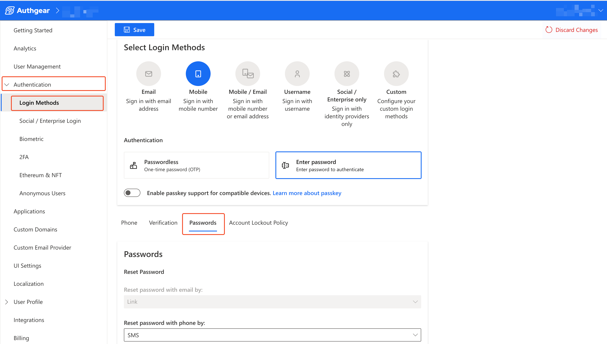
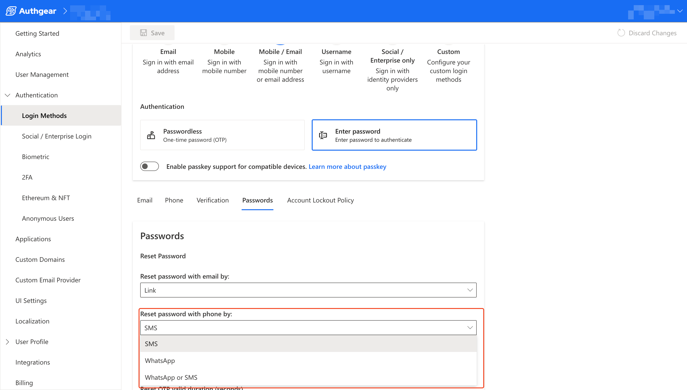
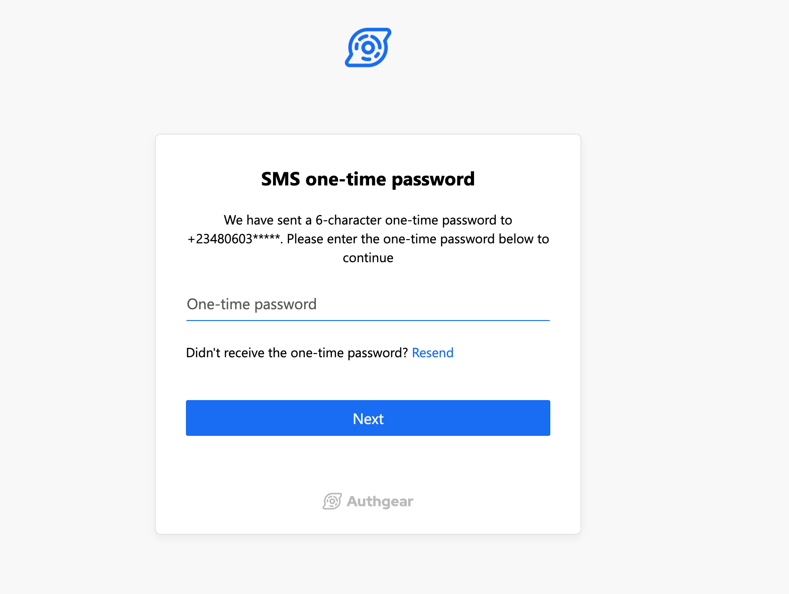
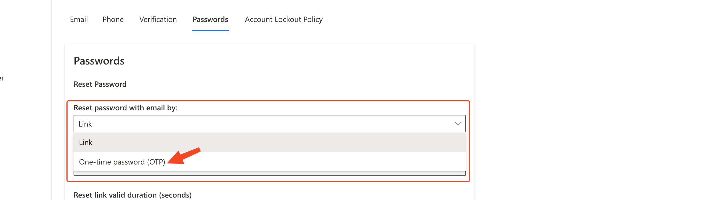

# Forgot/Reset Password settings

The Forgot/Reset Password settings tab allows you to configure the behavior of the account recovery process for your Authgear project to meet your specific needs. For example, you can use this feature to determine whether to deliver recovery code to users via SMS, WhatsApp, or email.

In this post, you'll learn the various configurations available via the Password Settings tab and how to navigate to the page.

### 1. How to Navigate to the Password Settings Page

To access the Password Settings page, log in to your Authgear account, select your project, and then navigate to **Authentication** > **Login Methods**.&#x20;

Next, select your current **Login Method** (Email, Mobile, Mobile/Email, or Custom). The login method you select affects the options available for you to customize.

Scroll down to just below the **Select Login Methods** section and click on the Password tab to reveal the Password settings screen.&#x20;

<figure><figcaption></figcaption></figure>

**Note**: Make sure the login method you select has password enabled (you can not view the password settings screen if you only enable Passwordless login).

### 2. Enable Reset Password by Phone Number

When you enable password reset by phone number for your project, users will receive an OTP code that they can enter in the AuthUI to finish the account recovery flow.

To able this feature, first in the Password Settings tab, select a Login Method that supports Mobile (E.g Mobile or Mobile/Email methods) and has the password option enabled.&#x20;

Next, click on the "**Reset password with phone by**" dropdown then select how you want to send the OTP from the available options. The available options include SMS, WhatsApp, and WhatsApp or SMS.

<figure><figcaption></figcaption></figure>

Once you're done save your changes to enable the new configuration.

The next time your users try to reset their password using their phone number as the login ID, they should see a screen like this to enter the OTP sent to their phone:

<figure><figcaption></figcaption></figure>

### 3. Reset by Email using OTP Instead of Link

If you prefer your users receive an OTP that they can enter in the AuthUI instead of a recovery link that they would normally click, you can use this password recovery settings to enable that.

To enable this setting, click on the "**Reset password with email by**" dropdown in the Password Settings tab. Then, select the **One-time Password (OTP)** option. Save your changes to enable the feature.

<figure><figcaption></figcaption></figure>
