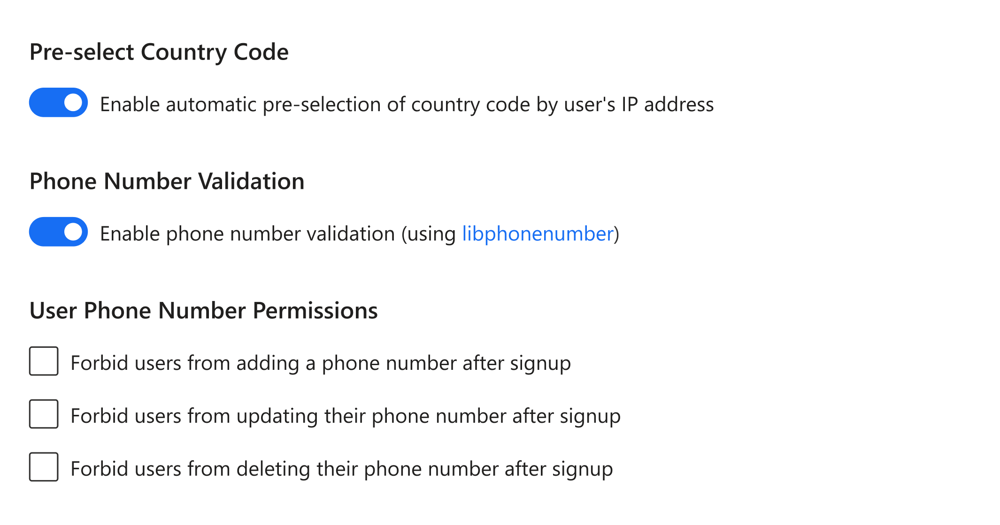

# Phone number validation

Use the Phone Number Validation Settings to configure your app to check the phone number your users enter without depending on SMS or WhatsApp for validation and verification.

Under the hood, the Phone Number Validation Settings uses the [libphonenumber](https://github.com/google/libphonenumber) library. The library can parse, format, and validate phone numbers for all countries/regions in the world.

To access Phone Number Validation settings in your Authgear project, navigate to **Authentication** > **Login Methods** in the Authgear Portal.

Next, select a login method that uses mobile phone number as login ID (e.g., **Mobile**, **Mobile/Email,** or **Custom** with phone number enabled as login ID). Then, scroll down to the Phone Number Validation section. Toggle the **Enable phone number validation (using libphonenumber)** switch to enable or disable phone number validation.

<figure><figcaption>
phone number validation
</figcaption></figure>


**Note**: The phone number validation logic may become outdated due to recent changes in the numbering style in certain countries/regions. In such a case, you can **disable** the Phone Number Validation feature to enable users to register new numbers that the logic is unable to recognize.

