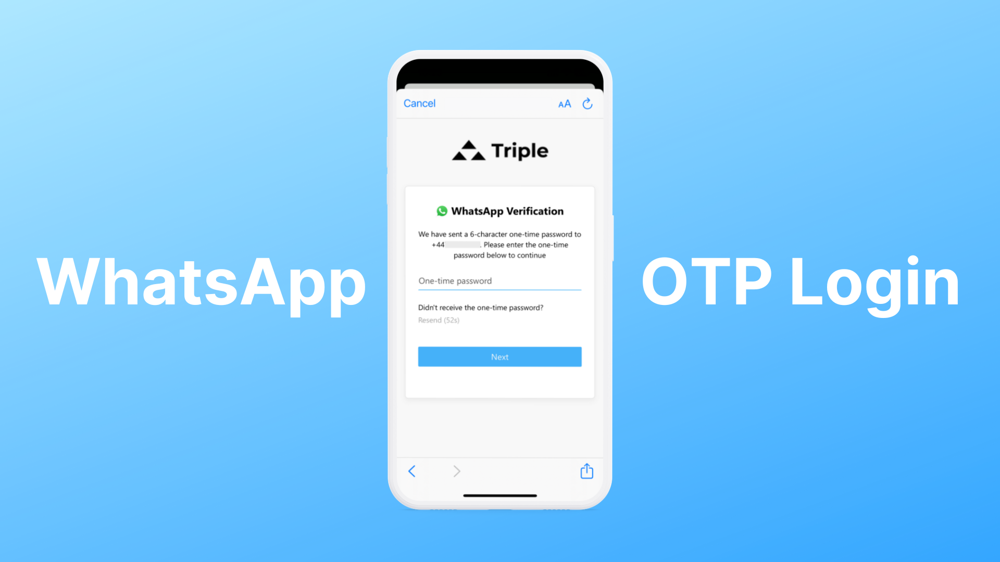
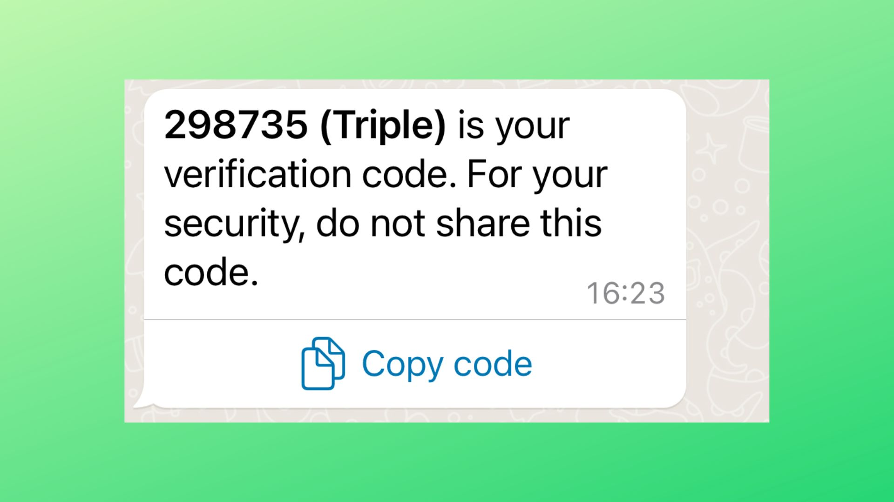

# Add WhatsApp OTP Login

<figure><figcaption></figcaption></figure>

Authgear let your users login passwordlessly with WhatsApp OTP.

To enable this feature from the Portal:

1. Go to **Authentication > Login Methods**, we are going make few changes on this page.
2. In the top section of **Select Login Methods**, select **Mobile**.
3. In **Authentication** of **Select Login Methods**, select **Passwordless**.
4. In the tabs section below, switch to the tab **Verification and OTP**.
5. In the dropdown **Verify phone number by**, select either **WhatsApp or SMS** or **WhatsApp only**.
6. Press **Save** on the top left corner.

<figure><figcaption></figcaption></figure>

When the user login with their phone number, a WhatsApp message with an OTP and the app name will be received. They can copy the code by tapping on the "Copy code" button and log in by the code.

If "**Verify phone number by WhatsApp or SMS**" is enabled, the user can switch to receive the OTP via SMS instead in the login page.
