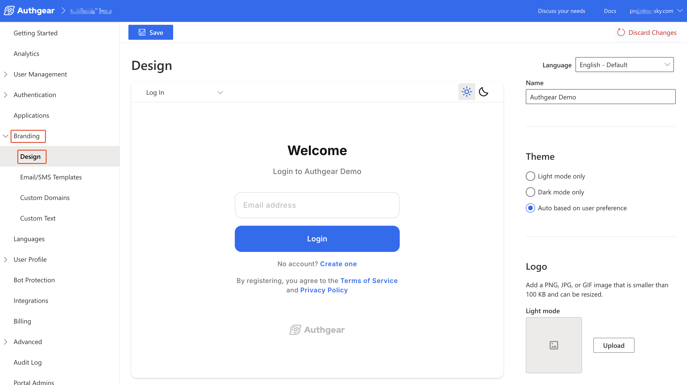
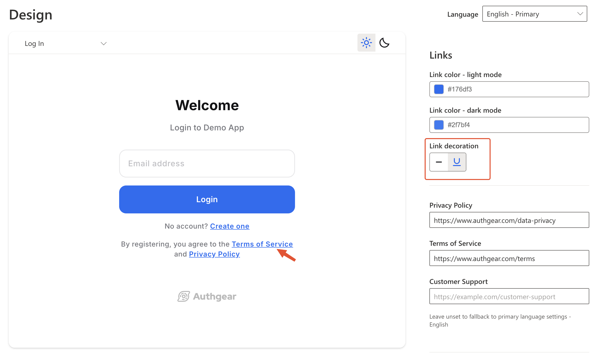

# Branding in Auth UI

Authgear makes it easy for you to customize the built-in AuthUI to meet the specific branding needs of your application. You can customize UI elements such as the logo, text input fields, and buttons.

In this guide, you'll learn how to use all the customization options available.

### Authgear Design Page

To open the new Authgear Design page, log in to the Authgear Portal and navigate to **Branding** > **Design**.

<figure><figcaption></figcaption></figure>

The Design page is divided into 2 columns. The left column shows a preview of your customizations in real time. The right column is the menu with all the customization options for different UI elements (e.g. Name, Logo, Favicon).

The **Language** drop-down on the top right corner allows you to customize AuthUI text such as Organisation Name, and [links](branding.md#id-7.-links) (Privacy Policy, Terms of Service, and Customer Support) for specific languages.

### Customization Options

#### 1. Name

Use this option to set the application name you want to display in AuthUI (Login and Register pages).

#### 2. Theme

The Theme options allow you to switch between Light Mode, Dark Mode, or Auto (User Preference) on the Design page and for your project. If you select a theme and click the **Save** button, that theme will be applied to your project.

When the **Auto based on user preference** theme option is selected, AuthUI will choose a theme based on a specific user's settings.

You can also use the Design page to select a theme (Dark mode or Light mode) to further customize it. Skip to the [Dark mode section](branding.md#customize-dark-mode-and-light-mode) to learn more

#### 3. Logo

The logo option allows you to replace the default Authgear logo in AuthUI with your own brand logo. You can add a PNG, JPG, or GIF image smaller than 100 KB.

#### 4. Favicon

Use this option to add a custom favicon that will show in browser tabs. The size of the image you upload must be a multiple of 32px square, and be a PNG, JPG, or GIF file.

#### 5. Card

The card option allows you to set the **Alignment** of the AuthUI card. By default, the AuthUI card is aligned to the **Center**. You change the alignment to either Left, Right, or Center.

#### 6. Background

Use this option to change the background color of AuthUI pages. You can either use a background color (CSS hexadecimal color code) or upload a PNG, JPEG, or GIF image smaller than 1 MB.

#### 7. Buttons

The button customization option lets you customize multiple properties of the buttons in AuthUI. The following are the properties you can customize:

**Primary button:** Use this field to set the fill color of the buttons.

**Primary button label:** Use this field to set the color of the text inside a button.

**Border radius style**: Set the type of border-radius you want here. Available options include square edges, curved edges, and full-rounded ends.&#x20;

**Border radius:** The curved edges Border radius style allows further customization for the actual size of the border radius in pixels. Use this option to set the level of curved edges.

#### 8. Links

Under the Links section, you'll find options to set the text color for links in AuthUI and also options for configuring [Privacy Policy, Terms of Service](https://docs.authgear.com/how-to-guide/built-in-ui/privacy-policy-terms-of-service), and [Customer Support](https://docs.authgear.com/how-to-guide/built-in-ui/customer-support-link) that are linked on AuthUI.

**Link color:** Use this option to set the text color for links in AuthUI. The value should be a hexadecimal color code.

**Link decoration:** You can use this option to add the `underline` text-decoration to links that are displayed in AuthUI.

<figure><figcaption></figcaption></figure>

**Privacy Policy:** Use this option to add a link to your privacy policy page.

**Terms of Service:** Use this option to set a custom link for your terms of service

**Customer Support:** Use this option to add a link to your support page.

Note that when any of the link properties is unset AuthUI will fall back to the primary language's default settings.

#### 9. Input field

The Input field section contains options for styling text input fields in AuthUI. The following are the various properties you can set:

**Border radius style:** Use this option to set the type of border-radius you want. The available options are square edges, curved edges, and full-rounded ends.

**Border radius:** You can use this option to further customize the level of curve of the curved edges Border radius style.

#### 10. Back to your app

Use this option to add a button under the [user settings page](https://docs.authgear.com/how-to-guide/built-in-ui/auth-ui) to navigate the user to your website.

#### 11. Authgear branding

You can use this toggle to remove Authgear branding in the AuthUI for your project.

### Customize Dark Mode and Light Mode

Attributes of the default AuthUI dark mode and light mode can be customized. For example, you can change the default color of the dark background in dark mode.

To customize an attribute, select the theme (light or dark mode) you wish to customize, then navigate to the attribute you wish to customize and modify it. Or select Auto based on user preference to see customization options for both themes at the same time.

The following are attributes you can customize for each theme:

* [Logo](branding.md#id-3.-logo)
* [Background](branding.md#id-6.-background)
* [Buttons](branding.md#id-7.-buttons) (fill color and label color)
* [Link Color](branding.md#id-8.-links)
