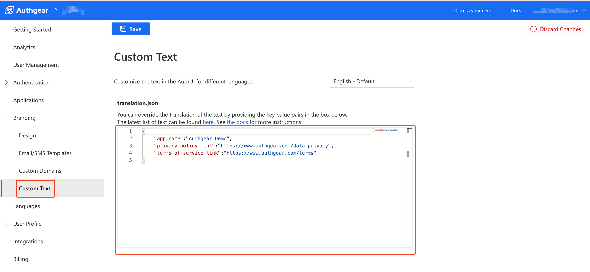

# Custom Text

You can use your own translation or change the default text in the AuthUI. To do this, you'll edit **translation.json**.

Custom Text enables the customization of specific UI texts in AuthUI for different languages.

Follow these steps to change any text in AuthUI.

1. Go to **Portal** > **Branding** > **Custom Text**
2. Override translation by adding the key-value pair or modifying the value of an existing key in the JSON object in the text box. See default translation.json [here](https://github.com/authgear/authgear-server/blob/52b0c60d8ea2/resources/authgear/templates/en/translation.json) for a list of available keys and their default values.

<figure><figcaption></figcaption></figure>


The value you add will override the default and if you remove a key-value pair, Authgear will use the default value.

