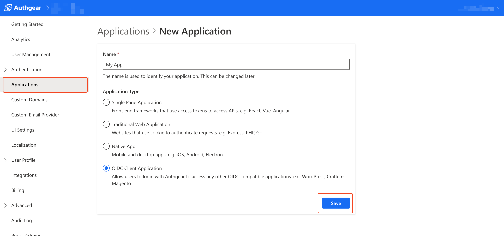

# Implement Authentication Flow API using PHP

You can create your own login and signup page from the ground up, using the Authentication flow API. In this guide, we'll implement Authentication Flow API using PHP.

Before we dive into the step-by-step guide, here are some key things you should know about working with the Authentication Flow API.

* **URL Query**: When any of the Authgear SDKs redirects users to your Custom UI URL, Authgear adds some additional queries to the URL. These queries are required in order to get the `finish_redirect_uri`.
* **Endpoint**: You can find your Authgear project domain from your application configuration page (usually under the **Endpoint** section) in Authgear Portal. The full endpoint is this Authgear domain followed by a valid path for an operation. For example, `https://my-project.authgear.cloud/api/v1/authentication_flows` to start an authentication flow. The two valid paths the API supports are `/api/v1/authentication_flows` and `/api/v1/authentication_flows/states/input` (which is for passing input to an existing authentication flow).
* **State Token**: The Authentication Flow API supports authentication with multi-step UI just like the default authentication flow in Auth UI. State tokens can be used to make this type of type of authentication flow work. You can pass information about a previous step to the next step by using the state token. For example, using the state token in the result of step A as input in step B to continue using the state of the previous step.
* **Inputs**: You can pass values to Authentication Flow API using the `input` or `batch_input` parameters in your HTTP request body. Use the `batch_input` to send multiple values as in an array and `input` when you are passing only 1 value.&#x20;
* **Finish Redirect URI**: A URL that you can use to redirect back to your app at the end of the authentication flow.

### Pre-requisites

To follow along with the example in this post, you should have the following:

* PHP installed on your local machine.
* [Composer](https://getcomposer.org/) installed on your computer.
* A code editor like VS Code, Sublime, Atom, or any editor you use for PHP development.
* An Authgear account. You can create one for free [here](https://www.authgear.com/).
* Enable Custom UI for your Authgear Project. [Contact us](https://www.authgear.com/talk-with-us) to enable custom UI.&#x20;

Now that you understand basic concepts about the Authentication API and what you need to follow along with our example, let's look at how to create our first custom login and signup page from scratch.

### Part 1: Configure Authgear Project in Portal

In this section, you'll learn how to configure your Authgear project for the Authentication Flow API.

#### Step 1: Set up an Authgear Application

Navigate to **Application** > **Add Application** in Authgear Portal (or select an existing application then update the configuration).

Enter a name for your application and set the **Application Type** as **OIDC Client Application**. then click on the **Save** button.

**Note**: You can select any Application Type on the Portal depending on the nature of your client application that will be interacting with Authgear and your Custom UI.

<figure><figcaption></figcaption></figure>

#### Step 2: Add Authorized Redirect URIs

In this step, you'll add redirect URIs to your application. An Authorized Redirect URI should be a valid page on your application that you want Authgear to redirect users to at the end of the authentication flow.

To add a new URI, scroll down to the **URIs** section on the configuration page for the application you created in the previous step. Next, click on the **Add URI** button then enter a valid URL for your application. For this example, enter `http://localhost:8081/` as a redirect URI.

<figure><figcaption></figcaption></figure>

Once you're done, save the changes to continue.

#### Step 3: Add Custom UI URI

The value for the Custom UI URI should be a link (absolute URL) to your custom login page. Authgear will redirect users to this page when they start an authentication request. Also, during redirect, Authgear will automatically include the URL query we mentioned earlier.

Now, still within the configuration page for your application, scroll down to the **Custom UI** section and add a link to your custom login page.

<figure><figcaption></figcaption></figure>

If you're testing your custom UI on a browser on the same device that you'll be using to serve the PHP code, you can enter your `localhost` URL  in Custom UI URI. For example, you can use the following URL if you will run the PHP code on your local machine using port 8081 :

```
http://localhost:8081/login.php
```

Alternatively, can use  [CloudFlare Tunnel](https://developers.cloudflare.com/pages/how-to/preview-with-cloudflare-tunnel/) to get a public URL for your PHP application that's running locally. Then, enter the public URL from CloudFlare as your Custom UI URI.

With that, we're done with the required configuration on the Authgear Portal. In the next part, we'll design some custom UI and implement the Authentication Flow API.

#### Step 4: Enable Email + Password Login Option and Disable 2FA

For our example app in this tutorial, users will be using their email and password to log in. Hence, you are required to enable this option in the Authgear Portal.

&#x20;To do that,  enable the "Email + Password" option under **Authentication** > **Login Methods**.&#x20;

<figure><figcaption></figcaption></figure>


Also, disable 2FA (if enabled) so that the authentication flow does not include an extra step which our demo app will not cover.  You can disable 2FA Requirements in **Authentication** > **2FA** in the Authgear Portal.

<figure><figcaption></figcaption></figure>

### Part 2: Implementing Authentication Flow API

Now that your Authgear project is set to use the Authentication Flow API, let's walk through the steps for creating a custom login and signup page. Our example app for this part of the guide uses PHP.

The application you'll build in this part is the same application your Custom UI URI should point to.

Step 1: Set up Authgear PHP Example App

Create a new folder on your computer for your PHP project using the following command or a file explore:

```sh
mkdir authgear-php-example
```

Change your current directory to the new folder using by running the following command:

```sh
cd authgear-php-example
```

For this example, we'll be using the oauth2-client package to interact with Authgear. Install the package using the following command:

```sh
composer require league/oauth2-client
```

Create the following files in  and add the corresponding code to the files:

**config.php:**

```php
<?php
require 'vendor/autoload.php';

$appUrl = "";
$clientID = "";
$clientSecret = "";
$redirectUri = "http://localhost:8081/";

$provider = new \League\OAuth2\Client\Provider\GenericProvider([
    'clientId'                => $clientID,    // The client ID assigned to you by the provider
    'clientSecret'            => $clientSecret,    // The client password assigned to you by the provider
    'redirectUri'             => $redirectUri,
    'urlAuthorize'            => $appUrl.'/oauth2/authorize',
    'urlAccessToken'          => $appUrl.'/oauth2/token',
    'urlResourceOwnerDetails' => $appUrl.'/oauth2/userInfo',
    'scopes' => 'openid'
]);
?>
```

Add the correct values for `$clientID`, `$clientSecret`, and `$redirectUri` from your Authgear application configuration page. The value for `$appUrl` should be your application endpoint.

**index.php:**

```php
<?php
include "config.php";

// if code is set, get access token
if (isset($_GET['code'])) {
    $code = $_GET['code'];
    try {
        $accessToken = $provider->getAccessToken('authorization_code', [
            'code' => $code
        ]);
        $_SESSION['accessToken'] = $accessToken;
    } catch (\League\OAuth2\Client\Provider\Exception\IdentityProviderException $e) {
        // Failed to get the access token or user details.
        exit($e->getMessage());
    }
} 
?>
<!DOCTYPE html>
<html lang="en">
<head>
    <meta charset="UTF-8">
    <meta name="viewport" content="width=device-width, initial-scale=1.0">
    <title>PHP Demo - Home</title>
</head>
<body style="background-color: #DEDEDE">
    <div style="max-width: 650px; margin: 16px auto; background-color: #FFFFFF; padding: 16px;">
        <h3>Hello world!</h3>
        <p>This demo app shows you how to add user authentication to your app using Authgear</p>
        <p>Checkout <a href="https://docs.authgear.com">docs.authgear.com</a> to learn more about adding Authgear to your apps.</p>
        <?php
        if (isset($_SESSION['accessToken'])) {
            //if access token exists in session, attempt to fetch user info
            $resourceOwner = $provider->getResourceOwner($accessToken);
            $userInfo = $resourceOwner->toArray();

            echo "Welcome back " . $userInfo['email'];
            echo "<br/>";
            echo '<a href="'.$appUrl.'/logout">Logout</a>';
            
        } else { ?>
        <p><a href="startLogin.php">Login/Signup</a></p>
        <?php
        } 
        ?>
    </div>
</body>
</html>
```

The above page will serve as a landing page for our example application. After a user clicks on the login link, they'll be redirected to your custom login page.

**startLogin.php:**

```php
<?php
include "config.php";

if (!isset($_GET['code'])) {
    // Fetch the authorization URL from the provider; this returns the
    // urlAuthorize option and generates and applies any necessary parameters
    // (e.g. state).
    $authorizationUrl = $provider->getAuthorizationUrl();

    // Get the state generated for you and store it to the session.
    $_SESSION['oauth2state'] = $provider->getState();

    // Redirect the user to the authorization URL.
    header('Location: ' . $authorizationUrl);
    exit;
}
?>
```

The code in startLogin.php initiates a regular Authgear authentication flow by redirecting the user to the authorization URL. In the case of our example, this authorization URL will point to our custom login page instead.

#### Step 2: Create Login Page

Still, in your PHP project folder, create a new **login.php** file and add the following code to it:

```php
<?php $url_params = $_SERVER['QUERY_STRING']; 
?>
<!DOCTYPE html>
<html lang="en">

<head>
    <meta charset="UTF-8">
    <meta name="viewport" content="width=device-width, initial-scale=1.0">
    <link rel="stylesheet" href="https://cdn.jsdelivr.net/npm/bootstrap@4.0.0/dist/css/bootstrap.min.css"
        integrity="sha384-Gn5384xqQ1aoWXA+058RXPxPg6fy4IWvTNh0E263XmFcJlSAwiGgFAW/dAiS6JXm" crossorigin="anonymous">
    <title>Login</title>
</head>

<body>
    <div class="container pt-4">
        <form class="" action="<?php echo "form.php?action=login&" . $url_params; ?>" method="POST">
            <div class="">
                <label class="">
                    Email
                </label>
                <input name="email" type="email" class="form-control mb-2" placeholder="Enter your email" />
            </div>
            <div>
                <label>
                    Password
                </label>
                <input name="password" type="password" class="form-control mb-2" placeholder="Enter your password" />
            </div>
            <button type="submit" class="btn btn-primary">
                Submit
            </button>
        </form>
        <div>
            <span>Or</span>
            <a href="signup.php?<?php echo $url_params; ?>">Sign Up</a>
        </div>
    </div>
</body>
</html>
```

The above code creates a basic login page with email and password fields and a submit button.

On the first line of the code, the value for the URL Query that Authgear adds to your custom UI URI is read and stored in the `$url_params` variable. This value is required to finish the authentication flow.

Also in the above code, the form action points to a **form.php** with `$url_params` appended to the path**.** It is this form.php file that will process the form data and complete the login flow. We'll implement the file in a later step.

The following screenshot shows the output of the custom login page on a browser:

<figure><figcaption></figcaption></figure>

#### Step 3: Implement Login Flow

This is the part where you start to make interactions with the actual Authentication Flow API.&#x20;

In this first interaction, we'll be making an HTTP request to the API endpoint to log a user into our application.&#x20;

In the request, we'll send the email and password the user enters in the **login.php** page to the API endpoint to complete the authentication flow in a single step. What this means is that we'll initiate and finish the login flow using a single HTTP request. Unlike what we'll do in later steps for signup and OTP flows.

We'll use the [GuzzleHttp](https://github.com/guzzle/guzzle) package to make HTTP requests to the Authentication Flow API. Hence, run the following command in the root folder of your project to install it:

```sh
composer require guzzlehttp/guzzle
```

Now create a new **form.php** file and the following code to it:

```php
<?php
require 'vendor/autoload.php';
use GuzzleHttp\Client;

$endpoint = "https://your-project.authgear.cloud"; //Check Authgear Portal for your endpoint

if (isset($_GET["action"])) {
    $action = $_GET["action"];

    if ($action == "login") {
        $url_params = $_SERVER['QUERY_STRING'];
        $url = $endpoint . "/api/v1/authentication_flows";

        $client = new Client();
        $headers = [
            'Content-Type' => 'application/json',
            'Accept' => 'application/json',
        ];
        $response = $client->post($url . "?" . $url_params, [
            "json" => [
                'type' => 'login',
                'name' => 'default',
                "batch_input" => [
                    [
                        "identification" => "email",
                        "login_id" => $_POST['email']
                    ],
                    [
                        "authentication" => "primary_password",
                        "password" => $_POST['password']
                    ]
                ]
            ],
            "headers" => $headers
        ]);

        if ($response->getStatusCode() == 200) {
            $response_array = json_decode($response->getBody(), true);
            header("Location: " . $response_array["result"]["action"]["data"]["finish_redirect_uri"]);
        }

    } 
}
```

Here are the key things the PHP code in form.php does at this point:

* First, it reads the URL query from the form action and appends it to the API endpoint.
* Then it makes a POST HTTP request to the endpoint with both `Content-Type` and `Accept` header values set to `application/json`. These header values are required for sending requests to the endpoint.
* Next, the user input (email and password) from the form is sent in the body of the HTTP request. Also in the request body is `type` and `name` parameters that specify the type of authentication flow (login) and the name of the flow (default) respectively.
* And finally, the value for `finish_redirect_uri` is read from the response of the HTTP request. This value is then used to redirect the user to the "finish redirect URI" to complete the login flow.

The HTTP response from the above request will look like this:

```json
{
    "result": {
        "state_token": "authflowstate_RB482Y95Q4BT8D4CAHXD499Y21MGAH2J",
        "type": "login",
        "name": "default",
        "action": {
            "type": "finished",
            "data": {
                "finish_redirect_uri": "https://cube-crisp-110.authgear-staging.com/oauth2/consent?code=HD2AS7394RJCGVYWYHQHXGDKYX8BZ28Q"
            }
        }
    }
}
```

#### Step 4: Test the Login Flow

To your application, start your PHP server and try visiting the index.php from a web browser. If you have PHP installed on your local machine and the environment path set, you can start a PHP server for your project by running:

```sh
php -S localhost:8081
```

Now test the login flow by clicking on the login link on the landing page. You should be redirected to the custom login instead of the default AuthUI Authgear provides.

Enter a valid email and password combination and click the Login button like a normal user would test your implementation. The user should be redirected back to the application at the end of the authentication flow.

#### Step 5: Initialize Signup Flow

For this signup flow example, we'll be making two requests to the Authentication Flow API. In this step, we'll implement the first request which will only initialize the signup flow.

Create a new **signup.php** file inside your project folder and add the following code to it:

```php
<?php
require 'vendor/autoload.php';
use GuzzleHttp\Client;

$endpoint = "https://your-project.authgear.cloud"; //Check Authgear Portal for your endpoint
function initSignUp() {
    $url_params = $_SERVER['QUERY_STRING'];
    $url = $endpoint . "/api/v1/authentication_flows?" . $url_params;

    $client = new Client();
    $headers = [
        'Content-Type' => 'application/json',
        'Accept' => 'application/json',
    ];
    $response = $client->post($url, [
        "json" => [
            "type" => "signup",
            "name" => "default"
        ],
        "headers" => $headers
    ]);

    $response_array = json_decode($response->getBody(), true);

    $state_token = $response_array["result"]["state_token"];
    return $state_token;
}
?>
```

As you can see from the code snippet above, for this authentication flow, the type is "signup".

The `initSignUp()` method handles the step that starts the authentication flow for the specified type and returns a `state_token` that you can use to continue the flow.

#### Step 6: Create Signup Page

In this step, we'll create a sign-up page. The login page already contains a link that points to the sign-up page and also includes the URL Query.

To create the UI for the signup page, add the following code to the signup.php file just below the closing `"?>"` PHP embedded closing tag:

```php
<!DOCTYPE html>
<html lang="en">
<head>
    <meta charset="UTF-8">
    <meta name="viewport" content="width=device-width, initial-scale=1.0">
    <link rel="stylesheet" href="https://cdn.jsdelivr.net/npm/bootstrap@4.0.0/dist/css/bootstrap.min.css"
        integrity="sha384-Gn5384xqQ1aoWXA+058RXPxPg6fy4IWvTNh0E263XmFcJlSAwiGgFAW/dAiS6JXm" crossorigin="anonymous">
    <title>Register</title>
</head>

<body>
    <div class="container pt-4">
        <form class="" action="form.php?action=signup" method="POST">
            <div class="form-group">
                <label class="">
                    Email
                </label>
                <input name="email" type="email" class="form-control mb-2" placeholder="Enter your email" />
            </div>
            <div class="form-group">
                <label>
                    Password
                </label>
                <input name="password" type="password" class="form-control mb-2" placeholder="Enter your password" />
            </div>
            <div class="form-group">
                <label>
                    Repeat Password
                </label>
                <input name="password" type="password" class="form-control mb-2" placeholder="Enter your password" />
            </div>
            <input type="hidden" name="state_token" value="<?php echo initSignUp(); ?>">
            <button type="submit" class="btn btn-primary">
                Submit
            </button>
        </form>
    <div>
</body>
</html>
```

The above code implements a signup form that includes fields for users to enter their email and password and a submit button. The value for the `<input type="hidden">` is the `state_token` returned from the previous. You need this `state_token` to proceed with the flow.

<figure><figcaption></figcaption></figure>

#### Step 7: Complete Signup Flow

Open **form.php** and add a new conditional block for when `action=="signup"` using the following code:

```php
else if ($action == "signup") {

    $url = $endpoint . "/api/v1/authentication_flows/states/input";

    $client = new Client();
    $headers = [
        'Content-Type' => 'application/json',
        'Accept' => 'application/json',
    ];
    $response = $client->post($url, [
        "json" => [
            'state_token' => $_POST['state_token'],
            "batch_input" => [
                [
                    "identification" => "email",
                    "login_id" => $_POST['email']
                ],
                [
                    "authentication" => "primary_password",
                    "new_password" => $_POST["password"]
                ]
            ]
        ],
        "headers" => $headers
    ]);

    if ($response->getStatusCode() == 200) {
        $response_array = json_decode($response->getBody(), true);
        header("Location: " . $response_array["result"]["action"]["data"]["finish_redirect_uri"]);
    }

}
```

The above code sends the `state_token` from the previous step as part of the request body.

It also sends the email and password the user entered in the form.

On successful response, the code will redirect the user to the `finish_redirect_url` .

Test your implementation again using your frontend application and you should be able to register a new account using the custom UI.

### Conclusion

Beyond login and sign-up, there's more you can do with the Authentication Flow API. However, the focus of this post has been to provide a guide for getting started with your first implementation of Authentication Flow API.

To learn more about supported flows, endpoints, their inputs, and responses, check out the official API Reference for Authentication Flow API.
