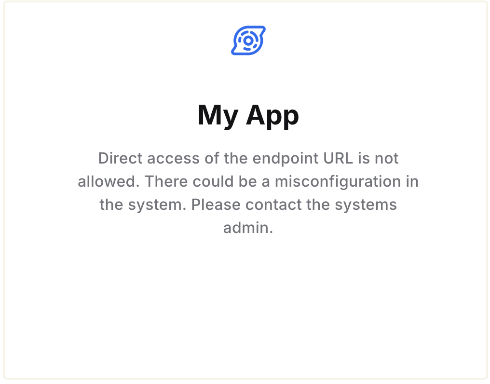

# Directly accessing Authgear Endpoint

Endpoint Direct Access can be used to configure what happens when users directly visit the endpoint URL (e.g. `https://my-project.authgear.cloud`) of an Authgear project.

By default, Authgear only allows access to your project endpoint from an OAuth request or using a custom domain connected to the project. As a result, when users access the endpoint of a project directly, they'll see an error page that looks like this:

<figure><figcaption></figcaption></figure>

You can configure Endpoint Direct Access for your project to replace the above page.

### How to Enable Endpoint Direct Access

To enable Endpoint Direct Access, log in to Authgear Portal, select your project, and then navigate to **Advanced** > **Endpoint Direct Access**.

<figure><figcaption></figcaption></figure>

The following are the two ways to enable Endpoint Direct Access:&#x20;

#### 1. Brand page

Use the **Brand page** option to replace the default "Direct access of the endpoint URL is not allowed" page with a page that shows your Authgear project brand logo, project name, and a link to a page (e.g. back to home link) you wish to direct your users to.

To enable direct access using **Brand page**, click on the **Brand page** radio button and then enter the link you wish to show in the input field below. Click **Save** to keep your changes. Your users will see a page like this the next time they access your endpoint directly:

<figure><figcaption></figcaption></figure>

#### &#x20;2. Custom

The Custom option is only available for Authgear projects with [custom domain](integration/custom-domain.md) enabled. When user access the endpoint directly, they will be redirected to the `/login` page. After login, the user will be directed to the [User Settings](built-in-ui/auth-ui.md) page (`/settings`)

**Post-login link**

If a post-login link is provided, the user will be redirected to it instead of the User Settings page after logging in without an OAuth request.

**Post-logout link**

The post-logout link is where Authgear will redirect users that clicked logout from the logout page  (e.g. `https://auth.example.com/logout`) directly.

