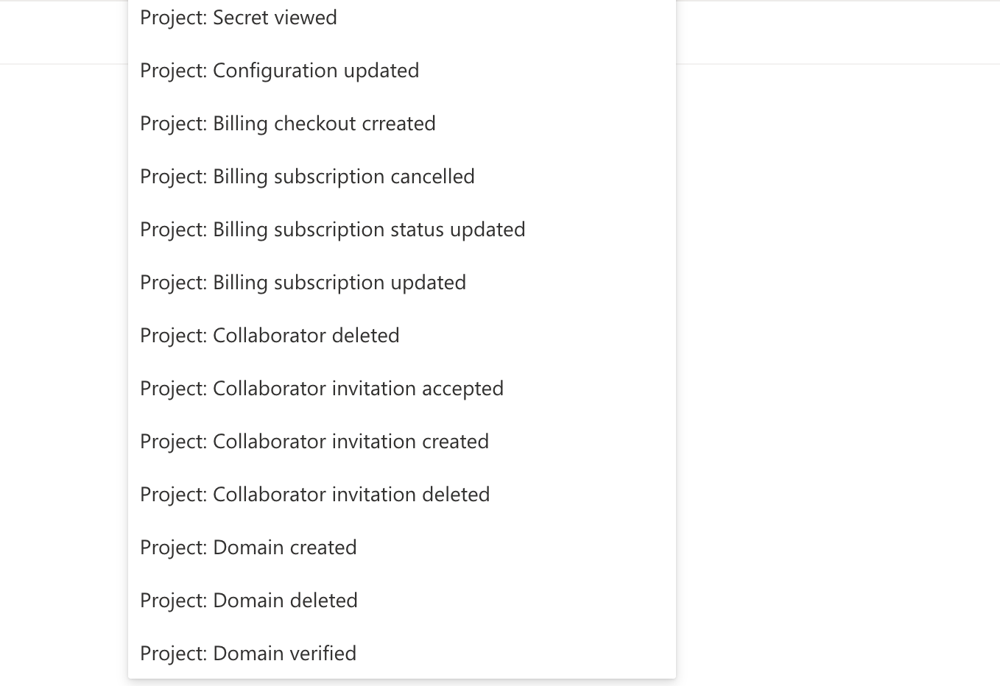

# Events and Hooks

Events are divided into two kinds, **Blocking** and **Non-blocking**.

Each event can have multiple hooks. The delivery order of non-blocking events is unspecified. Blocking events are delivered in the order as in the configuration.

## Blocking Events

Blocking events are triggered before the operation is performed, such as before user creation. The operation can be aborted by your hooks.

They are delivered to your hooks synchronously, right before changes are persisted to the database.

Your hooks must return a JSON document to indicate whether the operation should continue.

To let the operation proceed, return a JSON document with `is_allowed` set to `true`.

```json
{
  "is_allowed": true
}
```

To abort the operation, return a JSON document with `is_allowed` set to `false`, and a non-empty `reason` and `title`.

```json
{
  "is_allowed": false,
  "reason": "some reason",
  "title": "some title"
}
```

If any of your hooks abort the operation, the operation is aborted. The `reason` and `title` will be shown to the end-user as an error message.

Each of your hooks must respond within 5 seconds. All of your hooks must complete within 10 seconds. Otherwise, the delivery will fail to due timeout.

### Blocking Event Mutations

Your hooks can optionally apply mutation for certain blocking events. The supported mutation is specific for each type of blocking event. Refer to the [Event List](event-list.md) to see what mutation is supported.

Mutations by a hook are applied only when the operation is allowed to proceed. Mutations take effect only when all hooks allow the operation to proceed.

The mutations are specified in the hook response. Objects not appearing in `mutations` are left intact. The mutated objects are **NOT** merged with the original ones.

The mutated objects are **NOT** validated, and are propagated along the hook chain. The mutated objects are validated after traversing the hook chain.

Mutations do **NOT** generate extra events to avoid infinite loops.

#### Mutations on the user object

When a blocking event supports mutations on the user object, your hooks can respond a JSON document to allow the operation, and specify the mutations you want to apply on the user object.

```json
{
  "is_allowed": true,
  "mutations": {
    "user": {
      "standard_attributes": {
        "name": "John"
      },
      "custom_attributes": {
        "age": 30
      }
    }
  }
}
```

To mutate the user object, include `user` inside `mutations`. Only `standard_attributes` and `custom_attributes` of the user object are mutable.

> You must include the **WHOLE** `standard_attributes` or `custom_attributes` when you specify the mutations. Otherwise, missing attributes **WILL BE** deleted.

#### Mutations on the JWT payload

When a blocking event supports mutations on the JWT payload, your hooks can respond a JSON document to allow the operation, and specify additional fields that you want to include in the JWT payload. However, you **MUST NOT** change or remove any existing fields in the JWT payload, as they are essential to the validity of the JWT.

```json5
{
  "is_allowed": true,
  "mutations": {
    "jwt": {
      "payload": {
        // The original payload you get from the event object.
        "iss": "https://myapp.authgear.cloud",
        "aud": ["YOUR_CLIENT_ID"],
        "sub": "THE_USER_ID",
        // Other essential JWT fields that you MUST retain.

        // Additional fields that you want to add.
        "https://myapp.com": {
          "custom_field": "custom_value"
        }
      }
    }
  }
}
```

To add additional fields to the JWT payload, include `jwt.payload` inside `mutations`. You **MUST** add your own fields only.

> You must include the **WHOLE** `jwt.payload` from the event object when you specify the mutations.

## Non-blocking Events

Non-blocking events are triggered after the operation is performed.

They are delivered to your hooks asynchronously after the operation is performed.

Your hooks must finish within 60 seconds. Otherwise, the delivery will fail to due timeout.

The response of your hooks is ignored.

## Event Shape

Events have the following shape:

```json5
{
  "id": "0E1E9537-DF4F-4AF6-8B48-3DB4574D4F24",
  "seq": 435,
  "type": "user.pre_create",
  "payload": { /* ... */ },
  "context": {
    "timestamp": 1670570552,
    "user_id": "f333b70b-4436-4efb-a40b-d9ed7a74d319",
    "preferred_languages": ["en-US", "zh-HK"],
    "language": "en-US",
    "triggered_by": "user"
  }
}
```

* `id`: The ID of the event.
* `seq`: A monotonically increasing signed 64-bit integer.
* `type`: The type of the event.
* `payload`: The payload of the event, varies with type.
* `context`: The context of the event.
* `context.timestamp`: signed 64-bit UNIX timestamp of when this event is generated. Retried deliveries do not affect this field.
* `context.user_id`: The ID of the user associated with the event. It may be absent. For example, the user has not been authenticated yet.
* `context.preferred_languages`: User-preferred languages, which are inferred from the request. Return values of the `ui_locales` query if it is provided in the Auth UI, otherwise return languages in the `Accept-Language` request header.
* `context.language`: User locale which is derived based on the user's preferred languages and the app's languages config.
* `context.triggered_by`: Triggered by indicates who triggered the events, values can be `user` , `admin_api`, `system`, or `portal`. `user` means it is triggered by the end-user. `admin_api` means it is triggered by Admin API or using Admin API operations via the portal. `system` means the event originates from a background job. `portal` means the event originates from the Authgear portal and is an operation that does not use the Admin API. Examples of operations that do not use the Admin API can be found in the screenshot below:

<figure><figcaption></figcaption></figure>
