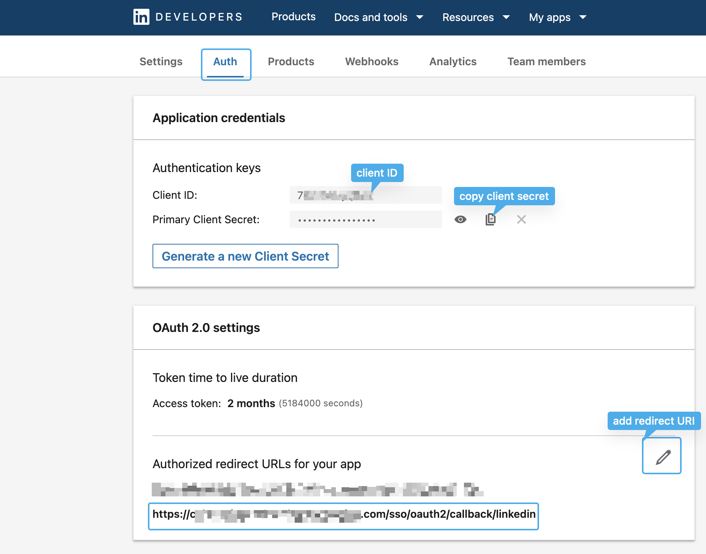

# Connect Apps to LinkedIn

## Prerequisite

* A LinkedIn Developer profile. You can create one on the [LinkedIn Developers Portal](https://developer.linkedin.com/).
* LinkedIn App

### Step 1: Create a LinkedIn App

Log in to the [LinkedIn Developers Portal](https://developer.linkedin.com/) and create a new app or update the configuration for an existing one.

Go to the **Auth** tab of your LinkedIn app and take note of the "Client ID" and "Client Secret".&#x20;

Also, add `https://<YOUR_AUTHGEAR_ENDPOINT>/sso/oauth2/callback/linkedin` to "Authorized redirect URLs" under "OAuth 2.0 settings" section.

<figure><figcaption>
linkedin app, auth tab
</figcaption></figure>


The redirect URI has the form of `/sso/oauth2/callback/:alias`. The `alias` is used as the identifier of OAuth provider. You can configure the `alias` in Authgear Portal


Next, open the **Products** tab of your LinkedIn app, and request access to "Sign In with LinkedIn using OpenID Connect."

<figure><figcaption>
linkedin app product list
</figcaption></figure>

### Step 2: Configure Sign in with LinkedIn through the portal

In the Authgear Portal, go to **Authentication** > **Social / Enterprise Login**.

Enable **Sign in with LinkedIn**.

Then fill in the **Client ID**. and **Client Secret** from your LinkedIn app.

**Save** the settings.

🎉 Done! You have just added LinkedIn Login to your apps!
