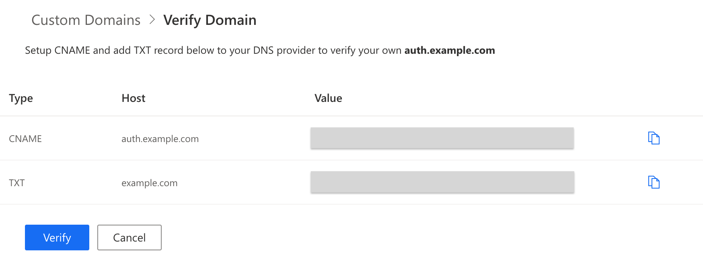

# Custom domain

Set up a custom domain to let your users access the Authgear pages with your unique, brand-centric domain name. You can use a custom domain (e.g. `auth.yourdomain.com`) instead of the Authgear generated domain (e.g. `<YOUR_APP>.authgear.cloud`).


A paid subscription is required for setting up a custom domain.


## How to Set Up a Custom Domain

### 1. Add domain

* Go to **Branding** > **Custom Domains** in your project portal.
* Enter the custom domain name that you would like to connect to Authgear, and click **Add**.
* Your custom domain will appear on the list, click **Verify** to start the verification process.

### 2. Verify domain ownership

* Go to your domain provider's site, and add DNS records based on the values shown on the portal page.
* Click **Verify** after adding the DNS records, you may need to wait for the propagation of your updated DNS records.

### 3. Activate your custom domain

* You will return to the custom domain list after verifying your custom domain. Click **Activate** to use your custom domain.
* Now you can access Authgear pages with your custom domain, your default Authgear generated domain (e.g. `<YOUR_APP>.authgear.cloud`) cannot be used anymore. **Update your SDK endpoint to use the new custom domain**.
* The certificate of your custom domain is managed by Authgear, you may need to wait for a while for certificate provisioning.

## Configure Post-login link and Post-logout link

Users can access the login and logout pages directly in your Authgear project when you're using a custom domain. As a result, the post-login and post-logout links are available to help you determine where users are redirected when they access the above pages without an OAuth flow.

To configure these values, in Authgear Portal navigate to **Branding** > **Custom Domains**. Then scroll down to the **Default Redirect URLs** section.

### Post-login link&#x20;

Use this field to set the page where users will be redirected after login if they visit the login page directly instead of going through an OAuth flow.&#x20;

### Post-logout link

The URL you enter as a post-logout link is where users will be redirected after logout when they visit the logout page directly.
