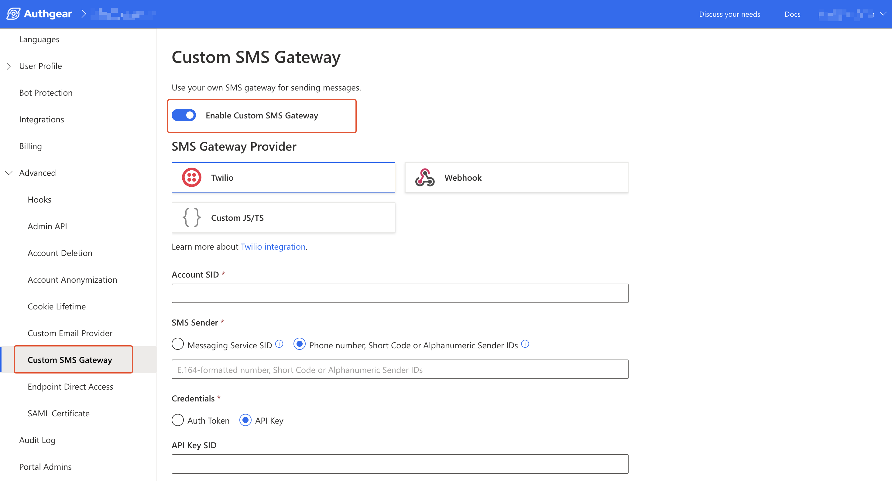
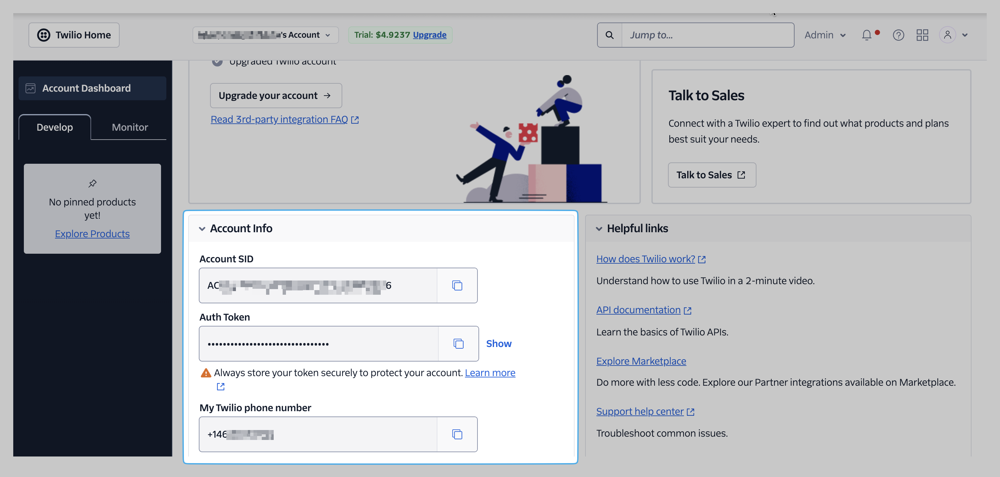
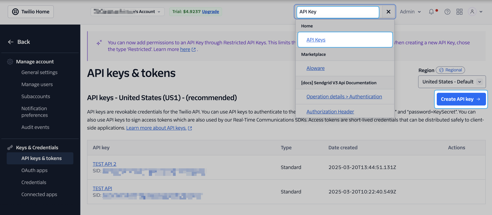
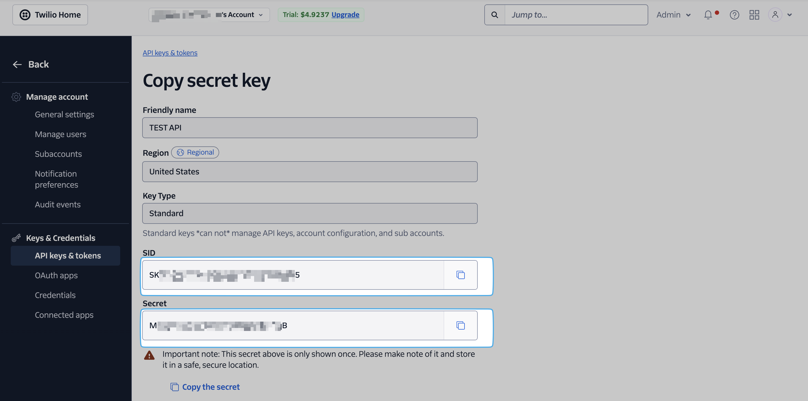

# Twilio

In this guide, you'll learn how to set up your Authgear project to use Twilio as a custom SMS provider.

By configuring your Authgear project to use Twilio as a custom SMS provider, you switch from the default SMS provider to your own Twilio account. As a result, you can control and manage billing and other settings for your SMS from the Twilio console independent of Authgear.

### Prerequisite&#x20;

* A Twilio account
* An Authgear project with the Custom SMS Gateway feature enabled.

### Step 1: Enable Custom SMS Gateway

To get started, log in to Authgear Portal, then navigate to **Advanced** > **Custom SMS Gateway**.

Next, toggle the **Enable Custom SMS Gateway** switch on to enable the SMS Gateway Provider settings.

<figure><figcaption>
authgear custom sms gateway
</figcaption></figure>


**Note:** Your project must be on an enterprise plan to use the Custom SMS Provider feature. [Contact us](https://www.authgear.com/schedule-demo) for more details.


### Step 2: Link Twilio Account Credentials

For this step, your Twilio account credentials such as Account SID, Auth Token (or API SID) are required. You can find these details in your console at [twilio.com](https://console.twilio.com/).

To get your **Account SID** and **Auth Token** from Twilio, log in to your Twilio console and scroll to the Account Info section to find your Account SID, Auth Token, and Twilio phone number.

<figure><figcaption>
Twilio console account info
</figcaption></figure>

Once you have your Twilio credentials, click on **Twilio** from the SMS Gateway Provider list. This will open the provider's settings.

**API Key**

To use **API Key** as credential, search for "API Key" in the search bar on the top right corner of the Twilio console. Select **Home** > **API Keys** from the search result to open the API Keys page.

Click on the Create API Key button to create a new API Key.

<figure><figcaption>
twilio console api keys
</figcaption></figure>

Enter the name for your new API Key in the **Friendly name** text field then click **Create**.

<figure><figcaption>
twilio api key details
</figcaption></figure>

Copy the **SID** and **Secret** for your new API Key and store them in a safe location. Note that you can only view your API Secret once.

Now set the following options in Authgear Portal using the details from your Twilio account:

* Enter your **Twilio Account SID**.
* Enter an **SMS Sender,** this can be either a **Message Service ID,** or your **Twilio phone number, shortcode or alphanumeric sender ID** that is registered on Twilio.


**Message Service ID** is a feature on Twilio that lets you create multiple sender IDs based on different campaigns and conditions. Enter your Twilio Message Service ID to have Authgear use the multiple sender IDs under it. Learn more about Twilio Messaging Services [here](https://www.twilio.com/docs/messaging/services).


* Select the type of credential you wish to use to connect to your Twilio account. This can be either an **Auth Token** or **API Key** from your Twilio console. We recommend using the **API Key** as the credential.
  * **API Key** (Recommended): Use the **API Key SID** and **API Key Secret** obtained in the Twilio's **API Keys & Token** page
  * **Auth Token:** The token is under "Account Info" in the Twilio dashboard home page

### Step 3: Save and Test Custom SMS Provider Settings

Finally, click on the **Save** button to save your new Twilio provider settings.

To test your work, click on the **Test** button next to the Save button, enter your phone number then click Send to test your new SMS provider.

&#x20;
