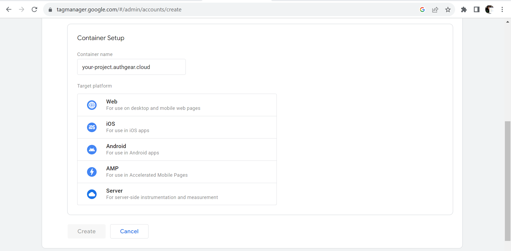
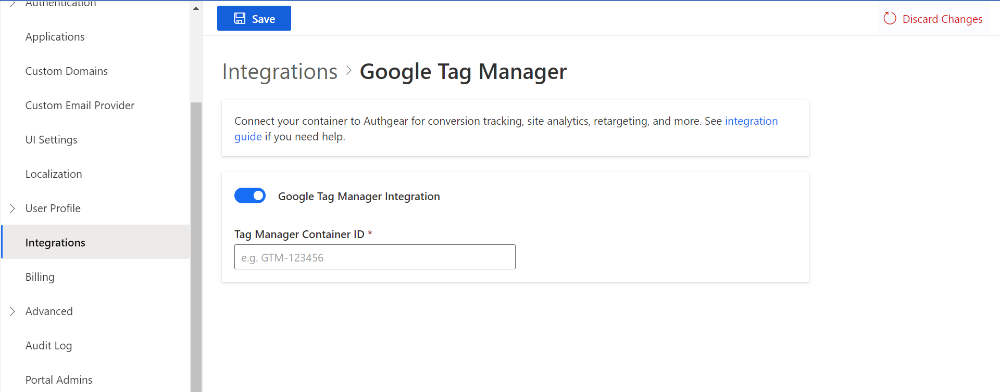
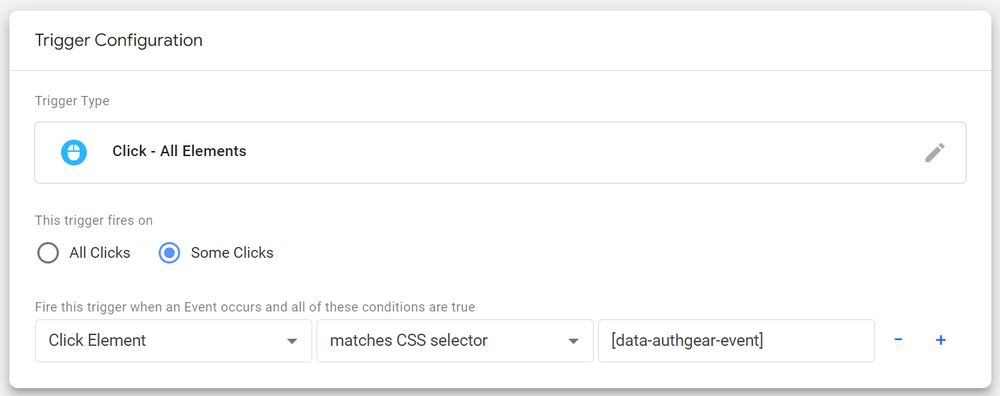

# User Analytics by Google Tag Manager

Authgear allows you to add third-party user analytics tools to your project using Google Tag Manager.

### What is Google Tag Manager?

Google Tag Manager (GTM) is a tag management tool from Google that makes it easy to add marketing tags to your website without modifying the site's source code.

Tags can help you track traffic and user behavior on your website or application.

In this guide, we will show you how to add Google Tag Manager to your Authgear project and send data to Google Analytics. You can also configure Google Tag Manager to send data from your Authgear project to other marketing tags from providers like Facebook.

### Pre-requisites

In order to setup Google Tag Manager and Google Analytics with Authgear, you need to have the following:

1. Authgear account
2. Google Tag Manager Account
3. Google Analytics Account

## Part 1: Connect Google Tag Manager to Authgear project

The process for connecting your GTM account to Authgear is simple and can be done in these two steps.

### Step 1: Get GTM container ID

Google Tag Manager lets you create containers that hold marketing tags. Each container has a unique ID and you'll need this container ID to connect your GTM container to Authgear.

To get the container ID, log in to [GTM](https://tagmanager.google.com/) and navigate to the dashboard's homepage. You should find a list of all your containers and their ID. Note down the ID for the container you wish to connect to Authgear.

<figure><figcaption></figcaption></figure>

If you don't have a container for your Authgear project yet, click on **Create Account** to create a new container. Enter your domain name for your Authgear project as the container name and select a target platform. For this example, we'll select **Web** as the target platform.

<figure><figcaption></figcaption></figure>

### Step 2: Add GTM container ID to Authgear

First, log in to the Authgear Portal, then select your project and navigate to **Integrations**.

<figure><figcaption></figcaption></figure>

Click on the **Connect** button next to the Google Tag Manager addon to open the configuration page.

<figure><figcaption></figcaption></figure>

Paste the GTM container ID you got from the previous step then click the Save button. And with that, you've successfully connected your GTM container to Authgear. In the next steps, we'll show you how to create tracking tags and send data to Google Analytics.

## Part 2: Track traffic and send data to Google Analytics

Google Analytics is one of the marketing tags we can manage from GTM. In this part of the guide, we'll set up some tags to track page views and user events like clicking on a link or button. The tags will send these data to Google Analytics.

### Step 1: Set up Google Analytics data stream

In order to create tags that send data to Google Analytics, you need to have an active data stream on Google Analytics. GTM requires the details for this stream while creating new tags for Google Analytics.

To create a stream, log in to Google Analytics then navigate to the **Admin** settings page.

<figure><figcaption></figcaption></figure>

Create a new Google Analytics property for your Authgear project or select an existing one. Click on the Data Streams item under the property to view all streams and add a new web stream for your Authgear project.

Note down the Measurement ID for your stream as we'll be using it later to create new tags.

<figure><figcaption></figcaption></figure>

### Step 2: Create a new user-defined variable in GTM

Before we start sending data to Google Analytics, let's create a new variable in Google Tag Manager.

Go back to GTM and select the correct container for your project.

<figure><figcaption></figcaption></figure>

Next, click on the **Variables** item on the left side navigation bar and create a new user variable with the following details:

* **Variable type**: Data Layer Variable
* **Data Layer Variable Name**: gtm.element.dataset.authgearEvent

Once you're done save the variable as "gtm.element.dataset.authgearEvent" and continue to the next step.

### Step 3: Create a click Trigger

Navigate to **Triggers** from the sidebar and create a new trigger with the following details:

* **Trigger type**: Click > All Elements
* **This trigger fires on**: Some Clicks

Authgear's implementation of GTM is declarative. The primary button on each page has `data-authgear-event` attribute. We'll be setting a condition for the "Some Clicks" using that attribute. Configure Some "Click" as shown below:

<figure><figcaption></figcaption></figure>

Next, save the trigger as "Authgear-btn-click" and continue.

### Step 4: Create Page View Tag

Navigate to **Tags** from the sidebar and create a new tag with the following configurations:

* **Tag type**: Google Analytics > Google Tag
* **Tag ID**: \<Your Tag ID is the unique Measurement ID for your stream in Google Analytics (See part 2 step 1 for more details)>

Next, expand the **Advanced Settings** section and set **Tag firing options** to **Once per page**.

Now, scroll down to the Trigger section of the new tag and select **All Pages (page view)** as the trigger.&#x20;

Save this new tag as "Auth-gear-pageview" and continue.

### Step 5: Create Event Tag

In this step, create another tag with the following configuration:

* Tag type: Google Analytics > Google Analytics: GA4 Event
* Measurement ID: \<Your Google Analytics stream measurement ID>
* Event Name: `gtm.element.dataset.authgearEvent`

Next, set the trigger for this tag to the "Authgear-btn-click" trigger we created earlier.

Save the tag as "Authgear-event-tag" and continue to preview the entire setup or publish to go live.

## Conclusion

After you publish your changes in Google Tag Manager when users generate hits or click buttons with the `data-authgear-event` attribute on your project you should see data on Google Analytics.

The following is a list of values for the  `data-authgear-event` attribute:

* `authgear.button.change_password`
* `authgear.button.change_additional_password`
* `authgear.button.create_password`
* `authgear.button.change_login_id`
* `authgear.button.remove_login_id`
* `authgear.button.resend_oob_otp`
* `authgear.button.enter_oob_otp`
* `authgear.button.enter_password`
* `authgear.button.enter_recovery_code`
* `authgear.button.enter_totp`
* `authgear.button.send_reset_password_code`
* `authgear.button.sign_in`
* `authgear.button.sign_up`
* `authgear.button.sign_out`
* `authgear.button.oauth`
* `authgear.button.reset_password`
* `authgear.button.continue_with_current_account`
* `authgear.button.use_another_account`
* `authgear.button.remove_biometric`
* `authgear.button.schedule_account_deletion`
* `authgear.button.connect_oauth`
* `authgear.button.disconnect_oauth`
* `authgear.button.resend_verification_code`
* `authgear.button.update_profile`
* `authgear.button.regenerate_recovery_code`
* `authgear.button.download_recovery_code`
* `authgear.button.remove_totp`
* `authgear.button.remove_oob_otp`
* `authgear.button.setup_oob_otp`
* `authgear.button.setup_totp`
* `authgear.button.enter_verification_code`
* `authgear.button.revoke_session`
* `authgear.button.revoke_session_group`
* `authgear.button.revoke_all_sessions`

