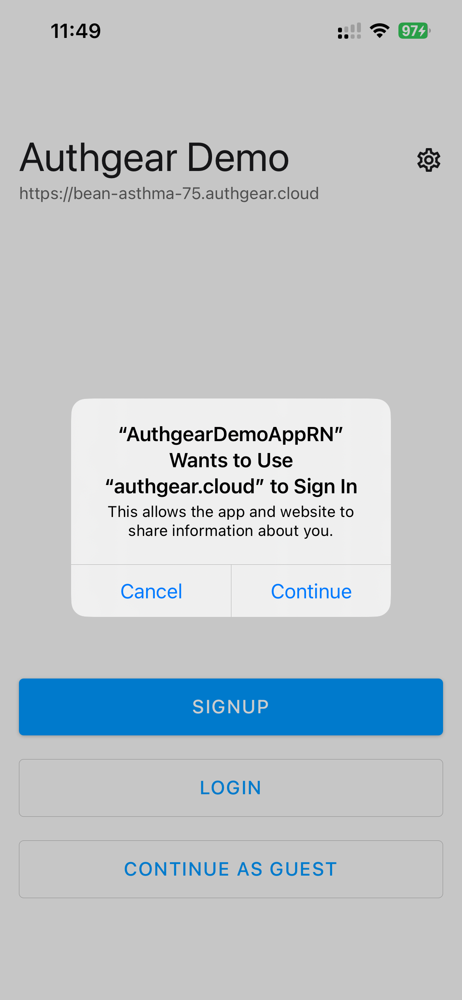

# Customize the Login Pop-up / Disable the login alert box

The default of the Authgear Mobile SDKs is to launch AuthUI in [ASWebAuthenticationSession](https://developer.apple.com/documentation/authenticationservices/aswebauthenticationsession) in iOS and [Custom Tabs](https://developer.chrome.com/docs/android/custom-tabs) in Android. ASWebAuthentication is an API provided by Apple for login purpose. It will store the session cookie and share with Safari, which makes Single Sign-on (SSO) between mobile apps and web apps possible.

However, it requires user consent, and will display a login alert box:

<figure><figcaption></figcaption></figure>

There are multiple ways you can avoid the login alert box:

## 1. Use ephemeral sessions

If you do not need SSO between mobile and web apps, you can disable it by setting `isSSOEnabled = false`.




```swift
Authgear(
            clientId: "<CLIENT_ID>",
            endpoint: "<AUTHGEAR_ENDPOINT>",
            isSSOEnabled: false,
        )
```



```javascript
authgear
      .configure({
        clientID: "<CLIENT_ID>",
        endpoint: "<AUTHGEAR_ENDPOINT>",
        isSSOEnabled: false,
});
```



It will not share the session cookies between your app and Safari. And the login alert box will not show to prompt user consent.

## 2. Use WebKitUIImplementation

The mobile SDKs include `WebKitWebViewUIImplementation`, a `UIImplementation` which makes it possible to customize more UI.

Depending on the platforms, there are various alternatives:

* iOS: WKWebViewUIImplementation
* Other platforms / Android: WebKitWebViewUIImplementation

Setting the `uiImplementation` attribute in the `configure()` method of the Authgear SDK to `WebKitWebViewUIImplementation()` will open AuthUI using [WKWebView](https://developer.apple.com/documentation/webkit/wkwebview) on iOS and [android.webkit.WebView](https://developer.android.com/reference/android/webkit/WebView) on Android.

Omitting the `uiImplementation` attribute in the `configure()` method will fall back to the default behavior (launching AuthUI in ASWebAuthenticationSession/Custom Tabs, which is `DeviceBrowserUIImplementation`).

### Example Code

The following examples show how to set the `uiImplementation`  attribute.



```typescript
authgearCapacitor.configure({
    clientID: "<CLIENT_ID>",
    endpoint: "<AUTHGEAR_ENDPOINT>",
    isSSOEnabled: true,
    uiImplementation: new WebKitWebViewUIImplementation(),
    tokenStorage: new TransientTokenStorage()
});
```



```typescript
authgear
      .configure({
        clientID: "<CLIENT_ID>",
        endpoint: "<AUTHGEAR_ENDPOINT>",
        uiImplementation: new WebKitWebViewUIImplementation()
});
```



```java
private Authgear authgear = new Authgear(
                                getApplication(),
                                "<CLIENT_ID>",
                                "<AUTHGEAR_ENDPOINT>",
                                tokenStorage,
                                new WebKitWebViewUIImplementation(),
                                isSsoEnabled,
                                null,
                                app2appOptions
                                );
```



```swift
Authgear(
            clientId: "<CLIENT_ID>",
            endpoint: "<AUTHGEAR_ENDPOINT>",
            tokenStorage: TransientTokenStorage(),
            uiImplementation: WKWebViewUIImplementation(),
            isSSOEnabled: true,
        )
```



Setting `uiImplementation` to `WebKitWebViewUIImplementation` in the above example will change the behavior of your application from using **ASWebAuthenticationSession** on iOS and **Custom Tabs** on Android to using `WKWebView` and `android.webkit.WebView` respectively.

To set `uiImplementation` to `WKWebView` in the native iOS SDK, use `WKWebViewUIImplementation` .

### Customizing the WebKitWebView UI

`WebKitWebViewUIImplementation`  allows you to customize some parts of the UI. You can do this by passing your customization options as parameters in WebKitWebViewUIImplementation(). You can customize the following parts of the UI:

**Android**

* `actionBarBackgroundColor`: Use this option to customize the color of the action bar on the WebView Activity screen. The value should be of type integer according to this encoding: [https://developer.android.com/reference/android/graphics/Color#encoding](https://developer.android.com/reference/android/graphics/Color#encoding)
* `actionBarButtonTintColor`: This option can be used to set the color of the icons and texts on the action bar. The value should also be of type integer and use the encoding here: [https://developer.android.com/reference/android/graphics/Color#encoding](https://developer.android.com/reference/android/graphics/Color#encoding).

**iOS**

* `navigationBarBackgroundColor`: This option can be used to customize the color of the navigation bar on iOS. The value should be of type [UIColor](https://developer.apple.com/documentation/uikit/uicolor/) or an integer (React Native or Ionic SDKs) using the following encoding: [https://developer.android.com/reference/android/graphics/Color#encoding](https://developer.android.com/reference/android/graphics/Color#encoding).
* `navigationBarButtonTintColor`: This option sets the color of icons and texts on the navigation bar. The value should also be UIColor or an integer (React Native or Ionic SDKs) using the same encoding as `navigationBarBackgroundColor`.
* `modalPresentationStyle`: Sets the type of modal to be shown. The value can be any of the following: "automatic", "fullScreen", "pageSheet".

The following examples show how to set custom background color, tint color, and modal presentation style.





```typescript
authgearCapacitor.configure({
  clientID: "<CLIENT_ID>",
  endpoint: "<AUTHGEAR_ENDPOINT>",
  uiImplementation: new WebKitWebViewUIImplementation({
    ios: {
      modalPresentationStyle: "fullScreen"
    },
    android: {
      actionBarBackgroundColor: 0xffffff00,
      actionBarButtonTintColor: 0xff000000
    }
  }),
  tokenStorage: new TransientTokenStorage()
});
```



```typescript
authgear
      .configure({
        clientID: "<CLIENT_ID>",
        endpoint: "<AUTHGEAR_ENDPOINT>",
        uiImplementation: new WebKitWebViewUIImplementation({
          ios: {
            modalPresentationStyle: "fullScreen"
          },
          android: {
            actionBarBackgroundColor: 0xffffff00,
            actionBarButtonTintColor: 0xff000000
          }
        })
      })
```



```java
private int actionBarBackgroundColor = 0xffffff00;
private int actionBarButtonTintColor = 0xff000000;
private Authgear authgear = new Authgear(
                                getApplication(),
                                "<CLIENT_ID>",
                                "<AUTHGEAR_ENDPOINT>",
                                tokenStorage,
                                new WebKitWebViewUIImplementation(actionBarBackgroundColor, actionBarButtonTintColor),
                                isSsoEnabled,
                                null,
                                app2appOptions
                                );
```



```swift
Authgear(
            clientId: "<CLIENT_ID>",
            endpoint: "<AUTHGEAR_ENDPOINT>",
            tokenStorage: TransientTokenStorage(),
            uiImplementation: WKWebViewUIImplementation(
               modalPresentationStyle: UIModalPresentationStyle.fullScreen,
               navigationBarBackgroundColor: UIColor.yellow,
               navigationBarButtonTintColor: UIColor.black
            ),
            isSSOEnabled: true
        )
```



## 3. Implement Custom UIImplementation

You can implement your own custom `UIImplementation` when the `WebKitWebViewUIImplementation` does not meet the requirements of your use case.

The WebKitWebViewUIImplementation class itself is basically a class that implements `UIImplementation` and overrides the `openAuthorizationURL()`method. Hence your custom implementation may look like this:

```typescript
class MyUIImplementation implements UIImplementation {
 async openAuthorizationURL(options: OpenAuthorizationURLOptions):
Promise<string> {
 // Call your own plugin code to implement this.
 }
}
```

Then, you can use your custom implementation like this:

```typescript
authgear.configure({
 clientID: "my_client_id",
 endpoint: "my_endpoint",
 isSSOEnabled: true,
 uiImplementation: new MyUIImplementation(),
})
```

To get a deeper understanding of how to implement your UIImplementation, see the code for the [WebKitWebViewUIImplementation](https://github.com/authgear/authgear-sdk-android/blob/main/sdk/src/main/java/com/oursky/authgear/WebKitWebViewUIImplementation.kt) implementation.

## Unsupported Features

When you drop the default DeviceBrowserUIImplementation to use your own custom UI implementation that uses WebView, it is important to note that you'll be losing the following features, due to iOS or other security limitations.

1. **Login with Google:** Google prohibits the use of `WebKitWebView` with the Google SSO. Learn more here: [https://developers.googleblog.com/2021/06/upcoming-security-changes-to-googles-oauth-2.0-authorization-endpoint.html](https://developers.googleblog.com/2021/06/upcoming-security-changes-to-googles-oauth-2.0-authorization-endpoint.html). As a result `WebKitWebViewUIImplementation` and Google SSO cannot be used together.
2. **Passkey:** Passkey is not supported in WebKitWebView.


