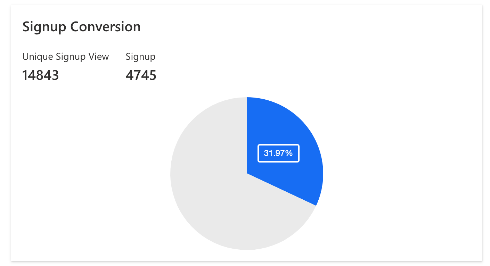

# Analytics

The Analytics section on the Authgear portal provides reports on your project activities. For example, the report shows the total number of users that sign up and active users over a specific time interval.

In this guide, you'll get detailed information about the information provided on the Authgear Analytics page and how to interpret it.

## Activity

The Analytics page shows two activity bar charts that show a weekly or monthly summary of user activities on your Authgear project.

### Active user

The first chart shows the total active users per week or month. Active users are users who sign up, log in, or access their accounts within a specific time.

<figure><figcaption></figcaption></figure>

### Total users

The second bar chat in the Activities section shows the total number of users your Authgear project has over a specific time interval. That is the total number of accounts created minus deleted users.

<figure><figcaption></figcaption></figure>

## Signup Conversion

The signup conversion piechart shows how many users visited your signup page (unique pageviews) and how many went ahead to complete the signup process. This report also shows a percentage of the signup conversion (unique pageviews vs. total signups).

<figure><figcaption></figcaption></figure>

## User Signup Methods

This section shows how many users you have per signup method in a pie chart.

<figure><figcaption></figcaption></figure>

**Note**: The data on the Analytics page may take 24 hours to be updated.
