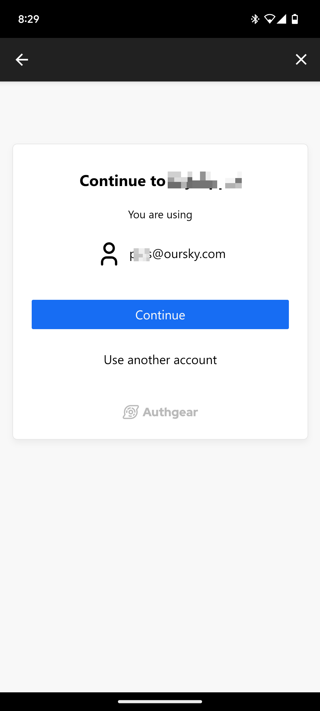

# Pre-authenticated URLs

Pre-authenticated URLs is a feature that enables single sign-on (SSO)  from a mobile application to a website. It allows users who are authenticated on a mobile application to open a website in an authenticated state.

An example use case for a pre-authenticated URL is opening a web application in a WebView.

### Prerequisites

&#x20;To use pre-authenticated URLs, you must have the following:

* An Authgear application of type Native app.
* A second Authgear application that has pre-authentication URLs enabled.

## How to Implement Pre-authentication URLs in your application

### Step 1: Enable SSO in Native Client App

First, ensure your mobile application uses an Authgear application with the **Native App**.

Your application must also enable SSO to allow pre-authenticated URLs to work. You can enable SSO by `isSSOEnabled: true` in the `configure()` method of Authgear SDK.

```typescript
authgear
  .configure({
    clientID: '<CLIENT_ID>',
    endpoint: '<AUTHGEAR_PROJECT_URL>',
    isSSOEnabled: true,
  })
```

### Step 2: Add Allowed Origin to Web App Client

Next, add an allowed origin to the web application client in Authgear. Navigate to **Applications** in the Authgear Portal, select the web application client, and scroll to the Allowed Origins section. Then, add the origin you wish to use for Pre-authentication URLs. Note that the origin should be of the format "protocol (scheme) + domain + port". For example, if the mobile application wants to open `https://www.mywebapp.com/home?key=value`, the origin must be `https://www.mywebapp.com`.

#### Step 3: Generate Pre-Authenticated URL

The Pre-Authenticated URL is a link that the Authgear SDK can generate for a mobile client that has the Pre-Authenticated URLs feature enabled. Your mobile application can open the Pre-Authenticated URL in a web view for users to start browsing the origin in an authenticated state.

To generate the Pre-Authenticated URL, call the `makePreAuthenticatedURL(`) method of the Authgear SDK as shown below:

```javascript
const url = await authgear.makePreAuthenticatedURL({
    webApplicationClientID: "YOUR_WEB_APP_CLIENT_ID", // Replace with you web app client id
    webApplicationURI: "YOUR_WEB_APP_URI", // Replace with you web app uri
  });
```

The `makePreAuthenticatedURL()` method accepts an object as a parameter. Inside the object, you should provide your web application's client ID and redirect URI.

The URL in `YOUR_WEB_APP_URI` should be a page on the web application that calls the `authenticate()` method of Authgear SDK with `isSSOEnabled: true` (or a page that initiates an authorization request) .&#x20;

### Step 4: Open Pre-Authenticated URL in a WebView

After the `makePreAuthenticatedURL()` return the URL, your mobile application should open the URL in a WebView. From there, users should be able to continue their current authenticated session (from the mobile app) on the web application.

The following code sample shows how to open the pre-authenticated URL using the `Linking.openURL()` method of React Native.

```javascript
Linking.openURL(url).catch(err =>
      console.error("Couldn't load page", err),
    );
```

The user will see a "Continue Screen" and will not need to enter their credentials again to log in.

<figure><figcaption></figcaption></figure>
