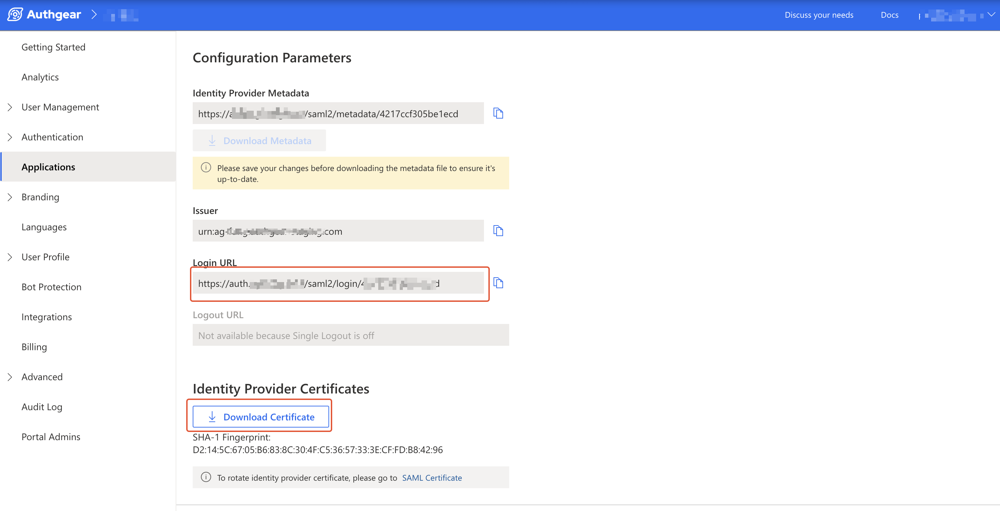
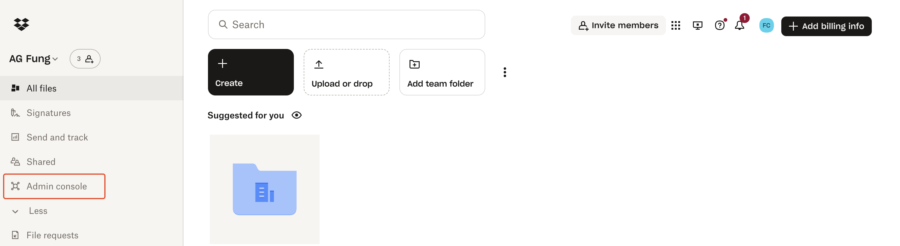
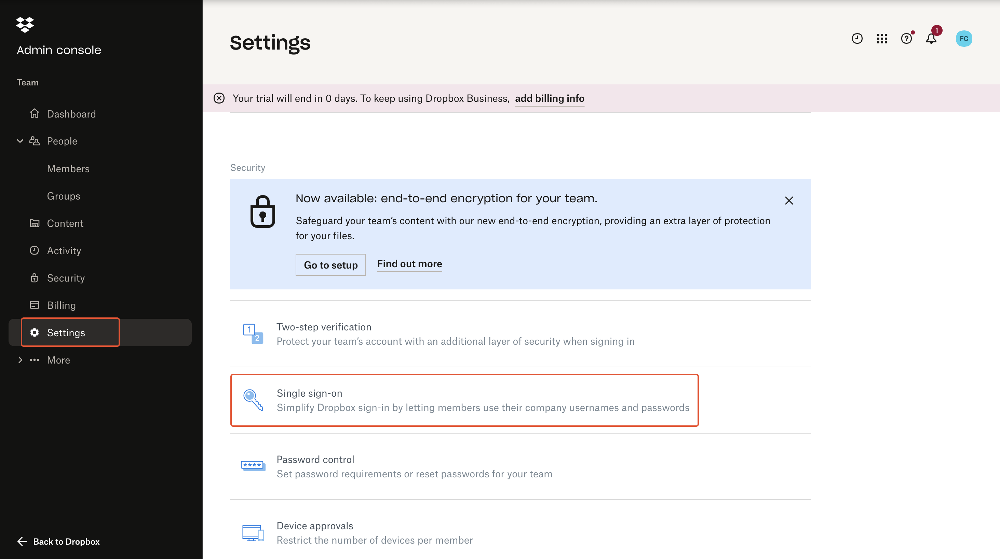
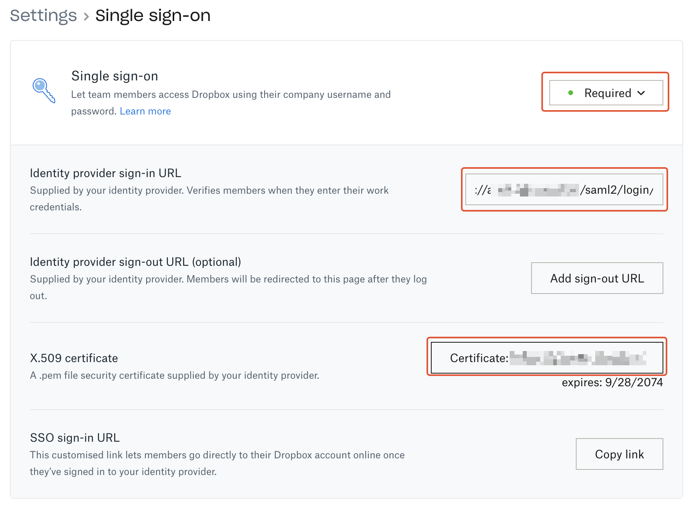

# Use Authgear as SAML Identity Provider for Dropbox

## Use Authgear as SAML Identity Provider for Dropbox

Security Assertion Markup Language (SAML) is a standard that allows an Identity Provider (IdP) and a Service Provider (SP) to perform user authentication and authorization without exchanging a user's password.

In this post, you'll learn how to set up Authgear as an Identity Provider and Dropbox as a Service Provider.

### Pre-requisites

* An Authgear account. Sign up for free.
* A Dropbox Business Advanced account.

### Step 1: Create an Authgear Client Application

You need an Authgear client application of type `OIDC/SAML Client Application` to use Authgear as a SAML identity provider.

To create a new client application, log in to Authgear Portal, select your project then click on the **Applications** link from the navigation menu.

<figure><figcaption></figcaption></figure>

Next, click on **Add Application** to create a new client application. Alternatively, select an existing application of type `OIDC/SAML Client Application` and skip to step 2.

On the New Application page, enter **Name** and select `OIDC/SAML Client Application` as the **Application Type**.

<figure><figcaption></figcaption></figure>

Click **Save** to proceed.

### Step 2: Enable SAML 2.0 in Client Application

By default, SAML 2.0 is not enabled for the client application.

To enable SAML for your client application, click on the **SAML 2.0** tab then toggle the **SAML 2.0 Support** switch on.

<figure><figcaption></figcaption></figure>

Next, change **NameID Format** to `urn:oasis:names:tc:SAML:1.1:nameid-format:emailAddress`.

Add the following URL (Dropbox post-back URL) in **Allowed Assertion Consumer Service URLs (ACS URLs)** field:

```
https://www.dropbox.com/saml_login
```

Click on **Save** to keep your changes.

### Step 3: Get SAML IdP Configuration and Download Certificate

Scroll down to the Configuration Parameters section of your Authgear client application's SAML 2.0 tab. Note the value for the login URL.

Also, download the **Identity Provider Certificate** for the client application to your computer.

You'll use the Login URL and certificate later in the Dropbox Admin console.

<figure><figcaption></figcaption></figure>

### Step 4: Add Authgear SAML IdP in Dropbox

Log in to your Dropbox Business Advanced account then click on **Admin console** in the navigation menu.

<figure><figcaption></figcaption></figure>

In the Dropbox Admin console navigate to **Settings** > **Single sign-on**.

<figure><figcaption></figcaption></figure>

Now in the Dropbox Single sign-on settings page, set Single sign-on to **Required**. Then, configure the following:

* Paste the value for your Authgear client application's `Login URL` in the `Identity provider sign-in URL` field.
* Under **X.509 certificate**, click on the Certificate upload button, then upload the Identity Provider Certificate you downloaded from your Authgear client application in the previous step.

<figure><figcaption></figcaption></figure>

### Step 5: Login to Dropbox Using Authgear SAML

To test your SAML implementation, you need to add a new user to your Dropbox with an email address that is associated with a user account in your Authgear project.

To add a new user to your Dropbox, navigate to **Admin console** > **People** > **Members** > **Invite member**.

Accept the invite for the new user, and try to log in to Dropbox using the registered email address for the new user. You should be redirected to the Authgear SAML login page. On successful login to the Authgear account, you should be redirected and signed in to Dropbox.&#x20;
