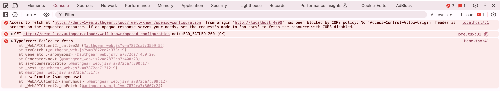
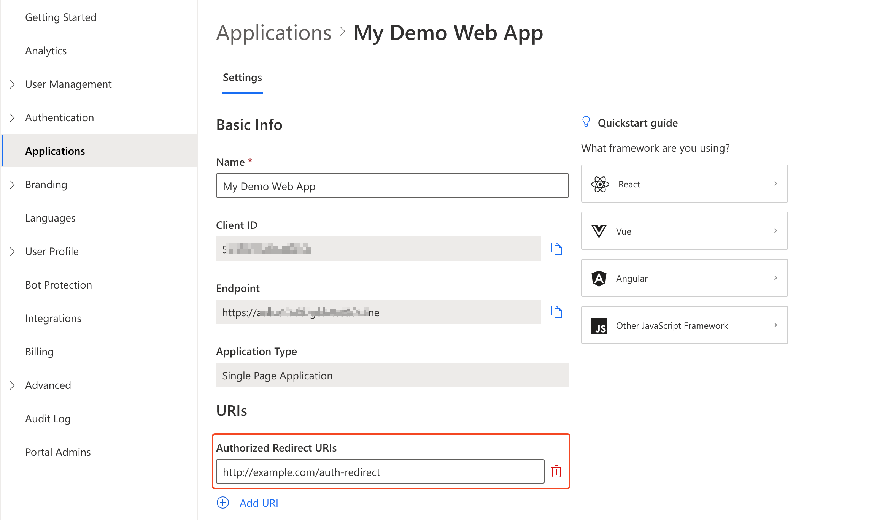

# How to Fix CORS Error

Cross-Origin Resource Sharing (CORS) error may occur when you do not add the domain of your application (the origin)  as an **Authorized Redirect URI** in your Authgear client application.

You can see more details about a CORS error in the JavaScript Console on your browser.

<figure><figcaption>
example showing CORS error on Chrome JavaScript Console
</figcaption></figure>

### Fix

To add your domain as an Authorized Redirect URI, first navigate to  **Applications** > **\[Your Client Application]** in Authgear Portal.

Click on the **Add URI** button under the Authorized Redirect URIs section. Add an Authorized Redirect URI that includes the full domain name of the domain from which your website or application will be making requests to the Authgear endpoints.

Save your settings in Authgear Portal, retry your application, and the CORS error should go away.

<figure><figcaption>
example showing authorized redirect URI in Portal
</figcaption></figure>
