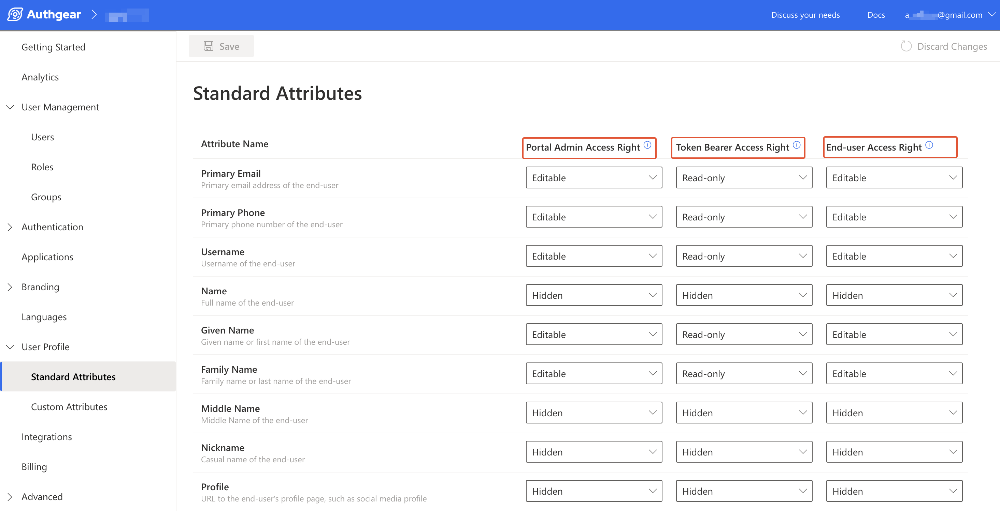

# Access User Profiles

To access any of the applications in your Authgear account, each user must have a profile in the account. [User Profiles](user-profile.md) contain information about your users such as name, contact information, and [standard](user-profile.md#standard-attributes) and[ custom attributes](user-profile.md#custom-attributes) you define. You can retrieve and manage user profiles in the following ways:

* [From the Authgear UI portal](access-user-profiles.md#id-1.-access-user-profiles-from-the-authgear-ui-portal).
* [From your apps using Authgear SDKs](access-user-profiles.md#id-2.-access-user-profiles-from-apps-using-authgear-sdks).
* [From Admin API](access-user-profiles.md#id-3.-access-user-profiles-from-admin-api).
* [From the OIDC UserInfo endpoint](access-user-profiles.md#id-4.-access-user-profiles-from-the-oidc-userinfo-endpoint).
* [Embed User Profiles into JWT](access-user-profiles.md#id-5.-embed-user-profiles-into-jwt)


The standard attributes in UserProfile in OIDC are a standardized schema for representing the end-users identity information and you can not add or delete them. To introduce additional attributes, use custom attributes.&#x20;


### User Profiles Access Right

Access Right defines what information can be viewed or modified when a user's profile is accessed via the Authgear Portal, User Info endpoint, or User Settings page.&#x20;

An Access Right can be set for each profile attribute under a specific medium of accessing user profiles. For example, in the following screenshot, the Primary Email attribute has the Editable Access Right for Portal, `Read-only` for User Info endpoint (also known as access Token Bearer), and `Editable` for User Settings page. In simpler terms, the example means an admin can modify Primary Email in Authgear Portal, while a client application can use a user's access token to view their Primary Email. Finally, users can edit their own Primary Email from the User Settings page.

<figure><figcaption></figcaption></figure>

#### Access Right Options

The following are the available Access Right options that can be applied to each attribute for a specific medium.

* **Editable:** Grants a medium access to view and modify the value of an attribute.
* **Read-only:** A medium with this access for an attribute can only view the value of the attribute.
* **Hidden:** If the access for an attribute is set to `Hidden` for a medium, that medium can not view or modify the attribute.

By default, Authgear sets different access rights for the standard attributes on each way of accessing user profiles. You can view and configure this default access right from **User Profile** > **Standard Attributes** in the Authgear Portal.

For Custom Attributes, you can define the access right for each way of accessing a user profile from **User Profile** > **Custom Attributes** in the portal.

Each way of accessing user profiles belongs to one of the following Access Right Categories:

* **Portal Admin Access Right:** Use this category to set the access right of an attribute in the Authgear Portal for an admin user.
* **Token Bearer Access Right:** This sets the access right of an attribute for the User Info endpoint when a token bearer accesses it. It can be "Hidden" or "Read-Only".
* **End-user Access Right:** Use this to set the access right of the attribute for the default User Settings UI when accessed by an end-user.

## How to Retrieve and Manage User Profiles

### Prerequisites

* **An Authgear account:** You need an Authgear account to follow this guide. If you don't have one, you can[ create it for free](https://accounts.portal.authgear.com/signup) on the Authgear website.
* **A Registered App:** You need a [registered application](https://docs.authgear.com/get-started/website#setup-application-in-authgear) (client) in Authgear.

### 1. Access user profiles from the Authgear UI portal

It is the fastest and easiest way to view user profiles and manage them.&#x20;

<details>

<summary>Expand this to see the guide</summary>

To view see user profile of a specific user:

1. Go to the [Authgear Portal](https://portal.authgear.com/).
2. Navigate to **User Management.**
3. Choose a user you would like to view a profile.
4. On the **User Details** page, you will see the **Profile** tab.


To manage access for standard attributes for all users:

Go to **Portal** > **User Profile** > **Standard Attributes**


To manage access and add new custom attributes for all users:

Go to **Portal** > **User Profile** > **Custom Attributes** and click **Add New Attribute**


</details>

### 2. Access user profiles from apps using Authgear SDKs

Once Authgear completes authentication and returns control to your application, it provides the user profile to the application. Most developers prefer to use the **Authgear SDKs** to get the UserInfo object using the **fetch user info** function. To start using this function read [getting started guides](../../get-started/start-building.md) relevant to the **SDK of your choice**. Here are some code snippets that call the fetch user info function for different Authgear SDKs:



```javascript
try{
    const userInfo = await authgear.fetchUserInfo()
    // example: output the 'sub' attribute from userInfo to console
    // sub is a unique identifier for each user.
    // You can read other attributes such as email and phoneNumber depending on your login method
    console.log(userInfo.sub)
} catch(e) {
    // failed to fetch user info
}
```



```swift
authgear.fetchUserInfo { userInfoResult in
    // sessionState is now up to date
    // it will change to .noSession if the session is invalid
    let sessionState = authgear.sessionState

    switch userInfoResult {
    case let .success(userInfo):
        // read the userInfo if needed
        let userId = userInfo.sub
        let email = userInfo.email
    case let .failure(error):
        // failed to fetch user info
        // the refresh token maybe expired or revoked
}
```



```kotlin
authgear.fetchUserInfo(new OnFetchUserInfoListener() {
    @Override
    public void onFetchedUserInfo(@NonNull UserInfo userInfo) {
        // sessionState is now up to date
        // read the userInfo if needed
        // example: output the 'sub' attribute from userInfo to LogCat
        // sub is a unique identifier for each user.
        // You can read other attributes such as email and phoneNumber depending on your login method
        Log.d("UserID:", userInfo.sub);
    }

    @Override
    public void onFetchingUserInfoFailed(@NonNull Throwable throwable) {
        // sessionState is now up to date
        // it will change to NO_SESSION if the session is invalid
    }
});
```



```dart
try {
  UserInfo userInfo = await authgear.getUserInfo();
  // read the userInfo if needed
  // example: output the 'sub' attribute from userInfo to console
  // sub is a unique identifier for each user.
  // You can read other attributes such as email and phoneNumber depending on your login method
  print(userInfo.sub);
} catch (e) {
  // failed to fetch user info
  // the refresh token maybe expired or revoked
}
// sessionState is now up to date
SessionState state = authgear.sessionState;
```



```csharp
try
{
    var userInfo = await authgear.FetchUserInfoAsync()
    // example: output the 'sub' attribute from userInfo to console
    // sub is a unique identifier for each user.
    // You can read other attributes such as email and phoneNumber depending on your login method
    console.log(userInfo.sub)
}
catch
{
    // failed to fetch user info
    // the refresh token maybe expired or revoked
}
```




See the [UserInfo page](https://docs.authgear.com/reference/apis/oauth-2.0-and-openid-connect-oidc/userinfo) for more details about the shape of user info and the available user profile attributes.


### 3. Access user profiles from Admin API

Authgear provides an [Admin API](../../reference/apis/admin-api/) GraphQL endpoint that allows applications and services to access and manipulate the User Profile object. The [API Explorer](../../reference/apis/admin-api/#api-explorer) lets users interactively explore the Admin API. With the API Explorer, you can search for users' profiles or update their standard or custom attributes. See the example steps of how to achieve this below:

<details>

<summary>Expand this to see the guide</summary>

1. Go to the **Portal**.
2. Navigate to the **Advanced** -> **Admin API.**
3. Find a section called **GraphiQL Explorer.**
4. Click on the **GraphiQL tool** link.


The explorer will be opened in a separate browser tab.


5. Search for a user by `email`and put in your query `standardAttributes` and `customAttributes`. For example:

```json5
query {
  users(
    searchKeyword: "bobur@oursky.com"
  ) {
    edges {
      node {
	standardAttributes
        customAttributes
      }
    }
  }
}
```

</details>

### 4. Access user profiles from the OIDC UserInfo endpoint

The OpenID Connect (OIDC) [UseInfo](user-profile.md#userinfo-endpoint) endpoint is a protected resource that provides information about a user when a service provider presents an access token that has been issued by your **Authgear Token endpoint**. The scopes in the access token specify the user attributes that are returned in the response of the user info endpoint. It is important to note that the `openid` scope must be one of the access token claims.

#### UserInfo Endpoint

The UserInfo endpoint returns the Claims about the authenticated end-user, including the standard profile and custom attributes.

The `userInfo` object is returned from calling **fetch user info** function which contains a unique identifier of the user.

The following are some attributes that are usually in the userInfo object. Other attributes like email, phoneNumber and custom attributes will be in the userInfo object if those attributes were set for the current user.

| Key         | Type      | Description                                                                                                                                                                                                       |
| ----------- | --------- | ----------------------------------------------------------------------------------------------------------------------------------------------------------------------------------------------------------------- |
| isAnonymous | _boolean_ | Indicate if the user is anonymous, i.e. no [identity](../../concepts/user-identity-and-authenticator.md#identity) or [authenticator](../../concepts/user-identity-and-authenticator.md#authenticator) is provided |
| isVerified  | _boolean_ | Indicate if the user completed the verification requirement                                                                                                                                                       |
| sub         | _string_  | Unique identifier of the user in your Authgear project                                                                                                                                                            |

To access a user's profile using the UserInfo endpoint of OpenID Connect, you need to follow these steps:

<details>

<summary>Expand this to see the guide</summary>

To access a user profile endpoint, you need to have a JWT access token in the header of a request to `/oauth2/userinfo`

We are going to use **cURL** commands in our API calls or you can also use [Postman](https://www.postman.com/) or similar tools.

**Prerequisites**

* Make sure that you have a registered app type of **OIDC Client Application** in Authgear Portal.
* You have successfully configured your application to use Authgear as an OIDC provider. See your [getting started guide](https://docs.authgear.com/get-started/start-building) for detailed steps.

**Step 1: Obtain an access token**

Your client application needs a valid access token for a user in order to make request to the UserInfo endpoint.

To get an access token, you need to make a request to the **OpenID App's Token endpoint** to exchange the **authorization code** that was retrieved after authorization for an access token.&#x20;

* The token endpoint URL is usually something like `https://<YOUR_AUTHGEAR_ENDPOINT>/oauth2/token`.
* Include parameters such as `grant_type=authorization_code`, `code=AUTHORIZATION_CODE`, `client_id=YOUR_CLIENT_ID`, `client_secret=YOUR_CLIENT_SECRET`, and `redirect_uri=YOUR_REDIRECT_URI`.
* Make a POST request to the token endpoint to obtain the access token.

The following is an example of a request to the token endpoint sent for a terminal using cURL:

```bash
curl --request POST \
  --url 'https://<YOUR_AUTHGEAR_ENDPOINT>/oauth2/token' \
  --header 'content-type: application/x-www-form-urlencoded' \
  --data grant_type=authorization_code \
  --data code={YOUR_AUTHORIZATION_CODE} \
  --data redirect_uri={YOUR_REDIRECT_URI} \
  --data 'client_id={YOUR_CLIENT_ID}' \
  --data client_secret={YOUR_CLIENT_SECRET} \
  --data scope=openid
```

**Step 2: Make a request to the Userinfo endpoint**

Once you have obtained a **JWT access token**, you can use it to make a request to the Userinfo endpoint. The request to the Userinfo endpoint should include the access token in the `Authorization` header using the `Bearer` scheme.

```bash
curl -X GET \
  -H "Authorization: Bearer ACCESS_TOKEN" \
  https://<YOUR_AUTHGEAR_ENDPOINT>/userinfo

```

If you are using Postman, you can enable the Authorization type of OAuth2.0, provide the necessary information for getting the authorization code, obtaining an access token and use that token to request the Userinfo endpoint:

.png>)

</details>

See a detailed explanation of the structure and fields included in the response of the UserInfo endpoint [here](../../reference/apis/oauth-2.0-and-openid-connect-oidc/userinfo.md).

### 5. Embed User Profiles into the JWT Access Token

Authgear WebHooks makes it possible to embed the standard attributes and custom attributes for a user's profile into the OIDC JSON Web Token (JWT). Hence, you access both profile attributes in the JWT returned to your OIDC client without making another call to the UserInfo endpoint.

See our post about how to [Add custom fields to a JWT Access Token](../integration/add-custom-fields-to-a-jwt-access-token.md) to learn more.

