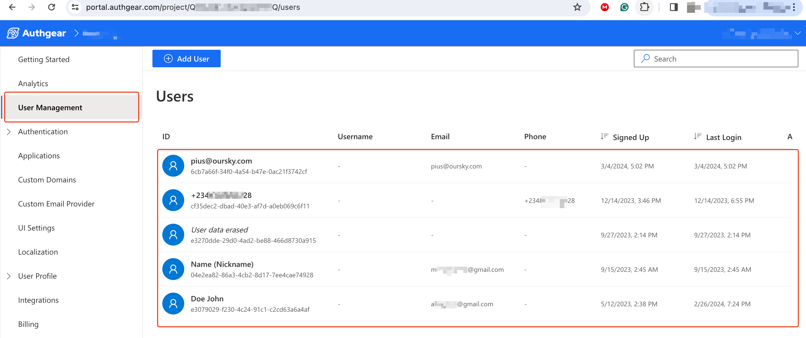
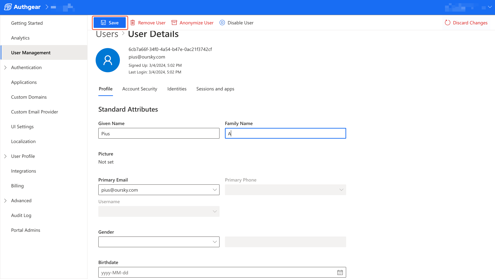
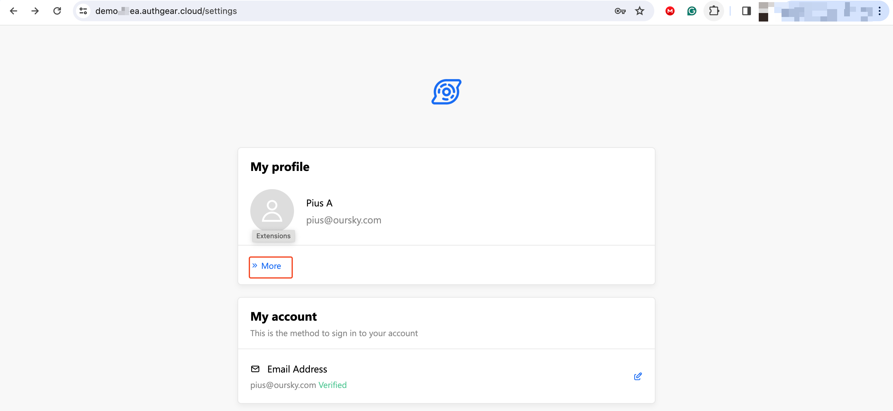
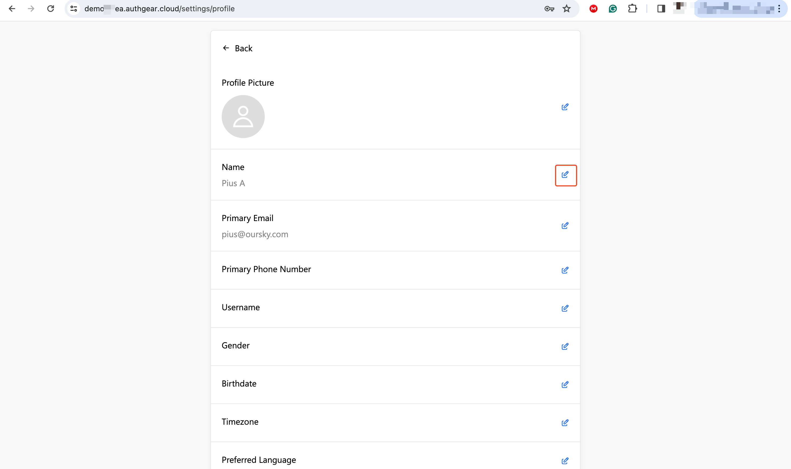
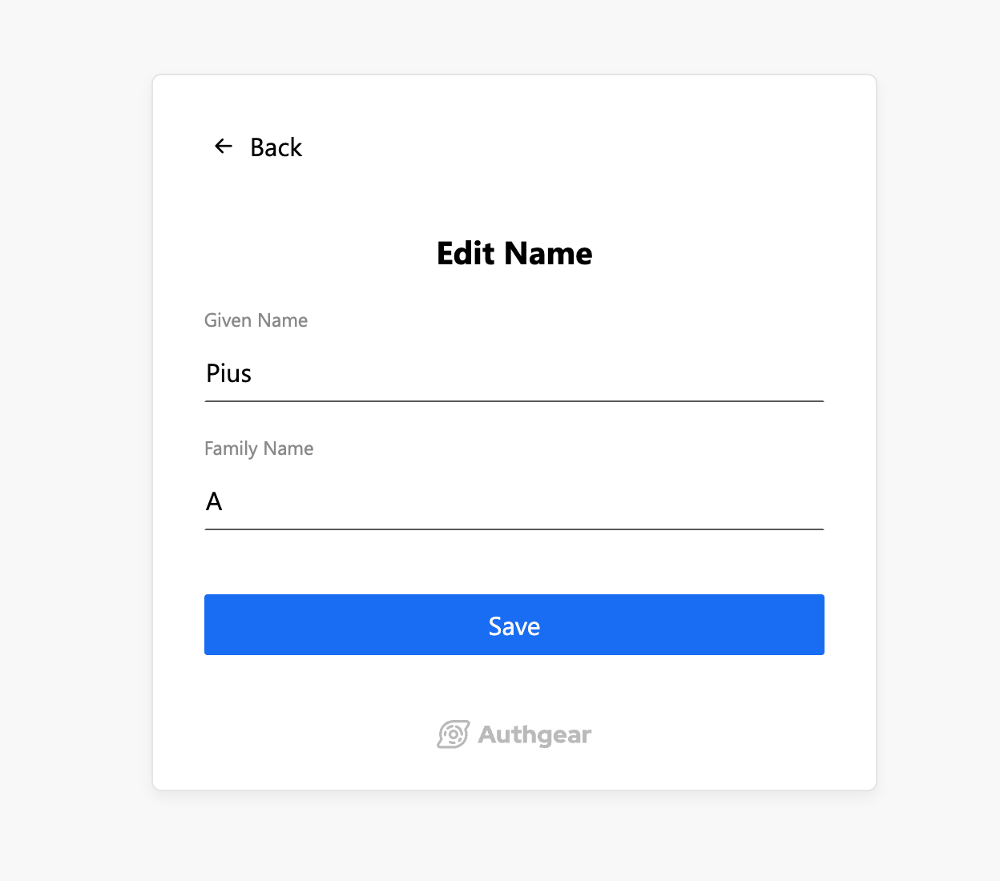

# Update User Profiles

Authgear offers multiple ways for you (the admin) and your users to update user profiles. As an admin, you can modify profile attributes for any of the users of your Authgear project. End users on the other hand can modify their own profile using the Profile settings UI provided by Authgear or using a custom logic you implement in your code.

In this guide, we'll walk through all the options for updating user profiles.

### Pre-requisites

To follow along, you need to have the following:

* An Authgear Account. You can create one for free [here](https://accounts.portal.authgear.com/signup).
* At least one registered user on your Authgear Project.

#### What you'll learn

At the end of this post you'll be able to do the following:

* Update a user profile as an admin from the Authgear Portal or using Admin API.
* Update a user profile as an end user via the profile settings page.

## 1.0 Update User Profiles as an Admin

You can update the profiles for your users as an admin using either the Authgear Portal or the Admin API. Below are guides on how to use both options.

### 1.1 How to Update User Profile from the Authgear Portal

This option provides an easier way to manage your users within the Authgear Portal.&#x20;

To update user profiles using this method, first, log in to the [Authgear Portal](https://portal.authgear.com/), then select your project.

Next, Navigate to **User Management** section to view all the users currently registered under your project.

<figure><figcaption></figcaption></figure>

Click on the ID (name, email, or phone number) for the user you wish to update their profile to open the edit user details page.

<figure><figcaption></figcaption></figure>

From the edit user details page, you can edit the selected user's standard attributes such as Given Name, Family Name, Birthday, etc. If you scroll down on the edit user details page, you'll find more fields like the custom attributes that you can also update.

Once you're done, click the **Save** button to keep your update.

### 1.2 Using Admin API to Update User Profiles

The second option available for updating user profiles is the Admin API. The Admin API is a GraphQL API that you can use to manage your users. You can access Admin API from the [API Explorer](https://docs.authgear.com/reference/apis/admin-api#api-explorer) or by making requests to the API from your code or a client like Postman.

To update a user profile via the Admin API, you need to create a mutation like the following:

First, create a variable with all the existing profile attributes for the user, then include new fields or update the value for the fields you wish to update. Note that omitting an existing attribute in your variable will cause Authgear to delete that attribute.

**Variable**

```graphql
{
  "standardAttributes": {
    "family_name": "John",
    "given_name": "Doe",
    "gender": "male"
  }
}
```

**Mutation**

```graphql
mutation ($standardAttributes: UserStandardAttributes) {
  updateUser(input: {userID: "<ENCODED USER ID>", standardAttributes: $standardAttributes}) {
    user {
      id
      standardAttributes
    }
  }
}
```

For a detailed guide on making a GraphQL query to update user profiles, see our dedicated post on updating[ user's standard attributes using Admin API](https://docs.authgear.com/reference/apis/admin-api/api-examples/update-users-standard-attributes).

Also, see the [Admin API example for updating custom attributes](https://docs.authgear.com/reference/apis/admin-api/api-queries-and-mutations#id-2.20.-updateuser) to learn how to update custom attributes of a user profile.

## 2 How End Users Can Update Their Own Profile

Authgear provides a user settings page in addition to the default Auth UI for user registration and login.

Your users can update their profile from this settings page by following the steps below:

First, within your application, provide a link to the user settings page for your Authgear project. The URL should look like this: `https://<YOUR_AUTHGEAR_ENDPOINT>/settings`. Note that users can not access this link directly without logging in first.

After a user logs in and visits the settings page, they can view their profile photo and other details. To access the edit profile page, the user should click on the **More** link under the **My profile** card.

<figure><figcaption></figcaption></figure>

On the edit profile page, the user can set their profile photo and update other details for their profile.

<figure><figcaption></figcaption></figure>

To edit an attribute, the user should click on the edit icon beside that attribute.

<figure><figcaption></figcaption></figure>
