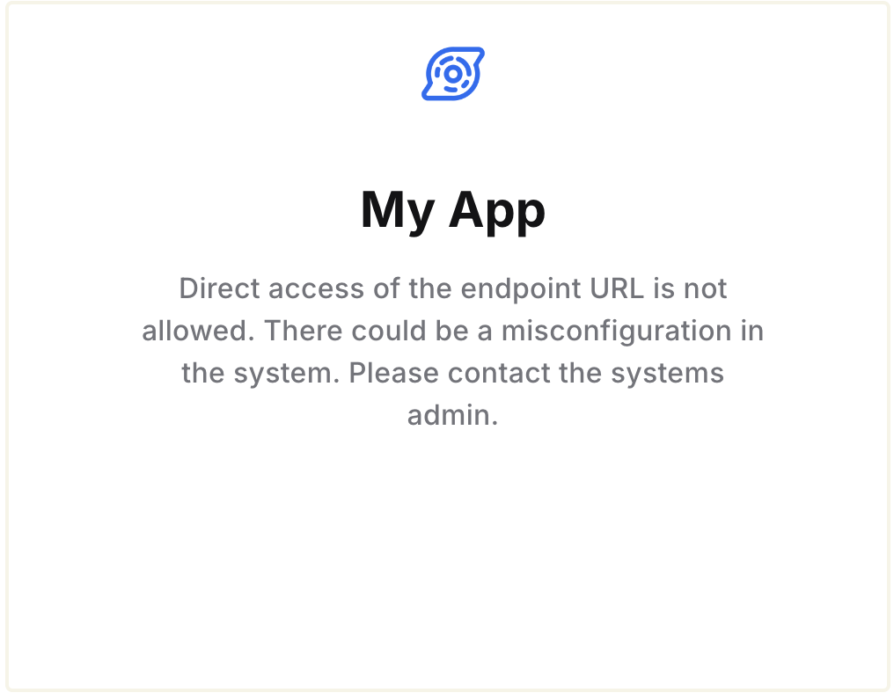

# Directly accessing Authgear Endpoint

Normally, the user should access the signup/login page through an OIDC flow, via the SDK or SAML. In such cases, the user will be redirected to the application specified by the flow.

Use the Endpoint Direct Access settings to configure what happens when users directly visit the endpoint URL (e.g. `https://my-project.authgear.cloud`) of an Authgear project unexpectedly.

By default, when users access the endpoint of a project directly, they'll see an error page that looks like this:

<figure><figcaption></figcaption></figure>

## Show a "Back to home" link

Instead of the default error message, you can show a link to redirect the user away under your logo and project name. Go to **Advanced** > **Endpoint Direct Access,** select "**Show a simple brand page with a back to home link**" and provide the link.

<figure><figcaption>
Show a link under your logo and project name
</figcaption></figure>

## Cookie-based Authentication

If you are using [Cookie-based authentication](broken-reference), you can set Authgear to render the signup/login page even when the user is accessing the Endpoint URL directly. And therefore these options are only available when [custom domain](../customization/custom-domain.md) is enabled.&#x20;

When user access the endpoint directly, they will be redirected to the `/login` page. After login, the user will be directed to the [User Settings](../customization/built-in-ui/auth-ui.md) page (`/settings`).


This is only applicable for cookie-based authentication. If you integrate Authgear with the SDKs, OIDC or SAML protocols, the user should not access the endpoint URL directly in their browser. The authentication should be triggered from the flows.


### **Show the login page and redirect to the hosted settings page**

When the user accesses the endpoint URL directly in their browser, show the authentication page. After the user is authenticated, they are redirected to the hosted [User Settings](../customization/built-in-ui/auth-ui.md) page which they can manage their account.

### **Show the login page and redirect to a custom URL**

When the user accesses the endpoint URL directly in their browser, show the authentication page. After the user is authenticated, they are redirected to a custom URL, which is usually your application website.

## Post-logout URL

You should use the logout function in the SDK, the end-session endpoint for OIDC integration and Logout URL for SAML integration, in which the post-logout behaviour are specified according to the flows.

But if the user directly accesses the logout page, e.g. `https://myproject.authgear.cloud/logout`, the Post-Logout URL in Endpoint Direct Access settings controls where Authgear will redirect users after logout.

