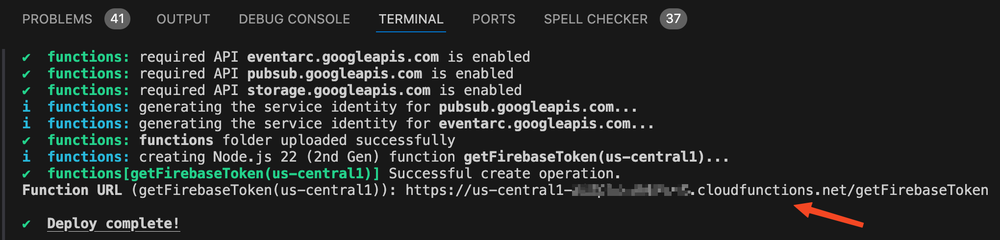
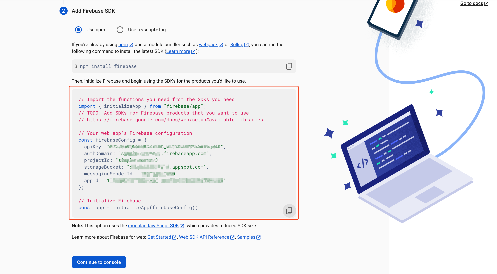
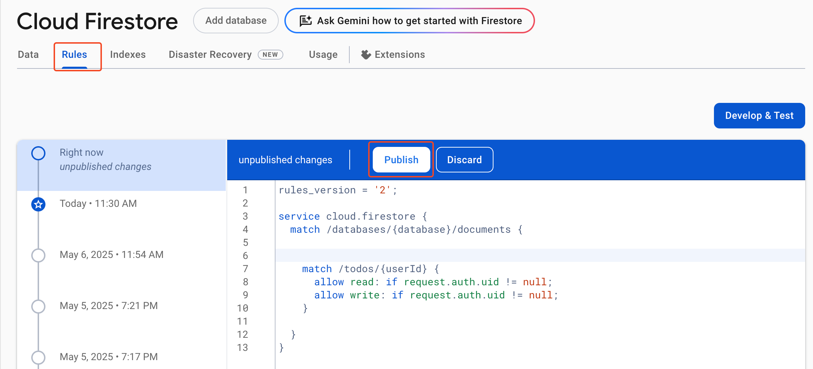
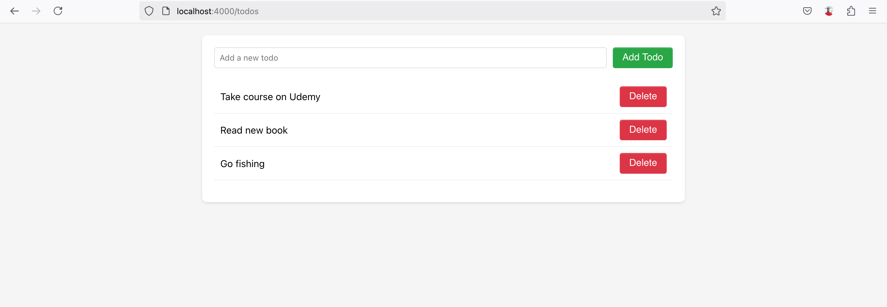

# Integrate Authgear with Firebase

## How to use a third-party authentication system to secure Firestore and other Firebase services.

Firebase is Google's flagship solution for building serverless web and mobile applications. Some of the services Firebase offers include Firestore database, Cloud Storage, Cloud Functions, and Authentication.

You can secure Firebase services like Firestore and Cloud Storage such that only authenticated users in your app have read and write access to certain parts or the entire database. This can be useful when your app allows users to generate content and you need to control who can add or view what.

In this guide, you'll learn how to use Authgear as a custom authentication system to secure Firestore database.

## Why use Authgear with Firebase?

Authgear is a cloud-based solution that is 100% focused on user authentication and IAM. While Firebase, on the other hand, offers other cloud services such as Cloud Storage and real-time database Firestore that enable developers to build full-stack apps without the need for implementing their own backend. Hence, you can use Authgear as an authentication provider for your app that uses Firebase to enjoy all the security and login features it offers.

## What is Firebase Custom Tokens?

Custom Tokens is a feature in Firebase that allows you to authenticate users using secure JWT (JSON Web Tokens) from a third-party authentication system.

Typically, to authenticate users via Custom Tokens, your authentication system (e.g., Authgear) will authenticate users using your preferred method (e.g., username and password), then return a valid JWT to your client application.

The client application will pass the JWT to Firebase to create a Firebase user instance using the user's `sub` attribute from Authgear.

The following flow diagram shows the complete sequence of using Firebase Custom Tokens and Authgear.

<figure><figcaption><p>flow diagran for authgear-firebase integration</p></figcaption></figure>

## How to integrate Authgear with Firebase using Custom Tokens

In this section, we'll cover a step-by-step guide for using Authgear JWT with Firebase Custom Tokens.


**Code Example**

The example app used for this guide is based on the Authgear React example repo (clone or download the code [here](https://github.com/authgear/authgear-example-react)). Once you get the code, you'll have to set up an Authgear client application with type "Single Page Application" in the Authgear portal. More details are in the README.md file for the repo.

Alternatively, you can view/download the complete code with the Firebase example from a separate GitHub repo [here](https://github.com/authgear/authgear-example-firebase).


As part of the guide, we'll build a demo Todo app. The app will have the following features:

* Users Login/Sign up
* Add to-do tasks
* Delete to-do tasks
* Only logged-in users can add tasks
* Data is stored on the cloud, and a user can only view/delete tasks they created.

### Prerequisites

In order to follow the steps in this guide, you should have the following:

* Authgear account (sign up for free [here](https://portal.authgear.com/))
* Firebase project
* Node.js installed on your computer

### Part 1: Configure Firebase

For this part, you'll login to your Firebase console and configure your project.

#### Step 1: Create Cloud Function

First, we'll create a Cloud Function that will verify the access token (JWT) from Authgear and use the `uid` associated with the JWT to create a Firebase Custom Token.

**Note:** this may require you to upgrade your Firebase project to at least the Blaze plan.

1. To create a Cloud Function, open [https://console.firebase.google.com/](https://console.firebase.google.com/) and navigate to **Build** > **Functions** and enable the Cloud Function if it isn't already active for your project.
2. Next, create a `cloud_functions` folder in the root directory of the Authgear React example project you cloned earlier.
3. Change your working directory to the `cloud_functions` folder:

```sh
cd cloud_functions
```

4. Run the following command to install Firebase CLI:

```sh
npm install -g firebase-tools
```

5. After the CLI is installed, run the `firebase login` command and follow the prompt to login to your Firebase project in the CLI.
6. Run the following command to initialize Cloud Function in the cloud\_functions folder you created earlier:

```sh
firebase init
```

Follow the prompt to create a v2 Cloud Function. Now you should have a `function/index.js` file in your cloud\_functions folder. This is where you'll write the code for your cloud function.

#### Step 2: Enable token creator permission for cloud functions

Edit the IAM settings for the service account linked to your project. To do this, go to [https://console.cloud.google.com/iam-admin/iam](https://console.cloud.google.com/iam-admin/iam) and add `Service Account Token Creator` to `{randomNumbers}-compute@developer.gserviceaccount.com`.

#### Step 3: Implement Cloud Function

In this step, we'll implement a cloud function that does the following:

* Accept HTTPS requests from your client application through an endpoint.
* Read the value of your Authgear JWT from the HTTPS request authorization header.
* Validate the JWT to ensure it is valid (not expired).
* If the JWT is valid, the function will read the `uid` attribute from it and use the value to call `firebaseAdmin.auth().createCustomToken(uid)`. This will generate a new Firebase Custom Token that your client application can use to login to Firebase.

To implement the above function, open `function/index.js` in your `cloud_functions` folder and replace the content with the following:

```javascript
const { onRequest } = require("firebase-functions/v2/https");
const jwt = require("jsonwebtoken");
const jwks = require("jwks-rsa");
const firebaseAdmin = require("firebase-admin");
const authgearEndpoint = ""; //place your authgear app endpoint here

// Get JWKs URI from Open ID Configuration documents
const getJwksUri = async (authgearEndpoint) => {
  const config_endpoint =
    authgearEndpoint + "/.well-known/openid-configuration";
  const response = await fetch(config_endpoint);
  const data = await response.json();
  return data.jwks_uri;
};

// Options for JWT verification
const options = {
  algorithms: ["RS256"],
  issuer: authgearEndpoint,
};

const checkReq = (req) => {
  const headerErr = ["must specify an Authorization header", null];
  const formatErr = ["format is 'Authorization: Bearer <token>'", null];
  if (!req) return "server error (request was invalid)";
  const { headers } = req;
  if (!headers) return headerErr; // missing header
  const { authorization } = headers;
  if (!authorization) return headerErr; // missing Authorization Header
  const parts = authorization.split(" ");
  if (parts.length != 2) return formatErr; // Authorization header format invalid
  const [scheme, credentials] = parts;
  if (!/^Bearer$/i.test(scheme)) return formatErr; // Authorization header is not Bearer
  return [false, credentials];
};

firebaseAdmin.initializeApp();

exports.getFirebaseToken = onRequest(async (req, res) => {
  res.set("Access-Control-Allow-Origin", "*");
  if (req.method === "OPTIONS") {
    res.set("Access-Control-Allow-Methods", "GET");
    res.set("Access-Control-Allow-Headers", "Authorization");
    res.set("Access-Control-Max-Age", "3600");
    return res.status(204).send("");
  }

  const [message, token] = checkReq(req);
  if (message) {
    return res.status(500).send({ message }); // return error message if checkReq failed
  } else {
    const decodedAccessToken = jwt.decode(token, { complete: true });
    // get signing key from JWKs with the "kid" in decoded access token
    jwksUri = await getJwksUri(authgearEndpoint);
    const client = jwks({
      rateLimit: true,
      strictSsl: true,
      jwksUri: jwksUri,
    });
    const signingKey = await client.getSigningKey(
      decodedAccessToken.header.kid
    );
    try {
      const decoded = jwt.verify(token, signingKey.publicKey, options); // verify jwt
      const uid = decoded.sub; // if the jwt is verified, use "sub" in JWT as uid
      const firebaseToken = await firebaseAdmin.auth().createCustomToken(uid); // create Firebase custom token with uid
      return res.json({ firebaseToken }); // return Firebase custom token
    } catch (err) {
      return res.status(500).send(err);
    }
  }
});

```

Put your Authgear endpoint in `const authgearEndpoint = "";`.

Run the following commands to install dependencies:

```sh
npm i jwks-rsa
npm i jsonwebtoken
```

Finally, run `firebase deploy` to deploy your new function.

On successful deploy, Firebase CLI will output the public endpoint for your function in the terminal. Copy the endpoint as you will use it later in your React app.

<figure><figcaption><p>firebase function URL</p></figcaption></figure>

### Part 2: Implement React App

In this part, we'll implement the client application that will use Authgear and Firebase.

As mentioned in the prerequisites for this post, you can get the starter code for the application from our React example app repo.

#### Step 4: Add Firebase to React App

1. Go to the Firebase Console and select your project. Next, click on **Web** as your target platform.
2. Enter the name of your app (e.g., My todo app), then click **Register app**.
3. In the Add Firebase SDK section, select **Use npm**, then run `npm install firebase` from the root directory of the Authgear React example repo (confirm that you're not running the command in the cloud\_functions folder).
4. Create a new `firebase.js` file in the root directory of your React project.
5. Copy the code that includes your Firebase config, and paste it in the `firebase.js` file.\


<figure><figcaption><p>Firebase app config</p></figcaption></figure>


1. Update `firebase.js` to expose the Firebase services you'll be using:

```javascript
import { initializeApp } from 'firebase/app';
import { getAuth } from 'firebase/auth';
import { getFirestore } from "firebase/firestore";

// Your web app's Firebase configuration
const firebaseConfig = {
    apiKey: "",
    authDomain: "",
    projectId: "",
    storageBucket: "",
    messagingSenderId: "",
    appId: ""
};

// Initialize Firebase
const app = initializeApp(firebaseConfig);
export const auth = getAuth(app);
export const db = getFirestore(app);
```

#### Step 5: Create Todo Component

Here we'll implement a to-do feature in our React app. The Todo component will contain all the code for implementing this feature.

The component will do the following:

* Get the current user's access token from Authgear using the Authgear SDK.
* Make an HTTPS request to your Firebase function endpoint using the `fetch()` method of the Authgear SDK. The `fetch()` method includes the user's access token in the HTTPS request's authorization header.
* Use the custom token that is returned by the cloud function to sign in to Firebase.
* Add a new todo item to the Firestore database
* Display the todo items
* Delete a todo item

Create a `Todo.tsx` file in the src folder of your React project, then add the following code to the file:

```javascript
import React, { useEffect, useState, useContext } from "react";
import authgear from "@authgear/web";
import { UserContext } from "./context/UserProvider.js";

import { signInWithCustomToken, UserCredential } from "firebase/auth";
import { collection, getDocs, addDoc, deleteDoc, doc } from "firebase/firestore";
import { auth, db } from "../firebase.js";

interface Todo {
  id: string;
  text: string;
  userId: string;
}

const Todo: React.FC = () => {
  const { isLoggedIn } = useContext(UserContext);
  const [firebaseUser, setFirebaseUser] = useState<object>({});
  const [authError, setAuthError] = useState<boolean>(false);

  const [todos, setTodos] = useState<Todo[]>([]);
  const [newTodo, setNewTodo] = useState("");

  useEffect(() => {
    async function getFirebaseUser() {
      if (isLoggedIn) {
        const firebaseFunctionEndpoint = ""; // place your cloud function endpoint here.
        try {
          const getCustomToken = await authgear
            .fetch(firebaseFunctionEndpoint)
            .then((response) => response.json());
          if (getCustomToken.firebaseToken !== null) {
            const firebaseUserObj = await signInWithCustomToken(
              auth,
              getCustomToken.firebaseToken
            );
            setFirebaseUser(firebaseUserObj);
            setAuthError(false);
          }
        } catch (e) {
          console.log(e);
          setAuthError(true);
        }
      } else {
        setAuthError(true);
      }
    }

    getFirebaseUser()
      .then(() => {
        fetchTodos();
      })
      .catch((e) => {
        console.error(e);
      });
  }, [authgear]);

  async function fetchTodos() {
    try {
      const querySnapshot = await getDocs(collection(db, "todos"));
      const todoList = querySnapshot.docs.map((doc) => ({
        id: doc.id,
        ...doc.data(),
      })) as Todo[];
      setTodos(todoList);
    } catch (error) {
      console.error("Error fetching todos:", error);
    }
  }

  async function addTodo(e: React.FormEvent) {
    e.preventDefault();
    if (!newTodo.trim() || authError) return;

    try {
      await addDoc(collection(db, "todos"), {
        text: newTodo,
        userId: (firebaseUser as UserCredential).user.uid,
        createdAt: new Date(),
      });
      setNewTodo("");
      fetchTodos();
    } catch (error) {
      console.error("Error adding todo:", error);
    }
  }

  async function deleteTodo(id: string) {
    try {
      await deleteDoc(doc(db, 'todos', id));
      fetchTodos();
    } catch (error) {
      console.error('Error deleting todo:', error);
    }
  }

  if (!authError) {
    return (
      <div className="app">
        <div className="todo-container">
          <form onSubmit={addTodo}>
            <input
              type="text"
              value={newTodo}
              onChange={(e) => setNewTodo(e.target.value)}
              placeholder="Add a new todo"
            />
            <button type="submit">Add Todo</button>
          </form>

          <ul>
            {todos.map((todo) => (
              <li key={todo.id}>
                {todo.text}
                <button onClick={() => deleteTodo(todo.id)}>Delete</button>
              </li>
            ))}
          </ul>
        </div>
      </div>
    );
  } else {
    return (
      <div>
        <p>User not logged in</p>
      </div>
    );
  }
};

export default Todo;

```

Add your Cloud Function endpoint in `const firebaseFunctionEndpoint = "";`

#### Step 6: Create Route for Todo Component

Open `App.tsx` and add the following route in `<Routes>`:

```tsx
<Route path="/todos" element={<Todo />} />
```

Make sure to import the Todo in App.tsx.

```javascript
import Todo from "./Todo";
```

Finally, add a router link to `Home.tsx` just after the **User Settings** link:

```tsx
<Link to="/todos">My Todos</Link>
```

You can click on the **My Todos** link to open the Todo page.

#### Step 7: Update Firestore Security Rule

Return to your project in Firebase console, then navigate to **Build** > **Firestore Database**. Enable Firestore if it's not active for your project.

<figure><figcaption></figcaption></figure>

Go to the Rules tab, then change the security rule to the following:

```javascript
service cloud.firestore {
  match /databases/{database}/documents {

  
    match /todos/{userId} {
      allow read: if request.auth.uid != null;
      allow write: if request.auth.uid != null;
    }

  }
}
```

The above rule will restrict read and write access to data in /todos/{userID} to only authenticated users. Click **Publish** to activate the new rule.

#### Step 8: Run React App

Follow the instructions in the `README.md` file for the Authgear React example app [here](https://github.com/authgear/authgear-example-react/blob/master/README.md) to configure the app with your Authgear project. Then run the app.

You should be able to authenticate with Authgear and add items to the to-do.

<figure><figcaption><p>UI of demo app</p></figcaption></figure>
