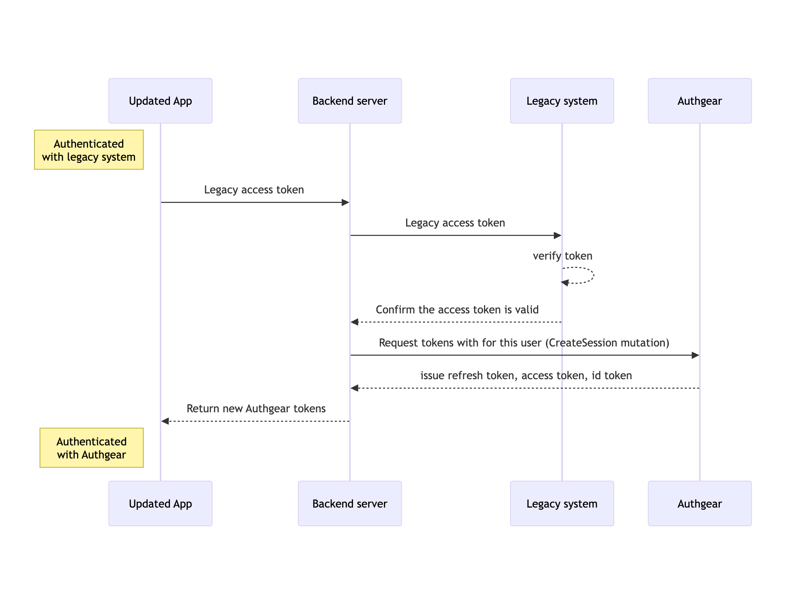

# Migration

You can keep your existing users and data when you move from another authentication system to Authgear.

We support migration from just about any authentication system, including services like Auth0 and a custom built authentication system. Whether you're leaving your existing authentication provider because your license is expiring soon or the system is being deprecated, you can seamlessly move to Authgear and keep your user data.

For more peace of mind and to avoid the feeling of being locked into Authgear as a provider, Authgear also allows you to seamlessly export your user data.

In this article, we'll cover all the best strategies and best practices you can use to migrate your users from other identity providers to Authgear.

## Migration Strategies

Generally, migration to Authgear is as simple as importing your user data to Authgear and then updating your app to use Authgear sessions. You can migrate all your data at once or do it gradually, depending on what approach works best in your specific use case.

We recommend these three approaches for migrating user data into Authgear:

* Bulk migration
* Rolling migration
* Zero-Downtime migration

### 1. Bulk migration

The bulk migration strategy allows you to import all your users to your Authgear project at once.

Bulk migration is ideal when you want to stop using your old authentication system immediately. For example, in a scenario where the license on your existing system is expiring or the product is being deprecated.

#### Pros

* Bulk migration is the most straightforward approach.
* It allows you to stop using your old system as quickly as possible.

#### Cons

* It requires some downtime while you are moving from the old system to Authgear.

For detailed steps on bulk migration, see:


[bulk-migration.md](bulk-migration.md)


### 2. Rolling deployment

The rolling deployment approach allows you to move some portion of your users (e.g., users in a specific region) to Authgear, or only allow new users to sign up via Authgear.

#### Pros

* Rolling deployment allows a slow transition with controllable user impact or downtime.

#### Cons

* It means indefinitely support for your old authentication system.


For new users who go through the new sign-up flow using Authgear, a record in the legacy system should be in place to handle an edge case where the user tries to log in on another device with an older app version.


### 3. Zero-Downtime migration

The Zero-Downtime migration ensures users remain logged in to your application throughout the migration from your legacy system to Authgear. &#x20;

In Zero-Downtime migration, Authgear seamlessly creates new sessions from external access tokens provided by your legacy authentication system.

#### Pros

* Users are not logged out. Hence, there is no need for them to repeat login.

#### Cons

* More complex setup and deployment.

The following flow diagram explains a typical authentication flow using the zero-downtime migration approach:

<figure><figcaption>
Zero-downtime migration flow diagram
</figcaption></figure>
