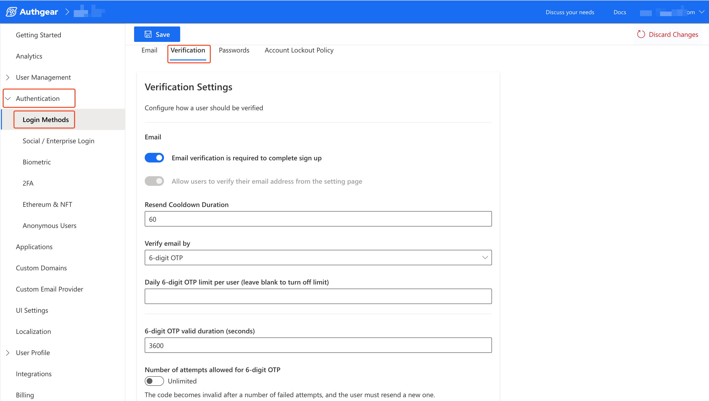

# Rate Limits

Authgear protects projects from an unusually high number of requests for services and resources. If a project receives too many requests in a very short period, it is likely to hit the limit. This feature is in place to prevent abuse and keep your application stable.

On this page, you'll find the details about the set limits for all Authgear services and resources.

### Default Limits

The following are the default rate limits for any Authgear resource when a limit is _not specified_ in this documentation:

* 60 requests per IP address in 1 minute (60/min).
* 10 requests per user per IP address in 1 minute (10/min).

Keep reading to learn more about rate limits for specific resources.

### Authentication

The following section contains a table with the rate limits for usage related to authentication.

**Limit per IP address:** This column specifies the maximum usage of a resource or feature from a single IP address in a specific time interval.

**Limit per user per IP:** This is the maximum number of usage of a resource or feature for a single user, on a single IP address in a specific time interval. For example, user _John.doe@example.com_ can only _use TOTP 10 times_ in _1 minute_ from the same _IP address_.

<table data-full-width="false"><thead><tr><th>Item</th><th>Limit per IP address</th><th>Limit per user per IP</th></tr></thead><tbody><tr><td>Sign up</td><td>7/168hrs (7 days)</td><td>N/A</td></tr><tr><td>Anonymous Sign up</td><td>60/min</td><td>N/A</td></tr><tr><td>Account Enumeration</td><td>10/min</td><td>N/A</td></tr><tr><td>Password</td><td>60/min</td><td>10/min</td></tr><tr><td>TOTP</td><td>60/min</td><td>10/min</td></tr><tr><td>Passkey</td><td>60/min</td><td>10/min</td></tr><tr><td>SIWE</td><td>60/min</td><td>10/min</td></tr><tr><td>Device Token (Biometric)</td><td>60/min</td><td>10/min</td></tr></tbody></table>

### Verification

The table below shows the rate limits for requests related to user verification.

**Trigger per IP:** The value under this column specifies the maximum number of user account verification requests that can be started from the same IP address per specific time (1 minute).

**Validate per IP**: This is the maximum number of user account verifications that can be completed from the same IP address per specific time (1 minute).

**Cooldown:** The minimum amount of time a user must wait for before they can send another request (retry) or use a feature. The **default cooldown** for SMS OTP and Email OTP is **60 seconds**.

<table><thead><tr><th width="245">Item</th><th width="152">Trigger per IP</th><th width="181">Validate per IP</th><th>Cooldown</th></tr></thead><tbody><tr><td>SMS OTP (Passwordless)</td><td>60/min</td><td>60/min</td><td>customizable </td></tr><tr><td>Email OTP  (Passwordless)</td><td>60/min</td><td>60/min</td><td>customizable</td></tr></tbody></table>

#### How to Customize Verification Cooldown and Limits

The cooldown for user verification can be set to a custom value in the Authgear Portal. To do this, navigate to **Authentication** > **Login Methods**, then click on the **Verification** tab. You can set the cooldown (in seconds) in the Verification tab window using the **Resend Cooldown Duration** input field.

<figure><figcaption></figcaption></figure>

Other limits you can set from the Verification tab include:&#x20;

* **Daily 6-digit OTP limit per user**: Sets the maximum number of OTP a user can request in 24 hours.
* **6-digit OTP valid duration (seconds):** The validity of an OTP code sent to a user. Authgear will no longer accept a code after the number of seconds specified here has passed since the user requested the OTP.
* **Number of attempts allowed for 6-digit OTP:** This feature is turned off by default. When turned on, a valid OTP will become invalid after a user enters the wrong codes for the specified number of attempts.

### Account Lockout

Account lockout is a temporary lock on a user due to them entering a wrong password, OTP, or recovery code more than the maximum number of attempts allowed.

For details about enabling and customizing account lockout, see the [account lockout documentation page](account-lockout.md).

### Account Recovery

The table below shows rate limits for sending account recovery messages to users. It also includes a `Validate per IP` column, that specifies the number of times a user on an IP address can attempt account recovery within a given period.

**Trigger per IP:** The value under this column specifies the maximum number of account recovery requests that can be started from the same IP address per specific time (1 minute).

**Validate per IP**: This is the maximum number of account recoveries that can be attempted or completed from the same IP address per specific time (1 minute).

**Cooldown per target:** The minimum amount of time a user must wait before they can send another request to the same target (email address or phone number).&#x20;

<table><thead><tr><th>Item</th><th width="165">Trigger per IP</th><th width="159">Validate per IP</th><th>cooldown per target</th></tr></thead><tbody><tr><td>Email</td><td>Disabled</td><td>60/min</td><td>1 minute</td></tr><tr><td>SMS</td><td>Disabled</td><td>60/min</td><td>1 minute</td></tr></tbody></table>

### Messaging

The rate limits under this section apply to all messages (email and SMS) your Authgear project sends.

**Limit per IP:** This column defines the maximum number of messages that can be initiated from the same IP address per specific time. For example, a user can send a maximum of 200 messages in 1 minute without changing their IP address.

**Limit per target:** This is the maximum number of messages that can be sent to a target (email address or phone number) per specific time (24 hours). For example, an Authgear project with a Limit per target of 50/24hrs can send a maximum of 50 messages to the same email address in 24 hours.

| Item  | Limit per IP | Limit per target |
| ----- | ------------ | ---------------- |
| Email | 200/min      | 50/24hrs         |
| SMS   | 60/min       | 10/hr            |

### Default OTP Valid Time

* The default valid time for a 6-digit One-time password (OTP) is 5 minutes.
* For one-time verification links, the default valid time is 20 minutes.

### Customizing Default Limits

Where the default rate limits do not work for your specific use case, you can [contact us](https://www.authgear.com/schedule-demo) for further discussions on customizing the default limits for your project.
