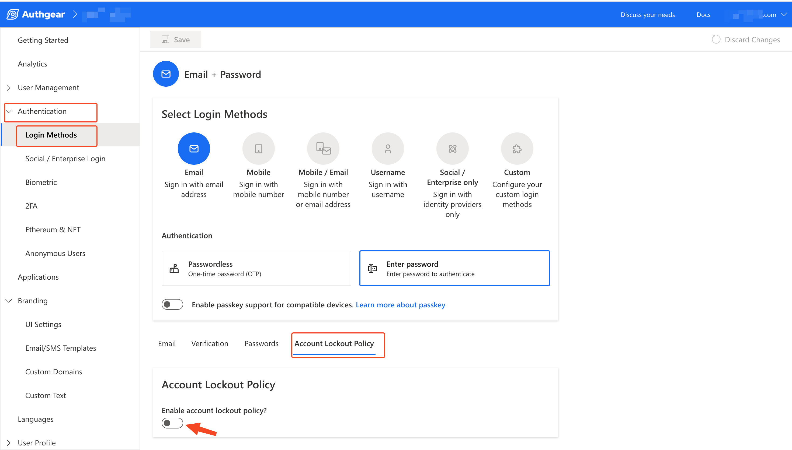
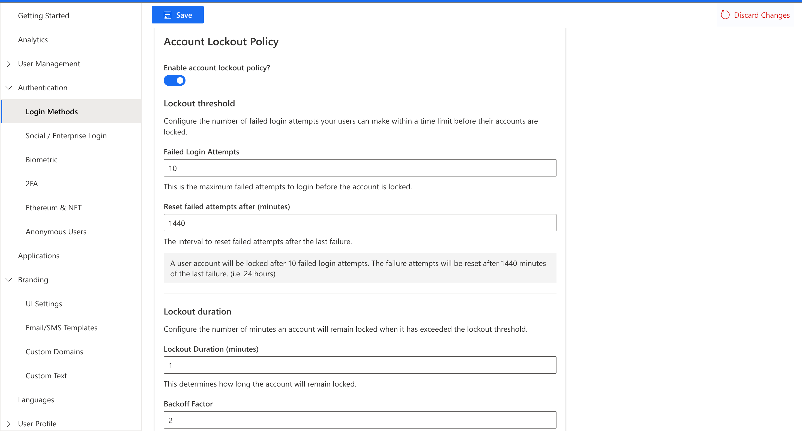

# Account Lockout

Account lockout is a feature that places a temporary lock on a user due to them entering a wrong password, OTP, or recovery code more than the maximum number of attempts allowed.&#x20;

> Account lockout attempts are shared for all supported authenticators. For example, if the maximum attempt for account lockout is 5, a user's account will be locked after they enter the wrong pass 2 times and a wrong recovery code 3 times (2+3 sum up to 5 attempts).

### How to Enable Account Lockout

The account lockout feature is not enabled by default. To enable it, in the Authgear Portal, navigate to **Authentication** > **Login Methods**. Then go to the **Account Lockout Policy** tab and toggle the **"Enable account lockout policy"** radio button.

<figure><figcaption></figcaption></figure>

Once you've enabled the account lockout policy, you can view and configure the various policies that control how the account lockout feature works.

<figure><figcaption></figcaption></figure>

#### Account Lockout Policies

The following are the different policies you can configure to control how account lockout will work on your Authgear project.

**1.0 Lockout Threshold**

This section of the account lockout policy is where you can configure the number of failed login attempts your users can make within a time limit before their accounts are locked.

**1.1 Failed Login Attempts**

The value for **Failed Login Attempts** is the maximum number of failed attempts to log in a user can make before their account is locked.

**1.2 Reset Failed Attempts After (minutes)**

This is where you can specify how long after the last failed login attempt that the system should reset the failed login attempt counter. For example, if the value for Failed Login Attempt is 10 and the Reset Failed Attempts After is 1440 minutes, this means the user will get another 10 attempts 24 hours (1440 minutes) after their last failed attempt that did not trigger a lockout.

**2.0 Lockout Duration**&#x20;

You can use this section for the account lockout policy to configure the number of minutes an account will remain locked when it has exceeded the lockout threshold.

**2.1 Lockout Duration (minutes)**

This determines how long the account will remain locked.

**2.2 Backoff Factor**

The value is a number by which the lockout duration will be multiplied for every subsequent failed attempt. Hence, increasing the lockout duration exponentially. For example, if Backoff Factor is 2, and lockout duration is 1 minute, the lockout duration will increase in the format of 2, 4, 8 minutes, and so on up till the maximum lockout duration.

**2.3 Maximum Lockout Duration (minutes)**

This is where you set a cap on the lockout duration.

**3.0 Lockout Type**

This determines whether the account lockout is only applied when the user attempts to log in with the same IP address, or when the user attempts to log in on any devices.

**4.0 Apply Policy to Selected Authenticators**

Under this section you can select the types of authenticator where failed login attempts will be counted. The available options include:

* Password
* Passwordless via Phone/Email
* Authenticator App (TOTP)
* Recovery codes
