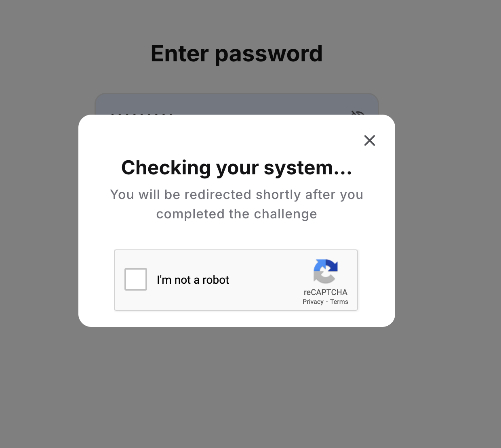
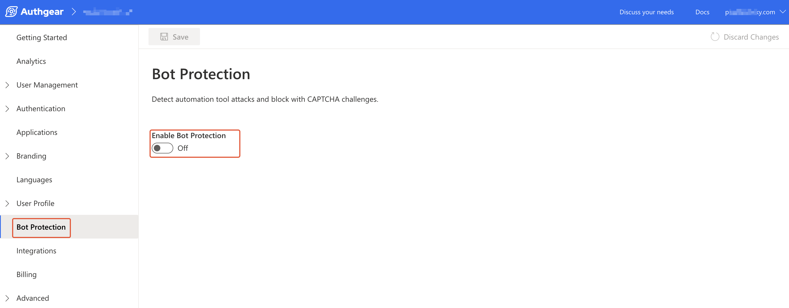
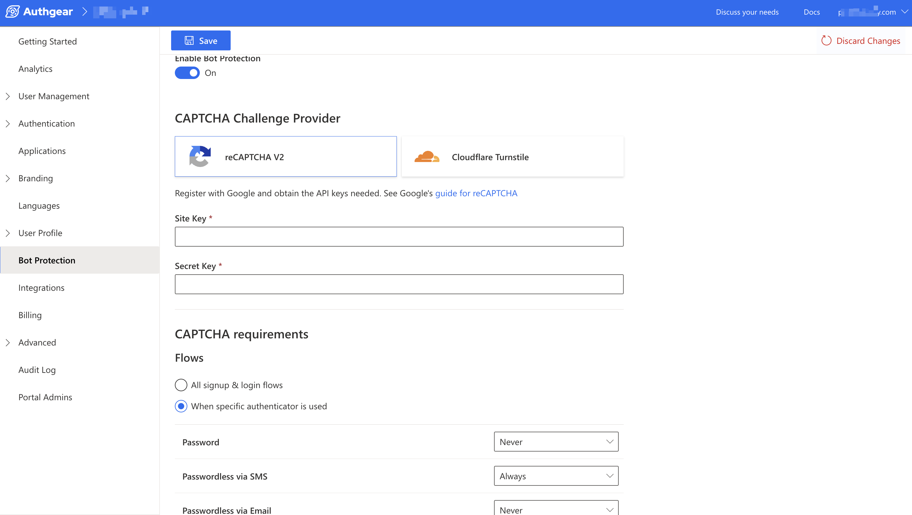
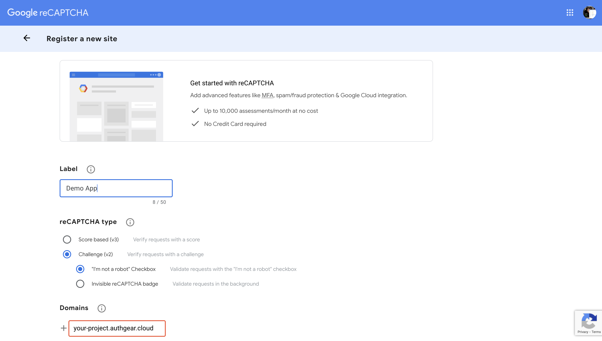
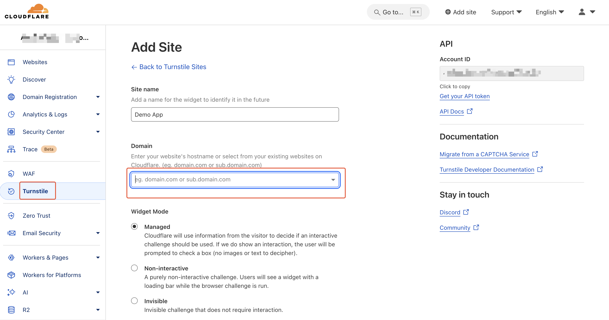

# Bot Protection

Bot protection detects and blocks attacks from automation tools. This secures your application by using CAPTCHA challenges to stop bots.

With bot protection enabled, Authgear may require your users to complete a CAPTCHA challenge before proceeding with specific authentication flows or actions. You can select the CAPTCHA provider you prefer in the Authgear portal.

The following screenshot shows a Bot Protection CAPTCHA in AuthUI:

<figure><figcaption></figcaption></figure>

## How to Enable Bot Protection

You can turn on bot protection for your project in the Authgear Portal. To do that, first, navigate to the **Bot Protection** section in the portal then toggle the **Enable Bot Protection** radio button on.

<figure><figcaption></figcaption></figure>

Once you've toggled Enable Bot Protection, you can access more options for setting up a CAPTCHA provider and configuring how bot protection will work in your project.

<figure><figcaption></figcaption></figure>

### 1. Set a CAPTCHA Provider

Scroll to the **CAPTCHA Challenge Provider** sub-section, and select one of the supported CAPTCHA providers.&#x20;

Authgear currently supports these providers:

* reCAPTCHA
* Cloudflare Turnstile

Then, enter your **Site Key** and **Secret Key** for the CAPTCHA provider.&#x20;

#### reCAPTCHA

To get a Site Key and Secret Key for reCAPTCHA go to the official website of [reCAPTCHA](https://www.google.com/recaptcha/admin/) and register a new site. Add your [Authgear project domain](https://docs.authgear.com/reference/glossary#your-authgear-endpoint) under **Domains**.

Only **reCAPTCHA Challenge (v2)** is supported.

<figure><figcaption></figcaption></figure>

#### Cloudflare Turnstile

For Cloudflare Turnstile, also visit the official [Cloudflare Turnstile](https://www.cloudflare.com/products/turnstile/) page and add a new site. Enter your [Authgear project domain](https://docs.authgear.com/reference/glossary#your-authgear-endpoint) in the Domain field.

Only the **Managed** Widget Mode is supported.

Once you're done adding your site, Cloudflare will provide you with the Site Key and Secret Key for your new site.

<figure><figcaption></figcaption></figure>

### 2. Set CAPTCHA Requirements

Scroll to the **CAPTCHA Requirement** sub-section to set the condition for showing CAPTCHA. The following are CAPTCHA requirements you can set:

#### **Flows**

Use the flow option to configure when your project shows CAPTCHA based on the type of authentication flow or when a user is using a specific authenticator.

The values you can set for Flows are:

**All signup & login flows:** If you select the **All signup & login flows** option, and select **Always** in the dropdown, your users will see a CAPTCHA when they log in or sign up for all authenticators.

**When specific authenticator is used:** Selecting this option will only show CAPTCHA to your users for specific authenticators. If you select the **When specific authenticator is used** option, you can continue to specify the authenticator you want users to see CAPTCHA for.

**Password**: This option will be available when you set Flows to **When specific authenticator is used**. Set it to **Always** to enable CAPTCHA when users log in using a password.

**Passwordless via SMS:** Set this option to **Always** to enable CAPTCHA when users log in using SMS OTP. It is only available when you set Flows to **When specific authenticator is used**.

**Passwordless via Email:** You can use this option to enable CAPTCHA for passwordless authentication using email. The option is only available when you set Flows to **When specific authenticator is used**.

### **3. Reset Password**

You can use this option to set whether to always or never show CAPTCHA when a user is performing a password reset.
