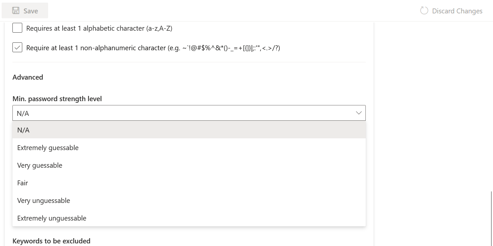

# Password Strength

### What is password strength?

Password strength is simply a measure of how difficult it is to guess or crack a password. It helps a user pick a password that is secure and difficult to guess or crack.&#x20;

Usually, password policies recommend users to set passwords that meet certain criteria such as a minimum number of characters, and a mix of alphabets, numbers, cases, and special characters to make it harder for humans and machines to guess or crack their passwords.&#x20;

All of the above are attributes that influence password strength, and combining two or more of them can improve password strength.

### How to set password strength for your Authgear project

Authgear allows you to set a password policy for your project. In the following section, you'll learn how to set password strength for your project from the Authgear Portal.

#### Step 1: Navigating to the Password Policy page

To open the password policy page, log in to the Authgear Portal and navigate to **Authentication** > **Login Methods**. Once you're on the login methods page, scroll down and click the Password Policy tab.

<figure><figcaption></figcaption></figure>

#### Step 2: Set Password Requirements

Now configure the minimum requirements users of your app must meet for their password to be accepted. Use the checkboxes provided to set one or more requirements. For example, you can check "Requires at least 1 digit", "Requires at least 1 lowercase character" and so on to add those requirements to your password policy.

#### Step 3: Set Minimum Password strength

You can set a minimum password strength in the Advance sub-section of the Password Policy page.

Click on the **Min. password strength level** dropdown and select your preferred option. The options for password strength level are shown below:

<figure><figcaption></figcaption></figure>

Once you're done hit the Save button to keep your changes.

In the next section, we'll explain how the password strength is calculated.

### How password strength is calculated in Authgear

Authgear currently uses the [zxcvbn](https://github.com/dropbox/zxcvbn) password strength estimator library. This password strength estimator does more than just score a password because it meets a certain length or has a mix of alphabets, numbers, and symbols. It uses pattern matching and recognizes common insecure passwords. A password is scored for how uncommon and guessable it is using the zxcvbn algorithm.

The following table shows the scores for the various minimum password strength levels in Authgear.

| Password Strength Level | Score | Description                                                                                                          |
| ----------------------- | ----- | -------------------------------------------------------------------------------------------------------------------- |
| N/A                     | -     | Totally ignore the Advance password strength score and use the Basic password policy. E.g. Minimum password length.  |
| Extremely guessable     | 0     | Too guessable: risky password. (guesses < 10^3)                                                                      |
| Very guessable          | 1     | Very guessable: protection from throttled online attacks. (guesses < 10^6)                                           |
| Fair                    | 2     | 
Somewhat guessable: protection from unthrottled online attacks. (guesses &#x3C; 10^8)

                  |
| Very unguessable        | 3     | 
Safely unguessable: moderate protection from offline slow-hash scenario. (guesses &#x3C; 10^10)

        |
| Extremely unguessable   | 4     | Very unguessable: strong protection from offline slow-hash scenario. (guesses >= 10^10)                              |
